# 复杂场景下多模态情感预测：全量实验数据分析报告

更新日期：2026年9月26日。分析对象为当前本地实验成果，不审核实现代码、不重新训练、不执行新的模型推理。图表沿用上版的字体、蓝橙绿配色、线型和多面板布局。

## 本次结果与上次相比改变了什么

上次分析记录了15个直接输入文件的SHA-256。本次逐一计算当前文件指纹，15个全部一致，0个改变、0个缺失。因此原有20组图的数据与结论基础仍然成立，已将20份SVG及对应PNG从旧目录移入本目录，未重新生成或改写。当前增加33组矢量图，总计53组；新增实验不能替代或混同于旧参考实验，而是扩展了可分析的任务范围。

这里的“新增”指相对上次分析新增纳入的数据；没有上次完整目录快照时，不声称能够证明每个新增纳入文件的历史创建时间。逐文件比对见[数据变化与图表沿用清单](数据变化与图表沿用清单.md)，机器可读清单为source_comparison.json、current_statistics.json。

## 针对题目的主要结论

1. **问题一具备100条样本的结构性成果与可追溯记录。**文本、音频、视觉维度分别768/74/35，每模态统一50位置；仍须区分覆盖率、对齐准确率和情感辨识质量。图1—3与图53分析该任务。
2. **问题二已具备受控局部缺失和三种子实验依据。**1044行评价覆盖3模型、3种子、2划分和58条件。文本损伤最敏感，文本后段缺失是突出困难条件。Robust改善回归误差和某些最差条件，但并未全面提升平均测试Macro-F1。图21—36承担核心鲁棒性论证，旧图4—20作为基础参考与诊断。
3. **问题三已具备预测与解释输出，但预测质量与证据定位仍有明显边界。**测试Accuracy 64.10%、Macro-F1 0.5516，中性召回仅17.72%；40份版本记录中36份文本主导。全部解释卡时长为1秒，与原视频容器时长不符，不能把已有秒数和帧号当作验证通过的原素材定位。图37—52逐项展开。

## 指标、比较单位与不确定性的统一口径

- 标签顺序固定为Negative、Neutral、Positive；0强度只属于Neutral。Accuracy为正确样本比例；Macro-F1为三类F1算术平均。MAE为平均绝对误差，RMSE为均方根误差，Pearson为真实与预测强度线性相关。
- 旧图5、14、15的区间采用video_id整组重采样1200次、种子20260924，描述固定预测的样本不确定性。新图22—34的误差线采用3个训练种子的样本标准差，分母为n−1；它们不是同一种不确定性，不能直接比较宽窄。
- 原ablation_summary.csv的std字段与本报告重新计算的样本标准差可能不同。本报告明确采用ddof=1，三种子时样本标准差是总体标准差的√(3/2)倍。均值相同不意味着标准差定义相同。
- 新增受控数据每个模型、种子有58条件，其中完整输入在baseline与ablation重复出现一次，指标一致；跨条件汇总去掉重复项。局部缺失共49条件，全压力共56条件。条件等权均值只是当前实验网格的描述，不代表真实应用缺失概率分布。
- 不将三个训练种子、同一视频多个片段、同一编号的两套特征版本、同一样本50个bin相互替代为独立样本。主实验使用aligned接口；unaligned专项输出只作为附加版本诊断。
- 附件三和附件四无真实标签，只描述预测与解释，绝不报告它们的准确率。题目中的训练/验证/测试职责仍保持区分，本报告没有用测试或专项输出重新选择模型。
- 图内采用英文标注，图题、图注和分析使用中文。SVG保留文字，PDF使用矢量图形；PNG是预览。分析不编造缺失的逐条件混淆矩阵、三类概率或原始时间真值。

## 题目要求与图表证据对应

| 题目关注点 | 主要图表 | 数据支持与边界 |
| --- | --- | --- |
| 问题一全量特征与时序组织 | 1、2、3、53；附录100条汇总 | 数量、维度、掩码、源区间齐备；覆盖率不等于对齐准确率 |
| 问题二验证基础评价与错误归因 | 4—13、17、22 | 旧参考逐样本预测可深入诊断；新条件表无全量逐样本概率 |
| 缺失模态、缺失率影响 | 23—26、29、33 | 全部7种模态组合，0.1—0.4请求缺失率 |
| 缺失位置、连续块时长影响 | 27、28 | 0.3请求率、单模态；不等同于物理秒数 |
| 消融、增强与训练稳定性 | 21、22、30—34 | 3模型、3种子；整模态删除作为额外压力条件 |
| 附件三全量预测 | 18、19、35、36；全量CSV | 30编号，两版本、三模型；无标签 |
| 问题三验证与错误分析 | 37—41 | 完整预测及50轮日志；问题三仅一个训练种子 |
| 模态作用与主要参考模态 | 43、47、51 | 归一化贡献与注意力不能互相替代 |
| 局部重要性分布与解释卡 | 44—50 | 主导模态全50位置；其他模态仅候选5位置 |
| 附件四全量结果与原素材定位 | 42、48—52；全量CSV | 已有输出齐备；保存秒数与真实视频时长不一致 |

## 一、沿用的基础实验分析

以下图1—20保持上次图件原样。涉及“参考模型”的表述，始终指problem2_outputs_bert_av_reproduce的固定历史结果，不指新增Robust模型，也不代表三种子平均。

## A1 分析对象与统计口径

问题一分析100条已有样本特征、300行逐模态汇总、文本截断统计，以及一个典型样本的词段和50个时间bin。时长沿用已有结果中的有效时长，不在本次改变时轴定义。

问题二以 `problem2_outputs_bert_av_reproduce` 为固定参考，分析728条验证预测、727条测试预测、附件三aligned和unaligned各30条输出。历史对比纳入另外四份拥有完整测试预测的实验。只保留指标文件而缺少逐样本预测的目录不重复计为独立证据；训练记录也不当作多个独立训练种子。

分类采用三分类Accuracy、Macro-F1及逐类Precision/Recall/F1。回归采用MAE、RMSE、Pearson相关系数和有符号残差。残差定义为预测强度减真实强度；正残差表示数值高估。概率分析另外计算10箱ECE、多类Brier分数、负对数似然、单类对其余类的ROC-AUC和平均精确率AP。

**区间估计方法。**验证集包含239个video_id，测试集包含381个video_id。考虑同一视频可能产生多个片段，以video_id为整组进行有放回重采样，共1200次，随机种子为20260924，每次保留抽中视频的全部片段。报告95%百分位区间；模型差异使用相同重采样权重，保留配对关系。指标仍按片段加权，而不是把每个视频先算指标后等权平均。

这些区间描述固定模型、固定预测下的样本不确定性，假设视频组之间可视为独立抽样单位；同一说话者若跨video_id出现，依赖性仍可能未完全覆盖。区间不包含训练种子差异，也不校正历史模型选择或多重比较。因此这里的比较是结果分析，不是对算法改进的因果证明。

## A2 问题一 样本构成与可用信息

100条样本中Negative、Neutral、Positive分别为18、25、57条，正面样本占多数。这样的组成要求区分“多数类占比”和“特征质量”：仅有正面占比高，不能推断模型学习到了有效情感信号。

保存的有效时长为2.260–29.290秒，均值7.8749秒，中位数6.725秒，均值高于中位数说明长片段使分布右尾延长。按类别的散点与箱线图展示组内分布，类别样本数量并不相同，不能仅根据箱体位置得出类别导致时长变化的结论。

文本长度统计显示6条样本超过当前存储上限，共省略70个token；最大单条省略34个，占全部省略量的48.57%。因此截断影响并非均匀分散，而是集中于少数长文本。这里是已有特征结果的描述，不据此重新定义或修改特征。

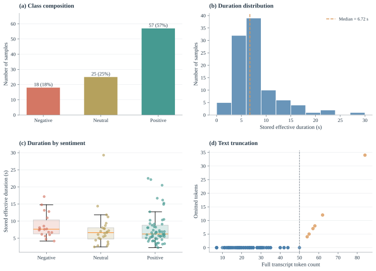

**图1 问题一 样本构成与文本长度。**基于100条已保存结果；时长使用结果文件中的有效时长口径。散点水平抖动仅用于显示。6条文本发生截断，共省略70个token。

### A2.1 覆盖率反映时序占用 不等于识别质量

文本、音频、视觉的平均区间覆盖率分别为0.5212、0.9827和1.0000；有效bin比例分别为0.7340、0.9932和1.0000。文本“有效bin占73.40%”与“平均覆盖52.12%”并不矛盾：一个bin只覆盖部分时间也可以被标为有效。两个量反映不同问题，不应混用。

文本平均覆盖率的中位数为0.5156，与均值接近，但样本间变化明显；音频覆盖率集中在1附近，视觉在当前区间定义下为1。视觉覆盖率为1仅说明每个时间区间都被某个视觉观测覆盖，不能解释成视觉特征准确率100%，也不能说明没有背景干扰或表情信息损失。

文本覆盖率与时长的Spearman相关系数仅0.0867，当前100条结果没有表现出明显单调关系。因此不宜写“视频越长文本覆盖就越差”。热图还显示，同样的平均覆盖率可能对应不同的局部空隙结构，整体均值会掩盖时序差异。

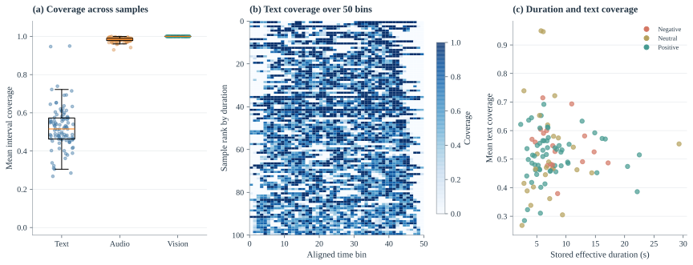

**图2 问题一 覆盖率分布与时序覆盖图。**覆盖率是源区间占用率，不是时间对齐准确率或情感识别准确率。热图按已保存时长排序，显示全部100条样本。

### A2.2 典型样本体现何种对应关系

典型样本 `-tANM6ETl_M$_$3` 的图展示了已记录的CTC词段、文本表示范数、音频RMS、视觉红色通道均值与区间覆盖率，三层共用保存的时间轴。音频RMS变化比视觉全帧颜色均值明显，而视觉曲线近似平坦；这只反映所选单个描述量的变化，不表示音频在模型决策中的贡献大于视觉。

图中每条特征曲线分别除以该样本自身最大值，避免量纲差异遮蔽形态。这样的归一化有助于看时序形状，但不能比较不同模态的绝对能量或重要性。词段与特征处在同一轴上只构成可视化对应，尚不能提供人工词边界误差、同步误差或对齐准确率。

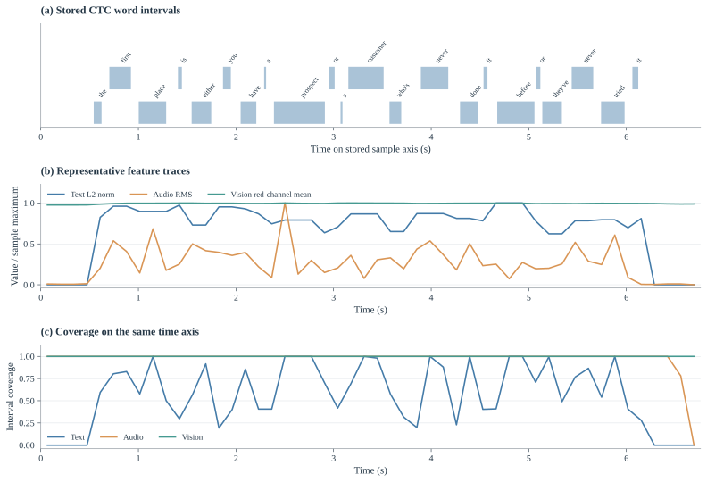

**图3 问题一 典型样本的词段与特征对应。**仅重绘已有词时间段和特征统计，不生成新的音频波形。各曲线分别按本样本最大值缩放，用于看时序变化，不用于比较模态贡献大小。

## 图53 问题一新增汇总中的完整性与可追溯性

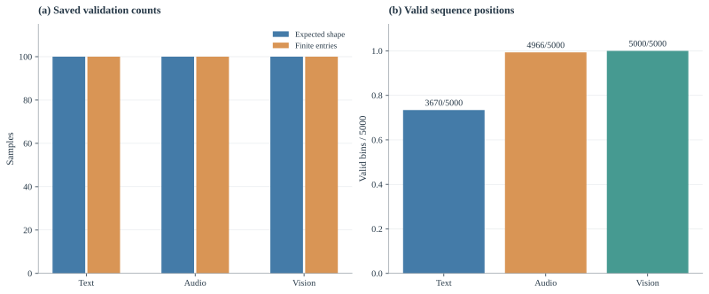

**数据来源与统计口径：**problem1_complete_analysis.json及problem1_validation.json；已有核验记录，非本次重跑提取。

三模态各100条样本具有预期形状且数值有限，逐模态汇总有300行，manifest有100行。这支持样本与特征的数量完整性；它不等于特征具备充分情感辨识能力，也不等于时序定位已经经过人工真值验证。

全部模态统一50位置，文本/音频/视觉有效bin为3670/4966/5000。固定存储尺寸与有效信息长度不同，模型应通过掩码区分填充。音视频所用74/35维描述并不因维度与附件二一致，就自动拥有相同物理含义或相同特征分布。

当前保存时长2.260–29.290秒与题面给出的原视频2.648–34.567秒范围不同。本文沿用已有结果的时长字段，不据此推断样本删减或擅自改数；在最终论文中应说明该字段与原视频容器时长的关系。附录提供全部100条样本的逐项统计。

**题目对应。**特征提取的完成证据包括100个ID、300条模态汇总、50位置接口、有效掩码与源区间计数。图1至3继续说明分布和典型对应；本图补充结构完整性。视觉全帧统计不等同于面部表情特征，音频谱描述不等同于专门学习的情绪表示，因此从这些结果能证明特征已生成，不能单独证明其在情感识别上优于其他特征。

| modality | samples_with_expected_shape | samples_with_finite_values | feature_dim | valid_bins | source_intervals |
| --- | --- | --- | --- | --- | --- |
| text | 100 | 100 | 768 | 3670 | 2447 |
| audio | 100 | 100 | 74 | 4966 | 77510 |
| vision | 100 | 100 | 35 | 5000 | 3936 |

## A3 问题二 数据组成与整体性能

训练、验证、测试样本数分别为3395、728和727。三类比例在不同划分之间有差异：验证集的中性占比为25.27%，测试集为21.73%；测试集正面占比49.79%，验证集为46.43%。以训练多数类Positive作恒定预测，测试准确率为49.79%；参考模型高出22.01个百分点，因此其表现明显超过“全部预测正面”的基线。

测试强度的平均绝对值约0.8849，高于验证集0.7690；绝对强度大于2的样本比例分别为6.74%和4.95%。测试集极性信号可能更明显，同时强度数值也更极端。这可以作为理解分类与回归指标方向不同的一条描述性线索，不能单独证明难度变化的因果原因。

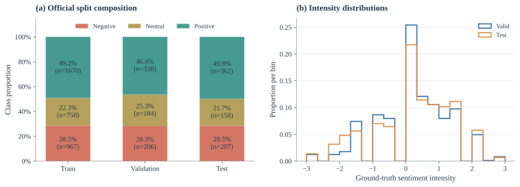

**图4 问题二 划分组成与真实强度分布。**训练类别数量来自已保存metrics；验证与测试强度来自预测表中的真实标签。比例图避免不同样本量造成误导。

| 指标 | 验证集 | 验证95%区间 | 测试集 | 测试95%区间 |
| --- | --- | --- | --- | --- |
| Accuracy | 64.15% | 60.11%–68.11% | 71.80% | 68.49%–75.28% |
| Macro-F1 | 0.6105 | 0.5692–0.6481 | 0.6708 | 0.6309–0.7089 |
| MAE | 0.5735 | 0.5307–0.6162 | 0.6102 | 0.5656–0.6563 |
| RMSE | 0.7626 | 0.6997–0.8229 | 0.8271 | 0.7674–0.8923 |
| Pearson r | 0.6865 | 0.6327–0.7285 | 0.6996 | 0.6443–0.7444 |

测试集准确率高于验证集7.65个百分点，而MAE反而高0.0367，说明“类别判断正确”和“强度数值接近”是两个不同目标。不能把两个不同划分上的指标差解释为模型训练前后的进步。

可做一个简单的组成标准化：保持验证集逐类召回率不变，只换成测试集类别比例，准确率约为65.38%。按这一替换顺序，类别比例变化对应约1.23个百分点，其余约6.42个百分点对应不同划分的类内识别率差异。这是代数分解，不是因果归因；它说明仅用“测试集中性更少”不足以解释全部差距。

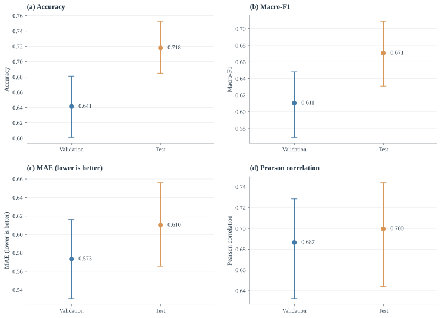

**图5 问题二 基础指标与聚类自助区间。**误差线为按video_id整组重采样1200次的95%百分位区间，条件于当前保存的固定预测；不代表多次训练的方差。验证和测试来自不同样本，不能解释成训练前后变化。

## A4 分类错误集中在哪里

测试727条中522条正确，205条错误。中性类158条中仅67条正确，召回率42.41%；其中28条被判为负面，63条被判为正面。预测为中性的117条中，50条实际属于其他类，说明中性类别同时存在漏判和误报。

涉及中性类别的错误共141条，占全部错误68.78%。另外64条直接在Negative与Positive之间反转，占31.22%，因此不能把所有问题都归为“靠近零的边界难例”。验证集也有同样结构：中性184条中73条正确，81条被判为Positive，中性召回率39.67%。

测试集中Positive召回率83.70%，明显高于Negative的73.43%与Neutral的42.41%。预测Positive共401条，超过真实Positive的362条；预测Neutral为117条，少于真实158条。这里可以准确表述为“输出分布中正面偏多、中性偏少”，不能未经原素材核查就断言训练标签错误或识别到了讽刺。

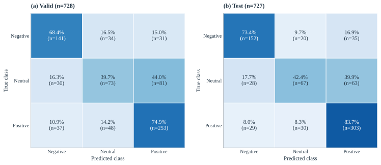

**图6 问题二 行归一化混淆矩阵。**每一行按真实类别样本数归一化，同时显示计数。颜色表示召回比例，不能把不同类别的格子计数直接当作比例比较。

| 类别 | 测试样本数 | Precision | Recall | F1 | 验证F1 |
| --- | --- | --- | --- | --- | --- |
| Negative | 207 | 0.7273 | 0.7343 | 0.7308 | 0.6812 |
| Neutral | 158 | 0.5726 | 0.4241 | 0.4873 | 0.4307 |
| Positive | 362 | 0.7556 | 0.8370 | 0.7942 | 0.7198 |

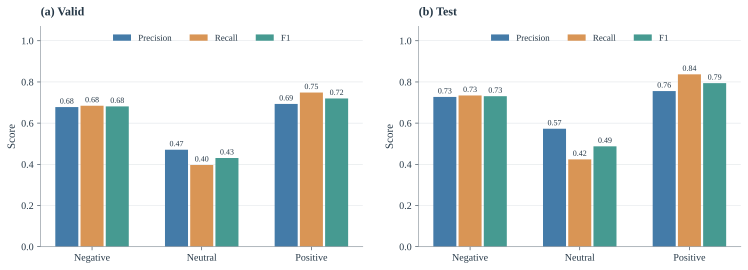

**图7 问题二 逐类精确率 召回率与F1。**使用同一量纲的分组柱状图，突出中性类的精确率和召回率同时不足。

**可用于论文的表述：**模型对正负极性的区分能力优于对中性的识别能力。中性相关错误占测试总错误的68.78%，且主要流向正面类；因此整体准确率之外，必须同时报告Macro-F1和逐类召回率。该现象在验证集和测试集上方向一致。

## A5 回归输出存在明显的强度压缩

测试回归Pearson r为0.6996，表明预测与真实强度有正相关，但相关性并不衡量数值尺度是否正确。以真实值为横轴、预测值为纵轴拟合诊断直线，验证与测试斜率分别约0.5144和0.4995，明显低于理想值1。这个结果与散点向中心压缩的形态一致：真实情绪越强，预测往往没有达到同样强度。

测试负面类平均真实强度为−1.3060，平均预测为−0.6702；正面类分别为1.0304和0.6097。模型在组平均意义上低估了正、负情绪的绝对强度。中性类平均预测为0.1350，表现出轻微正向偏移。诊断拟合不用于重新校正预测，也不构成一个新模型。

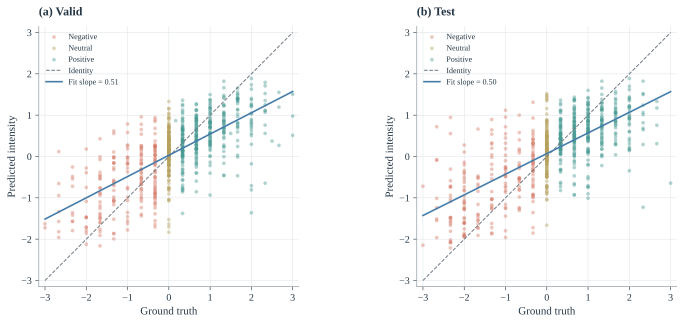

**图8 问题二 回归预测与强度收缩。**散点保留全部验证/测试样本，统一坐标；回归直线仅作为结果诊断，不用于修改任何预测。

| 测试类别 | 真实平均强度 | 预测平均强度 | 平均残差 | MAE |
| --- | --- | --- | --- | --- |
| Negative | -1.3060 | -0.6702 | 0.6357 | 0.7992 |
| Neutral | 0.0000 | 0.1350 | 0.1350 | 0.4109 |
| Positive | 1.0304 | 0.6097 | -0.4207 | 0.5891 |

整体测试平均残差仅0.00086，看似接近无偏，但负面类偏差+0.6357和正面类偏差−0.4207互相抵消。因此不能根据总体残差均值接近零写“模型无系统误差”。类别条件偏差比单一总体均值更能揭示强度预测的限制。

测试MAE为0.6102、RMSE为0.8271。RMSE更高表明尾部的大误差具有不可忽略的影响。绝对误差的中位数为0.4516，75%分位为0.8470，90%分位为1.3903，95%分位为1.6679。约一成样本的误差大于1.39个强度单位；若只报告均值，就会遗漏这部分情况。

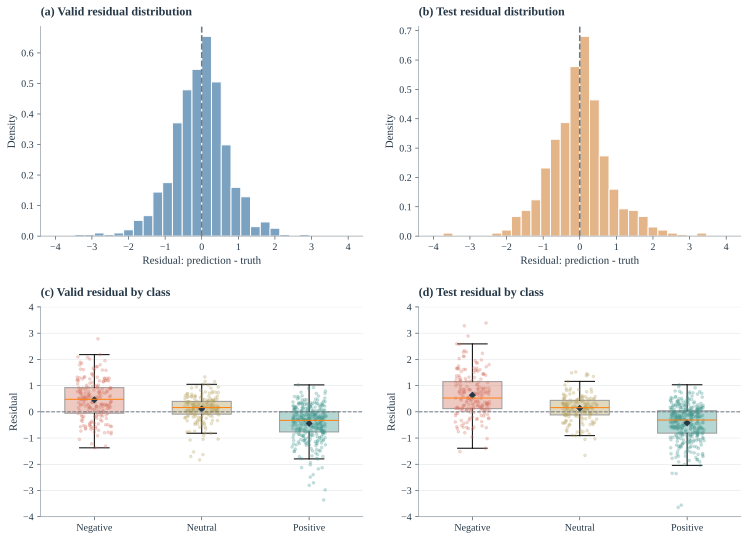

**图9 问题二 残差分布与类别方向性偏差。**残差定义为预测减真实。箱体为四分位区间，线为中位数，菱形为均值，散点展示样本；整体均值接近零可能掩盖类别间相反的偏差。

## A6 极性容易判对 并不代表强度容易估准

按真实强度绝对值分组可以同时看到两种趋势：从中性到较强极性，分类通常更容易；但强度较高时，MAE也更大。测试集在(1,2]区间的准确率达到90.96%，MAE仍为0.8083；在(2,3]区间，准确率83.67%，MAE上升至1.4432。强极性方向可以判断正确，数值幅度却可能被明显低估。

| 绝对真实强度 | 验证n | 验证Accuracy | 验证MAE | 测试n | 测试Accuracy | 测试MAE |
| --- | --- | --- | --- | --- | --- | --- |
| 0 | 184 | 39.67% | 0.3902 | 158 | 42.41% | 0.4109 |
| (0, 0.5] | 147 | 53.06% | 0.4648 | 130 | 65.38% | 0.3986 |
| (0.5, 1] | 198 | 72.73% | 0.4829 | 202 | 78.22% | 0.5158 |
| (1, 2] | 163 | 85.28% | 0.7983 | 188 | 90.96% | 0.8083 |
| (2, 3] | 36 | 91.67% | 1.4340 | 49 | 83.67% | 1.4432 |

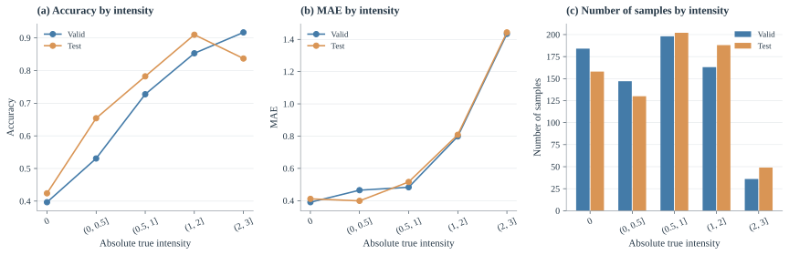

**图10 问题二 不同情感强度的分类与回归表现。**0单独代表中性类，其余区间合并正负两类。不同区间样本量同时展示；连线只用于比较分组，不表示连续函数拟合。

最强情绪区间样本数较少：验证36条、测试49条，其准确率的局部起伏不能直接解释为稳定规律。分组依据是真实强度，仅用于离线诊断；实际推理时不能根据未知真实强度选择不同处理策略。

## A7 分类概率是否可信

采用10个等宽概率箱，验证ECE为0.0767，测试ECE为0.0484；多类Brier分数分别为0.4712、0.4152，负对数似然为0.8124、0.7349。这些结果表明保存的测试概率在本批数据上比验证概率更接近经验正确率，但不能据此推广到新的场景。

验证集0.7–0.8置信度箱中，平均置信度约0.7522，实际正确率只有0.5728，是明显的局部过度自信。测试集低置信区间有些略偏保守，高置信区间则仍有过度自信。ECE会把不同方向、不同箱的差异汇总，且受分箱方案影响，不能单凭一个较小ECE值认定全部概率都可靠。

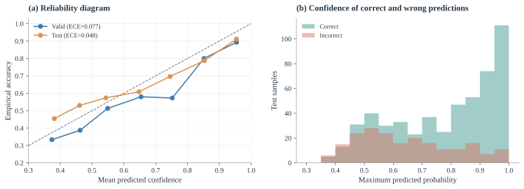

**图11 问题二 概率校准与高置信错误。**可靠性图使用10个等宽概率箱，仅绘制非空箱；ECE依赖分箱规则。较低ECE并不代表没有高置信度错误。

测试中置信度不低于0.8的330条预测仍有45条错误；不低于0.9的203条预测仍有18条错误。最强置信错误之一是 `ZS1Nb0OWYNE$_$15`：真实为Neutral，模型以0.9878的概率预测Positive，回归强度1.5209。这个案例说明概率很高也可能判断错误；本次没有原素材语义证据，不能为其编造原因。

### A7.1 提高阈值的代价是减少覆盖

按保存概率进行事后筛选，可以定量展示精度和覆盖率的权衡，但不能把筛选后的高准确率当作全体样本性能，也不能据测试结果确定部署阈值。

| 测试置信门槛 | 保留样本 | 覆盖率 | 保留样本正确率 | 仍错误 |
| --- | --- | --- | --- | --- |
| 0.7 | 419 | 57.63% | 82.82% | 72 |
| 0.8 | 330 | 45.39% | 86.36% | 45 |
| 0.9 | 203 | 27.92% | 91.13% | 18 |

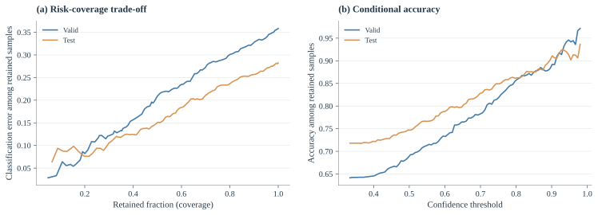

**图12 问题二 置信筛选的覆盖率与错误率权衡。**只分析现有概率排序，不部署或选择阈值。每个点至少保留15条样本；覆盖率下降意味着更多样本被拒绝，不能仅报告筛选后准确率。

例如门槛0.9时，正确率约91.13%，但只保留27.92%的样本，超过七成样本未被覆盖。这是“对少数高置信样本更准”，并不是“模型总体达到91%”。曲线末端样本更少，局部波动也更大。

### A7.2 排序能力与固定分类决策的区别

测试集Negative、Neutral、Positive的单类对其余类ROC-AUC分别为0.8942、0.7624、0.8498，AP分别为0.8078、0.4848、0.8194。中性类不仅在argmax决策下F1较低，概率排序也明显弱于其余两类，因此问题不只是简单的类别计数差异。

Neutral的AP仍高于其样本比例0.2173，说明其概率包含一定信息；但这不保证调阈值能够免费改善所有指标。AP受类别比例影响，不能把不同类AP直接当作在相同基准下的难度排名。ROC-AUC是二元排序指标，也不能替代三分类Accuracy。

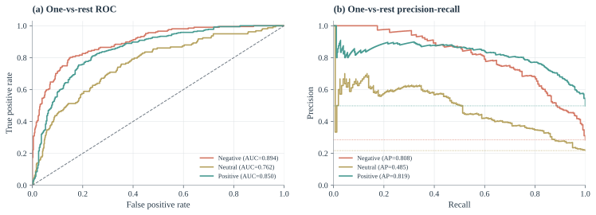

**图13 问题二 单类对其余类别的排序能力。**ROC与PR使用保存的三类概率；AP按召回增量加权精确率计算。PR中的水平虚线为各类样本比例。AUC不是三分类准确率。

## A8 历史实验之间有哪些可确认的差异

五份历史实验的测试预测按相同727条样本对齐后比较。下表是现存预测的描述性结果；实验间可能同时改变了结构、训练轮数、损失或校准方式，因此不使用“某一个组件带来全部提升”的因果语言。

| 实验 | Accuracy | Macro-F1 | MAE | RMSE | Pearson r |
| --- | --- | --- | --- | --- | --- |
| Legacy | 64.92% | 0.6162 | 0.6422 | 0.8864 | 0.6458 |
| Hybrid cosine | 64.92% | 0.5569 | 0.7014 | 0.9573 | 0.6260 |
| Hybrid ordinal | 66.44% | 0.6032 | 0.7386 | 0.9790 | 0.6553 |
| BERT AV reference | 71.80% | 0.6708 | 0.6102 | 0.8271 | 0.6996 |
| BERT AV history | 68.91% | 0.6583 | 0.6180 | 0.8622 | 0.6773 |

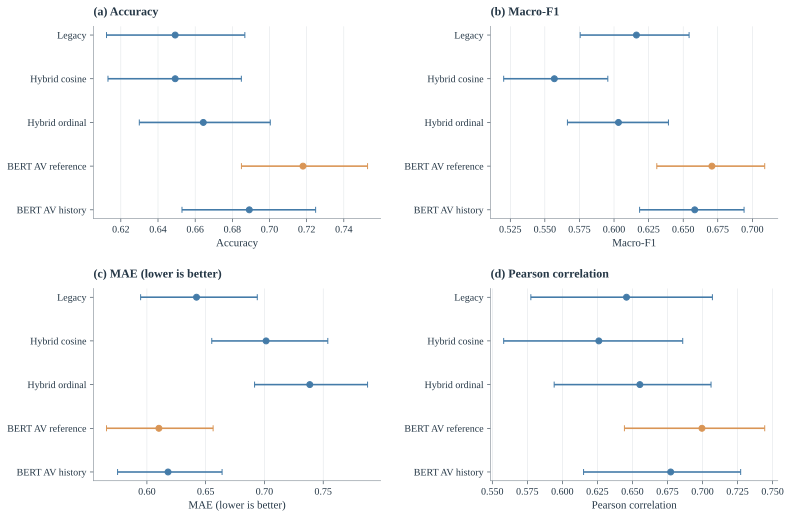

**图14 问题二 历史实验的多指标对比。**五份预测表对齐同一727条测试样本。区间使用同一video_id聚类自助抽样。历史实验设置不同，这是一组描述性比较，不是单因素消融。

参考模型的五个主要点估计在这组已保存实验中均较好。Legacy与Hybrid cosine的Accuracy同为64.92%，Macro-F1却相差约0.0593，说明相同总体准确率可能对应很不同的类别均衡程度。Hybrid ordinal准确率略高于Legacy，但MAE明显更高，进一步说明分类和回归目标之间不能只凭一个指标排序。

### A8.1 配对差异比独立区间更适合比较同批样本

相对Legacy，参考模型准确率增加6.88个百分点，配对95%区间约3.72–9.93个百分点；Macro-F1增加0.0546，区间0.0196–0.0909；MAE减少0.0320，差值区间为−0.0623至−0.0050。在固定预测、当前抽样假设下，三个区间都支持参考模型相对Legacy的有利方向。

逐样本看，参考模型相对Legacy新增判对92条，同时把Legacy判对的42条判错，净增加50条正确，即50/727=6.88个百分点。这比仅写“准确率提升”更具体，也说明参考模型并非在每个样本上都更好。

相对BERT AV history，参考准确率高2.89个百分点，配对区间约0.28–5.43个百分点；Macro-F1差值为0.0124，区间−0.0187至0.0433；MAE差值−0.0078，区间−0.0309至0.0158。后两项区间包含零，**现有结果不足以明确区分这两个固定模型在Macro-F1和MAE上的总体表现**。不能把点估计略高写成所有维度均稳定优于。

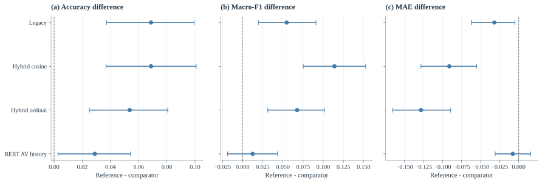

**图15 问题二 固定预测的配对差异区间。**同一轮聚类自助抽样同时用于参考模型和比较模型，保持样本配对。Accuracy/F1大于零有利于参考模型，MAE小于零有利于参考模型；不代表训练随机性或因果改进。

这些区间没有校正历史多次查看测试集带来的选择影响，也不是重复训练的显著性检验。准确表述应为“在保存的固定预测上，配对样本分析显示……”，避免扩大成算法普遍优越性的保证。

## A9 训练记录说明了什么

采用保存的30轮实测复现记录：参考窗口为前5轮，第2轮对应固定参考模型；第6–30轮是延长训练分析，完整记录的验证Macro-F1最高点在第16轮。这里绘制历史测量数据，不声称在本次重新训练，也不把这些轮次当作相互独立的实验重复。

| 轮次 | 训练Loss | 验证Loss | 训练Accuracy | 验证Accuracy | 训练Macro-F1 | 验证Macro-F1 | 训练MAE | 验证MAE |
| --- | --- | --- | --- | --- | --- | --- | --- | --- |
| 2 | 0.4237 | 0.8683 | 87.04% | 64.15% | 0.8474 | 0.6105 | 0.4401 | 0.5735 |
| 16 | 0.0081 | 2.7195 | 99.94% | 63.46% | 0.9994 | 0.6160 | 0.1352 | 0.5697 |
| 30 | 0.0061 | 3.3427 | 99.94% | 63.46% | 0.9994 | 0.5935 | 0.1132 | 0.5710 |

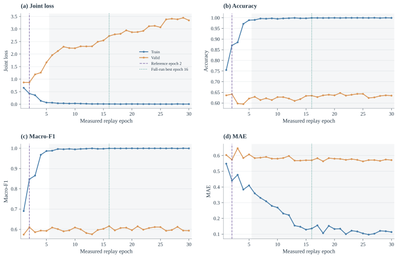

**图16 问题二 已记录复现训练过程。**使用保存的30轮实测复现记录；前5轮为参考实验窗口，阴影为延长训练。第2轮是固定参考，第16轮是完整记录中验证Macro-F1最高轮。不是丢失原日志的恢复，也不是新的训练实验。

第2轮后，训练准确率从87.04%继续提高到接近100%，训练MAE从0.4401降低到第30轮0.1132；验证准确率却大多在约0.60–0.65之间，验证MAE在0.57附近波动。训练与验证之间的差距明显扩大，支持过拟合的解释。

验证联合损失从第2轮0.8683上升至第30轮3.3427，而准确率没有同比例下降。这并不矛盾：Accuracy只看最大概率类别是否正确，交叉熵还惩罚“非常自信地判错”。已有记录显示后期分类损失增大，因此与错误预测越来越自信相容；但没有每一轮逐样本概率，不能进一步给出逐轮ECE或确认每个样本的置信度轨迹。

第16轮验证Macro-F1比第2轮只高约0.0054，说明“验证指标完全没有任何后期改善”也过于绝对。更准确的结论是：继续训练大幅改善了训练拟合，但验证收益很小且不稳定，训练损失的持续下降不能作为泛化改善的证据。

## A10 分类头与回归输出的关系

测试数据中预测为Negative的强度大多小于零，预测Positive的大多大于零，中性预测聚集在零附近。这说明两个输出总体方向协调。但仍有10条存在明显符号冲突：分类为负面而回归值为正，或分类为正面而回归值为负，占测试样本1.38%；验证集也为10条。

连续回归值几乎不会恰好等于零，因此本报告没有擅自把“预测强度不等于零”算作中性预测冲突，也没有人为选择一个中性阈值。对分类和回归一致性的判断需要明确阈值规则，不能通过事后自由设定来优化结果。

测试分类概率的归一化熵与绝对回归误差之间Spearman相关系数约−0.0602，接近零。说明低分类不确定性并不自动对应低强度误差。一个样本可能极性非常明显但强度被压缩，因而分类置信度高、回归误差仍大。

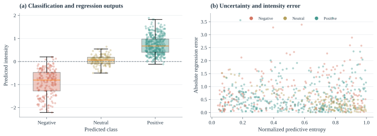

**图17 问题二 分类与回归输出的一致性。**不人为为回归建立中性阈值，仅统计预测负面但强度为正、预测正面但强度为负的明显符号冲突；熵与绝对误差的相关性是描述性统计。

## A11 附件三 全量预测与格式间差异

aligned输出30条样本，Negative/Neutral/Positive分别为6/7/17，预测强度范围−0.9567至1.4138，最大类别概率中位数为0.6899。概率堆叠图显示哪些样本类别占优明显、哪些位于边界；它比只给最终标签保留了更多信息。

例如sample_09和sample_16有较高的正向强度预测；sample_05是较强的负向预测。这里“较强”仅相对于这30条模型输出，不代表真实情感已经得到确认。附件三没有真实标签，不能为其计算Accuracy、F1、MAE或把预测类别比例当作真实类别比例。

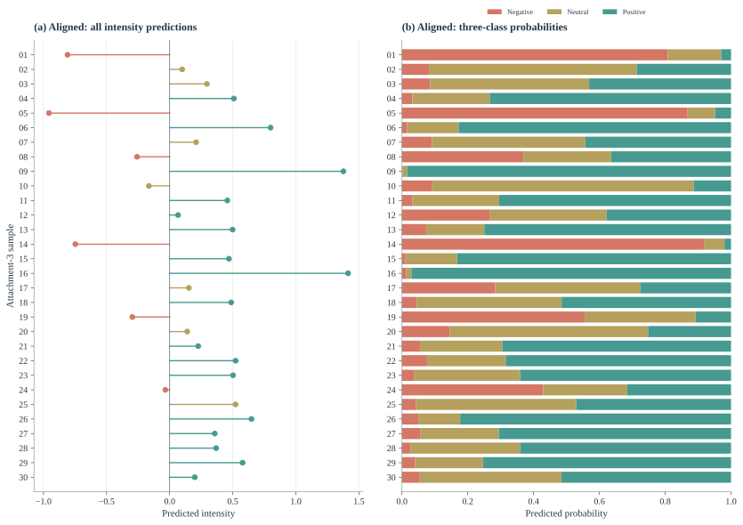

**图18 附件三 aligned 全量预测。**展示30条样本的强度及三类概率。无真实标签，因此只能分析预测分布、置信度和边界样本，不能给出准确率或鲁棒性结论。

两份历史格式输出中，类别一致26/30条，一致率86.67%；回归强度平均绝对差0.2228，有符号均差约+0.0989（unaligned减aligned）。4条类别变化全部转向Positive：sample_07、17、25从Neutral转向Positive，sample_24从Negative转向Positive。

| 样本 | aligned类别 | unaligned类别 | aligned强度 | unaligned强度 |
| --- | --- | --- | --- | --- |
| sample_07 | Neutral | Positive | 0.2093 | 0.3703 |
| sample_17 | Neutral | Positive | 0.1523 | 0.6079 |
| sample_24 | Negative | Positive | -0.0345 | 0.6456 |
| sample_25 | Neutral | Positive | 0.5216 | 0.7489 |

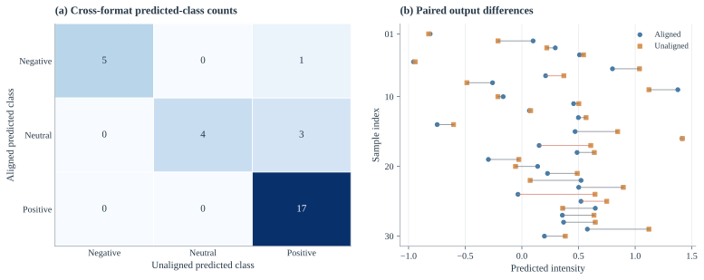

**图19 附件三 两种既有输出的描述性比较。**只比较两份历史输出。同编号配对的一致性不是准确率；格式和预处理不同，不能据此归因于单一模态缺失或判断哪个版本更优。

sample_24从约−0.0345变为+0.6456，是值得报告的跨极性输出差异。由于格式及其历史预处理不同，该差异不能被归因为某一个模态缺失，更不能说明后一种预测更正确。此处只做已有输出的一致性分析，不将两套30条当作60条独立有标签测试样本。

## A12 模型是否在同一批样本上失败

五份预测共有113条样本被所有模型判错，占测试集15.54%；至少有一个模型判错的样本为389条，占53.51%。错误高度重叠但并不完全相同，这说明存在一批较稳定的共同难例，也存在模型间的差异化错误。

参考模型与BERT AV history的错误集合Jaccard系数为0.6082；与Legacy为0.5488。Jaccard比较的是交集占并集比例，不是正确率，也不是两个模型的全部预测一致率。误差CDF则展示回归误差的完整分布，参考模型相对部分旧实验在较小误差范围内更有利，但曲线并非处处严格支配其他模型。

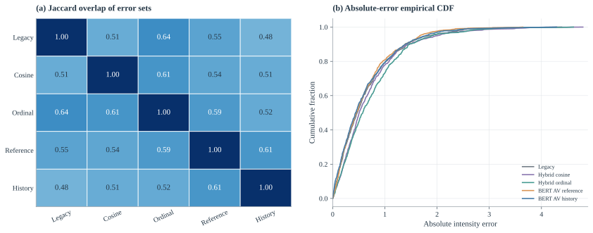

**图20 问题二 不同实验的错误重叠与误差累积分布。**错误交并比刻画相同难例的重叠；误差CDF越靠左上，表示更多样本具有较小误差。未训练或评估任何新集成模型。

错误的互补性可以为后续研究提供线索，但本次没有训练、选择或测试任何集成模型，因此不报告“集成后可达到某个准确率”。特别不能用知道真实标签后逐样本选择正确模型的理想结果，冒充可实现的性能。

## A13 代表性错误案例

下面仅对保存数据作定量描述，不编造文本、语音或表情解释。

| 划分与样本 | 已知事实 | 可以支持的结论 |
|---|---|---|
| 验证 `x2lOwQaAn4g$_$4` | 真实Neutral；以0.9832概率预测Positive；强度预测1.3323 | 存在高度自信的中性误判 |
| 验证 `f_ZJ7L14oYQ$_$21` | 真实强度2.0000；预测−1.3614；负面概率0.9791 | 高置信极性反转且回归误差大 |
| 测试 `91844$_$5` | 真实强度3.0000；预测−0.6438；绝对误差3.6438 | 尾部大误差对RMSE影响明显 |
| 测试 `198112$_$9` | 真实强度2.3333；预测−1.2262；负面概率0.9581 | 分类高置信不能排除强度大误差 |
| 测试 `ZS1Nb0OWYNE$_$15` | 真实Neutral；以0.9878概率预测Positive | 概率校准均值不能保证单样本可靠 |

完整验证和测试逐样本诊断已保存为CSV，包含ID、真实/预测类别、真实/预测强度、残差、绝对误差、置信度和归一化熵。可以用于后续人工查看素材，但仅凭这些数值不能判定讽刺、转写错误、视觉遮挡或标签质量。

## 二、问题二：新增受控缺失实验的逐图分析

## 图21 新增鲁棒性实验的覆盖范围

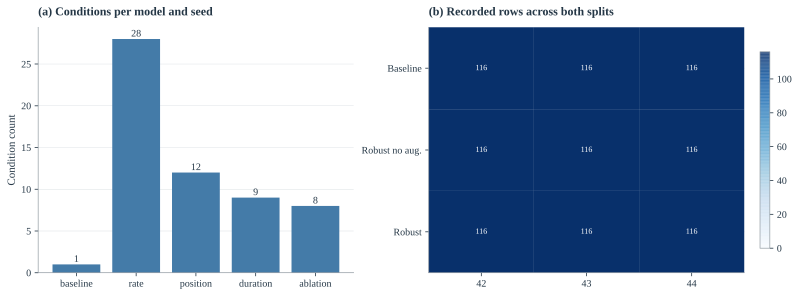

**数据来源与统计口径：**condition_metrics.csv，1044行；3模型×3种子×2划分×58条件。

每个模型与种子都有58个条件：完整输入1个、缺失率28个、位置12个、时长9个、全模态消融8个。验证和测试分别使用728、727条带标签样本。图中每格116行是条件数乘以两个划分，不是116次独立训练。

消融中还含一个完整输入对照，与baseline组重复，核对指标一致；汇总所有条件时将其去重，得到57个独特条件，其中56个为缺失条件。缺失率、位置和时长采用分组设计，并非全部因素的完整笛卡尔积，不能据此估计任意高阶交互。

相较上次结果，当前已具备分析局部缺失规律和训练随机性的数据依据。误差线统一使用3个种子的样本标准差（ddof=1），不称为95%置信区间；同一种子下不同条件也不能当作独立样本扩大显著性。

## 图22 完整输入下的多种子性能与稳定性

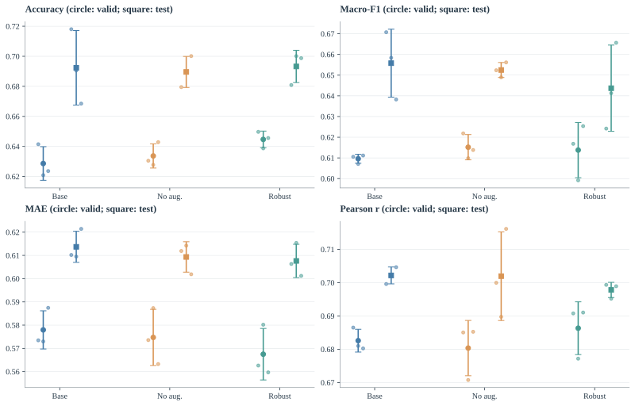

**数据来源与统计口径：**完整输入，3个种子；点为单次训练，误差线为种子样本标准差。

本图将单次最优结果与跨种子表现分开。旧参考模型对应baseline的seed 42，不能把其71.80%测试准确率当作baseline跨种子均值。下表同时列出两个划分的四项赛题指标。

比较Robust与No aug.可以观察加入训练缺失增强后的变化，比较No aug.与Baseline反映可用性感知架构及相关配置的整体差异。完整输入性能的提升或下降只说明完整输入代价；是否获得鲁棒性，需要结合后续缺失条件。三种子足以提供初步波动范围，但不足以证明普遍稳定。

**数值结论。**测试集Baseline、No aug.、Robust的跨种子Macro-F1依次为0.6558、0.6525、0.6437，Robust并未获得完整输入下最高的F1；MAE依次为0.6137、0.6093、0.6076，Robust的回归误差较低。测试准确率均值为69.23%、68.96%、69.33%，差异很小且需结合种子波动。Baseline准确率标准差约2.48个百分点，而Robust约1.07个百分点；但F1标准差分别0.0164与0.0208，不能泛称Robust所有指标都更稳定。

| split | model | accuracy | accuracy_sd | macro_f1 | macro_f1_sd | mae | mae_sd | pearson | pearson_sd |
| --- | --- | --- | --- | --- | --- | --- | --- | --- | --- |
| valid | baseline | 0.6287 | 0.0112 | 0.6096 | 0.0022 | 0.5780 | 0.0082 | 0.6826 | 0.0034 |
| valid | robust_noaug | 0.6337 | 0.0080 | 0.6152 | 0.0061 | 0.5747 | 0.0121 | 0.6804 | 0.0083 |
| valid | robust | 0.6447 | 0.0056 | 0.6138 | 0.0134 | 0.5675 | 0.0111 | 0.6863 | 0.0079 |
| test | baseline | 0.6923 | 0.0248 | 0.6558 | 0.0164 | 0.6137 | 0.0067 | 0.7022 | 0.0025 |
| test | robust_noaug | 0.6896 | 0.0103 | 0.6525 | 0.0036 | 0.6093 | 0.0066 | 0.7020 | 0.0133 |
| test | robust | 0.6933 | 0.0107 | 0.6437 | 0.0208 | 0.6076 | 0.0072 | 0.6978 | 0.0023 |

## 图23 验证集局部缺失率对Macro-F1的影响

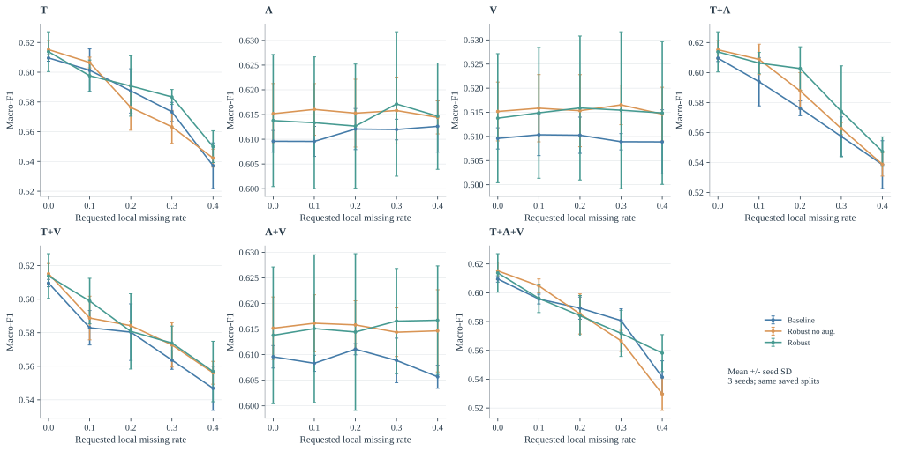

**数据来源与统计口径：**rate组，7种模态组合×4个非零缺失率×3模型×3种子；零点取完整输入。

曲线从完整输入延伸至请求缺失率0.4，图中T/A/V分别表示文本/语音/视觉。误差线为跨种子标准差，保留非单调结果；没有对曲线作平滑或强制下降。基线端点变化幅度最大的组合是T，Macro-F1由0.6096变为0.5371，差值-0.0725。该组合0.4端点表现最好的模型为robust，值为0.5500。

应在同一模态组合、同一请求缺失率下比较模型，不能用不同面板的横向位置替代相同实际信息损失。全局缺失率的分母含三个模态全部有效bin，因此文本缺失30%并不等于总信息缺失30%。下表报告全部端点，帮助区分对文本损伤敏感与对音视频损伤敏感的情况。

验证集用于建模选择，测试集用于描述最终泛化；本报告不据测试曲线重新挑选训练轮次或阈值。分类与回归曲线需共同判断，F1提升不自动意味着强度MAE下降。

**验证规律。**本图可用于建模阶段识别敏感因素；音频或视觉局部缺失的曲线通常接近完整输入，而包含文本的组合下降更明显。不同种子的误差线可能相互重叠，因此不以某个均值点略高就宣称显著优越。必须同时看图24，识别这种趋势是否延续到测试集。

| modalities | model | at_0 | at_0.4 | change | sd_at_0.4 |
| --- | --- | --- | --- | --- | --- |
| T | baseline | 0.6096 | 0.5371 | -0.0725 | 0.0153 |
| T | robust_noaug | 0.6152 | 0.5423 | -0.0729 | 0.0061 |
| T | robust | 0.6138 | 0.5500 | -0.0638 | 0.0107 |
| A | baseline | 0.6096 | 0.6126 | 0.0030 | 0.0052 |
| A | robust_noaug | 0.6152 | 0.6144 | -0.0007 | 0.0034 |
| A | robust | 0.6138 | 0.6147 | 0.0009 | 0.0108 |
| V | baseline | 0.6096 | 0.6089 | -0.0007 | 0.0066 |
| V | robust_noaug | 0.6152 | 0.6146 | -0.0006 | 0.0056 |
| V | robust | 0.6138 | 0.6149 | 0.0011 | 0.0148 |
| T+A | baseline | 0.6096 | 0.5386 | -0.0710 | 0.0159 |
| T+A | robust_noaug | 0.6152 | 0.5388 | -0.0764 | 0.0078 |
| T+A | robust | 0.6138 | 0.5473 | -0.0665 | 0.0098 |
| T+V | baseline | 0.6096 | 0.5469 | -0.0627 | 0.0132 |
| T+V | robust_noaug | 0.6152 | 0.5561 | -0.0590 | 0.0068 |
| T+V | robust | 0.6138 | 0.5569 | -0.0569 | 0.0180 |
| A+V | baseline | 0.6096 | 0.6057 | -0.0039 | 0.0023 |
| A+V | robust_noaug | 0.6152 | 0.6147 | -0.0005 | 0.0080 |
| A+V | robust | 0.6138 | 0.6167 | 0.0029 | 0.0106 |
| T+A+V | baseline | 0.6096 | 0.5414 | -0.0682 | 0.0114 |
| T+A+V | robust_noaug | 0.6152 | 0.5297 | -0.0855 | 0.0113 |
| T+A+V | robust | 0.6138 | 0.5581 | -0.0557 | 0.0128 |

## 图24 测试集局部缺失率对Macro-F1的影响

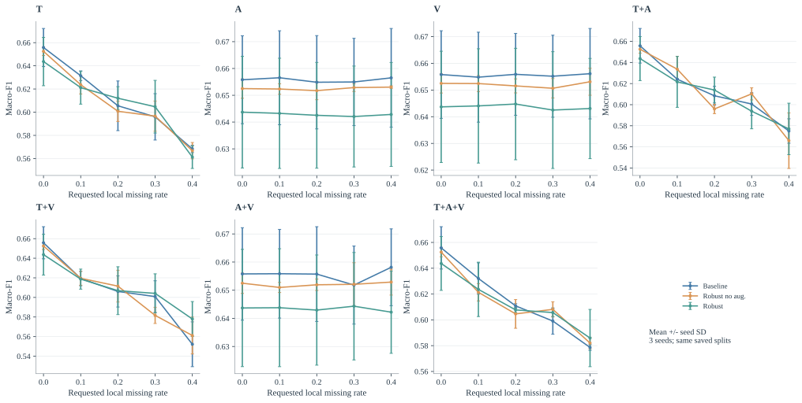

**数据来源与统计口径：**rate组，7种模态组合×4个非零缺失率×3模型×3种子；零点取完整输入。

曲线从完整输入延伸至请求缺失率0.4，图中T/A/V分别表示文本/语音/视觉。误差线为跨种子标准差，保留非单调结果；没有对曲线作平滑或强制下降。基线端点变化幅度最大的组合是T+V，Macro-F1由0.6558变为0.5522，差值-0.1036。该组合0.4端点表现最好的模型为robust，值为0.5780。

应在同一模态组合、同一请求缺失率下比较模型，不能用不同面板的横向位置替代相同实际信息损失。全局缺失率的分母含三个模态全部有效bin，因此文本缺失30%并不等于总信息缺失30%。下表报告全部端点，帮助区分对文本损伤敏感与对音视频损伤敏感的情况。

验证集用于建模选择，测试集用于描述最终泛化；本报告不据测试曲线重新挑选训练轮次或阈值。分类与回归曲线需共同判断，F1提升不自动意味着强度MAE下降。

**测试规律。**文本缺失40%时，Baseline的F1从0.6558降至0.5683，Robust从0.6437降至0.5613。Robust相对自身基线的降幅更小，但该端点绝对F1仍低于Baseline，说明“退化更少”与“结果更好”不能混用。T+V缺失40%时Robust为0.5780、Baseline为0.5522，差约0.0258；这才是明确的特定条件收益。单独A、V或A+V缺失时基线变化小于约0.003，不支持“任一模态局部缺失均导致严重崩溃”的写法。

| modalities | model | at_0 | at_0.4 | change | sd_at_0.4 |
| --- | --- | --- | --- | --- | --- |
| T | baseline | 0.6558 | 0.5683 | -0.0875 | 0.0032 |
| T | robust_noaug | 0.6525 | 0.5668 | -0.0857 | 0.0071 |
| T | robust | 0.6437 | 0.5613 | -0.0824 | 0.0098 |
| A | baseline | 0.6558 | 0.6565 | 0.0007 | 0.0184 |
| A | robust_noaug | 0.6525 | 0.6530 | 0.0006 | 0.0005 |
| A | robust | 0.6437 | 0.6428 | -0.0009 | 0.0194 |
| V | baseline | 0.6558 | 0.6561 | 0.0003 | 0.0169 |
| V | robust_noaug | 0.6525 | 0.6531 | 0.0006 | 0.0051 |
| V | robust | 0.6437 | 0.6431 | -0.0006 | 0.0188 |
| T+A | baseline | 0.6558 | 0.5750 | -0.0808 | 0.0116 |
| T+A | robust_noaug | 0.6525 | 0.5659 | -0.0866 | 0.0264 |
| T+A | robust | 0.6437 | 0.5770 | -0.0667 | 0.0244 |
| T+V | baseline | 0.6558 | 0.5522 | -0.1036 | 0.0229 |
| T+V | robust_noaug | 0.6525 | 0.5611 | -0.0914 | 0.0188 |
| T+V | robust | 0.6437 | 0.5780 | -0.0657 | 0.0178 |
| A+V | baseline | 0.6558 | 0.6582 | 0.0024 | 0.0136 |
| A+V | robust_noaug | 0.6525 | 0.6529 | 0.0004 | 0.0046 |
| A+V | robust | 0.6437 | 0.6422 | -0.0015 | 0.0146 |
| T+A+V | baseline | 0.6558 | 0.5786 | -0.0772 | 0.0022 |
| T+A+V | robust_noaug | 0.6525 | 0.5820 | -0.0705 | 0.0043 |
| T+A+V | robust | 0.6437 | 0.5859 | -0.0578 | 0.0222 |

## 图25 验证集局部缺失率对MAE的影响

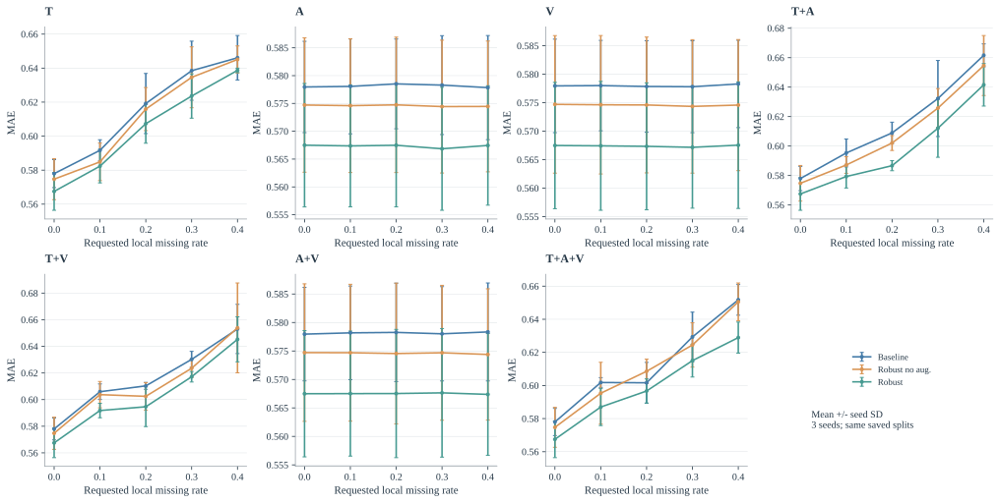

**数据来源与统计口径：**rate组，7种模态组合×4个非零缺失率×3模型×3种子；零点取完整输入。

曲线从完整输入延伸至请求缺失率0.4，图中T/A/V分别表示文本/语音/视觉。误差线为跨种子标准差，保留非单调结果；没有对曲线作平滑或强制下降。基线端点变化幅度最大的组合是T+A，MAE由0.5780变为0.6616，差值+0.0836。该组合0.4端点表现最好的模型为robust，值为0.6416。

应在同一模态组合、同一请求缺失率下比较模型，不能用不同面板的横向位置替代相同实际信息损失。全局缺失率的分母含三个模态全部有效bin，因此文本缺失30%并不等于总信息缺失30%。下表报告全部端点，帮助区分对文本损伤敏感与对音视频损伤敏感的情况。

验证集用于建模选择，测试集用于描述最终泛化；本报告不据测试曲线重新挑选训练轮次或阈值。分类与回归曲线需共同判断，F1提升不自动意味着强度MAE下降。

**分类回归需分开解释。**MAE越小越好，与F1纵轴方向相反。验证曲线用来观察损伤增大后的强度估计偏差；某条曲线轻微下降可能来自随机遮挡或噪声信息被去除，并不能仅凭这个现象宣称缺失本身有益。对照图23能够发现同一训练增强是否主要帮助回归而非分类。

| modalities | model | at_0 | at_0.4 | change | sd_at_0.4 |
| --- | --- | --- | --- | --- | --- |
| T | baseline | 0.5780 | 0.6461 | 0.0681 | 0.0131 |
| T | robust_noaug | 0.5747 | 0.6451 | 0.0704 | 0.0080 |
| T | robust | 0.5675 | 0.6387 | 0.0712 | 0.0013 |
| A | baseline | 0.5780 | 0.5778 | -0.0001 | 0.0094 |
| A | robust_noaug | 0.5747 | 0.5745 | -0.0003 | 0.0118 |
| A | robust | 0.5675 | 0.5674 | -0.0000 | 0.0107 |
| V | baseline | 0.5780 | 0.5783 | 0.0003 | 0.0077 |
| V | robust_noaug | 0.5747 | 0.5746 | -0.0001 | 0.0115 |
| V | robust | 0.5675 | 0.5676 | 0.0001 | 0.0111 |
| T+A | baseline | 0.5780 | 0.6616 | 0.0836 | 0.0078 |
| T+A | robust_noaug | 0.5747 | 0.6547 | 0.0799 | 0.0203 |
| T+A | robust | 0.5675 | 0.6416 | 0.0741 | 0.0144 |
| T+V | baseline | 0.5780 | 0.6531 | 0.0751 | 0.0185 |
| T+V | robust_noaug | 0.5747 | 0.6538 | 0.0791 | 0.0338 |
| T+V | robust | 0.5675 | 0.6452 | 0.0778 | 0.0169 |
| A+V | baseline | 0.5780 | 0.5783 | 0.0004 | 0.0086 |
| A+V | robust_noaug | 0.5747 | 0.5744 | -0.0003 | 0.0115 |
| A+V | robust | 0.5675 | 0.5674 | -0.0001 | 0.0107 |
| T+A+V | baseline | 0.5780 | 0.6517 | 0.0738 | 0.0092 |
| T+A+V | robust_noaug | 0.5747 | 0.6505 | 0.0758 | 0.0114 |
| T+A+V | robust | 0.5675 | 0.6289 | 0.0614 | 0.0094 |

## 图26 测试集局部缺失率对MAE的影响

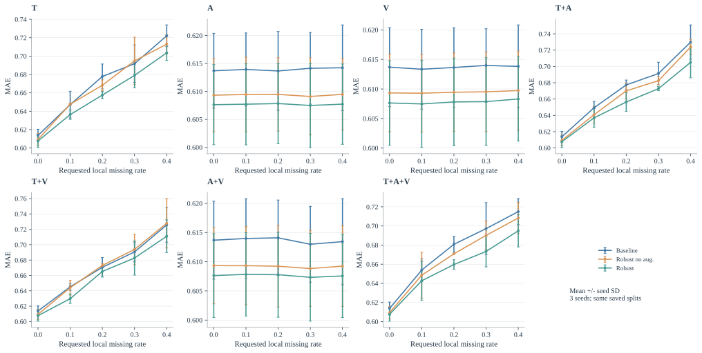

**数据来源与统计口径：**rate组，7种模态组合×4个非零缺失率×3模型×3种子；零点取完整输入。

曲线从完整输入延伸至请求缺失率0.4，图中T/A/V分别表示文本/语音/视觉。误差线为跨种子标准差，保留非单调结果；没有对曲线作平滑或强制下降。基线端点变化幅度最大的组合是T+A，MAE由0.6137变为0.7298，差值+0.1161。该组合0.4端点表现最好的模型为robust，值为0.7051。

应在同一模态组合、同一请求缺失率下比较模型，不能用不同面板的横向位置替代相同实际信息损失。全局缺失率的分母含三个模态全部有效bin，因此文本缺失30%并不等于总信息缺失30%。下表报告全部端点，帮助区分对文本损伤敏感与对音视频损伤敏感的情况。

验证集用于建模选择，测试集用于描述最终泛化；本报告不据测试曲线重新挑选训练轮次或阈值。分类与回归曲线需共同判断，F1提升不自动意味着强度MAE下降。

**与全局结论的联系。**图32的49个局部缺失条件等权汇总表明，测试MAE由Baseline的0.6494降低到Robust的0.6379；相对No aug.的0.6456也有下降。这个平均优势不能代替所有单独组合的检查，表中保留每个40%端点和跨种子波动。后续图31进一步说明回归改进在各局部条件族的三个种子中具有较一致方向。

| modalities | model | at_0 | at_0.4 | change | sd_at_0.4 |
| --- | --- | --- | --- | --- | --- |
| T | baseline | 0.6137 | 0.7221 | 0.1084 | 0.0118 |
| T | robust_noaug | 0.6093 | 0.7131 | 0.1037 | 0.0106 |
| T | robust | 0.6076 | 0.7036 | 0.0960 | 0.0084 |
| A | baseline | 0.6137 | 0.6142 | 0.0005 | 0.0077 |
| A | robust_noaug | 0.6093 | 0.6095 | 0.0001 | 0.0064 |
| A | robust | 0.6076 | 0.6077 | 0.0001 | 0.0072 |
| V | baseline | 0.6137 | 0.6138 | 0.0001 | 0.0070 |
| V | robust_noaug | 0.6093 | 0.6097 | 0.0004 | 0.0067 |
| V | robust | 0.6076 | 0.6083 | 0.0007 | 0.0071 |
| T+A | baseline | 0.6137 | 0.7298 | 0.1161 | 0.0211 |
| T+A | robust_noaug | 0.6093 | 0.7238 | 0.1144 | 0.0090 |
| T+A | robust | 0.6076 | 0.7051 | 0.0974 | 0.0190 |
| T+V | baseline | 0.6137 | 0.7258 | 0.1121 | 0.0226 |
| T+V | robust_noaug | 0.6093 | 0.7278 | 0.1185 | 0.0322 |
| T+V | robust | 0.6076 | 0.7110 | 0.1034 | 0.0213 |
| A+V | baseline | 0.6137 | 0.6134 | -0.0002 | 0.0074 |
| A+V | robust_noaug | 0.6093 | 0.6093 | -0.0001 | 0.0069 |
| A+V | robust | 0.6076 | 0.6076 | -0.0001 | 0.0071 |
| T+A+V | baseline | 0.6137 | 0.7150 | 0.1013 | 0.0136 |
| T+A+V | robust_noaug | 0.6093 | 0.7083 | 0.0990 | 0.0163 |
| T+A+V | robust | 0.6076 | 0.6950 | 0.0873 | 0.0169 |

## 图27 缺失位置对分类性能的影响

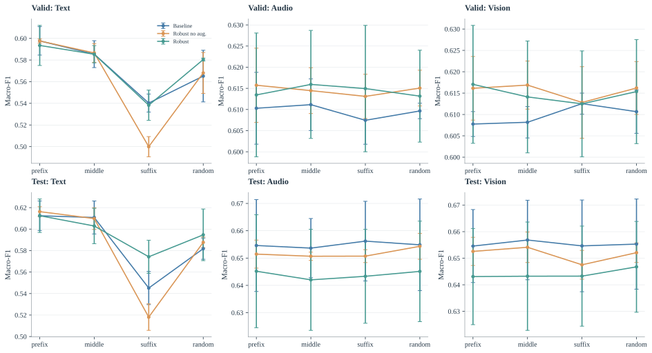

**数据来源与统计口径：**请求缺失率固定0.3；仅单模态；分别按位置或连续块时长分组；3种子。

这一组比较直接回应题目对缺失位置的要求。横轴是离散实验设置，连线用于同一模型组内比较，不是连续函数。下表同时给出MAE和全局实际缺失率，便于检查名义上相同缺失率是否对应相近损伤。

前段、中段、后段与随机缺失表现的差异，只能说明当前条件下模型对时序分布敏感。未结合逐样本语义和真实词时间戳时，不能把“前段更重要”解释成所有视频的开头都含决定性情绪。

各组观察范围：

- valid/baseline/text：suffix 0.5402 至 prefix 0.5977（差0.0574）
- valid/baseline/audio：suffix 0.6074 至 middle 0.6111（差0.0037）
- valid/baseline/vision：prefix 0.6078 至 suffix 0.6125（差0.0048）
- valid/robust_noaug/text：suffix 0.5000 至 prefix 0.5976（差0.0976）
- valid/robust_noaug/audio：suffix 0.6131 至 prefix 0.6157（差0.0026）
- valid/robust_noaug/vision：suffix 0.6128 至 middle 0.6169（差0.0041）
- valid/robust/text：suffix 0.5382 至 prefix 0.5935（差0.0552）
- valid/robust/audio：random 0.6132 至 middle 0.6159（差0.0028）
- valid/robust/vision：suffix 0.6125 至 prefix 0.6171（差0.0046）
- test/baseline/text：suffix 0.5451 至 prefix 0.6124（差0.0673）
- test/baseline/audio：middle 0.6536 至 suffix 0.6562（差0.0026）
- test/baseline/vision：prefix 0.6546 至 middle 0.6569（差0.0023）
- test/robust_noaug/text：suffix 0.5181 至 prefix 0.6162（差0.0982）
- test/robust_noaug/audio：middle 0.6507 至 random 0.6543（差0.0036）
- test/robust_noaug/vision：suffix 0.6475 至 middle 0.6541（差0.0066）
- test/robust/text：suffix 0.5742 至 prefix 0.6124（差0.0382）
- test/robust/audio：middle 0.6420 至 prefix 0.6452（差0.0031）
- test/robust/vision：prefix 0.6431 至 random 0.6468（差0.0037）

**最值得报告的位置效应。**测试集文本缺失30%时，Baseline前段/中段/后段/随机的F1依次为0.6124、0.6108、0.5451、0.5818，后段明显较弱。No aug.后段F1为0.5181，Robust提升至0.5742，增量0.0562；对应MAE从0.7755降至0.7117。该收益集中于文本后段缺失，不能扩大为所有模态位置均受益。验证集也存在文本后段较弱的现象，为趋势提供了跨划分对应证据。

| split | modality | model | position | macro_f1 | sd | mae | effective_total_rate |
| --- | --- | --- | --- | --- | --- | --- | --- |
| valid | text | baseline | prefix | 0.5977 | 0.0131 | 0.6155 | 0.1071 |
| valid | text | baseline | middle | 0.5854 | 0.0124 | 0.6280 | 0.1071 |
| valid | text | baseline | suffix | 0.5402 | 0.0083 | 0.6717 | 0.1071 |
| valid | text | baseline | random | 0.5652 | 0.0238 | 0.6369 | 0.1071 |
| valid | text | robust_noaug | prefix | 0.5976 | 0.0021 | 0.6067 | 0.1071 |
| valid | text | robust_noaug | middle | 0.5866 | 0.0087 | 0.6210 | 0.1071 |
| valid | text | robust_noaug | suffix | 0.5000 | 0.0093 | 0.7058 | 0.1071 |
| valid | text | robust_noaug | random | 0.5681 | 0.0189 | 0.6361 | 0.1071 |
| valid | text | robust | prefix | 0.5935 | 0.0185 | 0.6037 | 0.1071 |
| valid | text | robust | middle | 0.5853 | 0.0080 | 0.6124 | 0.1071 |
| valid | text | robust | suffix | 0.5382 | 0.0140 | 0.6435 | 0.1071 |
| valid | text | robust | random | 0.5805 | 0.0013 | 0.6227 | 0.1071 |
| valid | audio | baseline | prefix | 0.6103 | 0.0085 | 0.5784 | 0.0988 |
| valid | audio | baseline | middle | 0.6111 | 0.0061 | 0.5784 | 0.0988 |
| valid | audio | baseline | suffix | 0.6074 | 0.0057 | 0.5772 | 0.0988 |
| valid | audio | baseline | random | 0.6097 | 0.0018 | 0.5782 | 0.0988 |
| valid | audio | robust_noaug | prefix | 0.6157 | 0.0088 | 0.5747 | 0.0988 |
| valid | audio | robust_noaug | middle | 0.6145 | 0.0054 | 0.5749 | 0.0988 |
| valid | audio | robust_noaug | suffix | 0.6131 | 0.0052 | 0.5739 | 0.0988 |
| valid | audio | robust_noaug | random | 0.6151 | 0.0042 | 0.5744 | 0.0988 |
| valid | audio | robust | prefix | 0.6135 | 0.0146 | 0.5671 | 0.0988 |
| valid | audio | robust | middle | 0.6159 | 0.0128 | 0.5677 | 0.0988 |
| valid | audio | robust | suffix | 0.6149 | 0.0149 | 0.5669 | 0.0988 |
| valid | audio | robust | random | 0.6132 | 0.0109 | 0.5671 | 0.0988 |
| valid | vision | baseline | prefix | 0.6078 | 0.0029 | 0.5785 | 0.0933 |
| valid | vision | baseline | middle | 0.6082 | 0.0037 | 0.5775 | 0.0933 |
| valid | vision | baseline | suffix | 0.6125 | 0.0025 | 0.5790 | 0.0933 |
| valid | vision | baseline | random | 0.6107 | 0.0051 | 0.5777 | 0.0933 |
| valid | vision | robust_noaug | prefix | 0.6161 | 0.0074 | 0.5748 | 0.0933 |
| valid | vision | robust_noaug | middle | 0.6169 | 0.0056 | 0.5744 | 0.0933 |
| valid | vision | robust_noaug | suffix | 0.6128 | 0.0084 | 0.5753 | 0.0933 |
| valid | vision | robust_noaug | random | 0.6162 | 0.0062 | 0.5748 | 0.0933 |
| valid | vision | robust | prefix | 0.6171 | 0.0138 | 0.5674 | 0.0933 |
| valid | vision | robust | middle | 0.6141 | 0.0131 | 0.5674 | 0.0933 |
| valid | vision | robust | suffix | 0.6125 | 0.0124 | 0.5680 | 0.0933 |
| valid | vision | robust | random | 0.6154 | 0.0122 | 0.5673 | 0.0933 |
| test | text | baseline | prefix | 0.6124 | 0.0137 | 0.6621 | 0.1075 |
| test | text | baseline | middle | 0.6108 | 0.0154 | 0.6768 | 0.1075 |
| test | text | baseline | suffix | 0.5451 | 0.0154 | 0.7560 | 0.1075 |
| test | text | baseline | random | 0.5818 | 0.0099 | 0.7075 | 0.1075 |
| test | text | robust_noaug | prefix | 0.6162 | 0.0046 | 0.6510 | 0.1075 |
| test | text | robust_noaug | middle | 0.6098 | 0.0101 | 0.6797 | 0.1075 |
| test | text | robust_noaug | suffix | 0.5181 | 0.0123 | 0.7755 | 0.1075 |
| test | text | robust_noaug | random | 0.5877 | 0.0049 | 0.7011 | 0.1075 |
| test | text | robust | prefix | 0.6124 | 0.0156 | 0.6397 | 0.1075 |
| test | text | robust | middle | 0.6029 | 0.0165 | 0.6700 | 0.1075 |
| test | text | robust | suffix | 0.5742 | 0.0154 | 0.7117 | 0.1075 |
| test | text | robust | random | 0.5946 | 0.0240 | 0.6880 | 0.1075 |
| test | audio | baseline | prefix | 0.6546 | 0.0168 | 0.6136 | 0.0988 |
| test | audio | baseline | middle | 0.6536 | 0.0108 | 0.6143 | 0.0988 |
| test | audio | baseline | suffix | 0.6562 | 0.0146 | 0.6144 | 0.0988 |
| test | audio | baseline | random | 0.6548 | 0.0168 | 0.6144 | 0.0988 |
| test | audio | robust_noaug | prefix | 0.6514 | 0.0051 | 0.6090 | 0.0988 |
| test | audio | robust_noaug | middle | 0.6507 | 0.0015 | 0.6092 | 0.0988 |
| test | audio | robust_noaug | suffix | 0.6507 | 0.0024 | 0.6101 | 0.0988 |
| test | audio | robust_noaug | random | 0.6543 | 0.0047 | 0.6093 | 0.0988 |
| test | audio | robust | prefix | 0.6452 | 0.0207 | 0.6071 | 0.0988 |
| test | audio | robust | middle | 0.6420 | 0.0185 | 0.6079 | 0.0988 |
| test | audio | robust | suffix | 0.6433 | 0.0172 | 0.6081 | 0.0988 |
| test | audio | robust | random | 0.6451 | 0.0184 | 0.6078 | 0.0988 |
| test | vision | baseline | prefix | 0.6546 | 0.0137 | 0.6137 | 0.0928 |
| test | vision | baseline | middle | 0.6569 | 0.0150 | 0.6138 | 0.0928 |
| test | vision | baseline | suffix | 0.6546 | 0.0173 | 0.6141 | 0.0928 |
| test | vision | baseline | random | 0.6553 | 0.0170 | 0.6137 | 0.0928 |
| test | vision | robust_noaug | prefix | 0.6526 | 0.0053 | 0.6092 | 0.0928 |
| test | vision | robust_noaug | middle | 0.6541 | 0.0057 | 0.6093 | 0.0928 |
| test | vision | robust_noaug | suffix | 0.6475 | 0.0054 | 0.6103 | 0.0928 |
| test | vision | robust_noaug | random | 0.6521 | 0.0037 | 0.6095 | 0.0928 |
| test | vision | robust | prefix | 0.6431 | 0.0181 | 0.6071 | 0.0928 |
| test | vision | robust | middle | 0.6432 | 0.0204 | 0.6080 | 0.0928 |
| test | vision | robust | suffix | 0.6433 | 0.0188 | 0.6080 | 0.0928 |
| test | vision | robust | random | 0.6468 | 0.0171 | 0.6077 | 0.0928 |

## 图28 缺失连续块时长对分类性能的影响

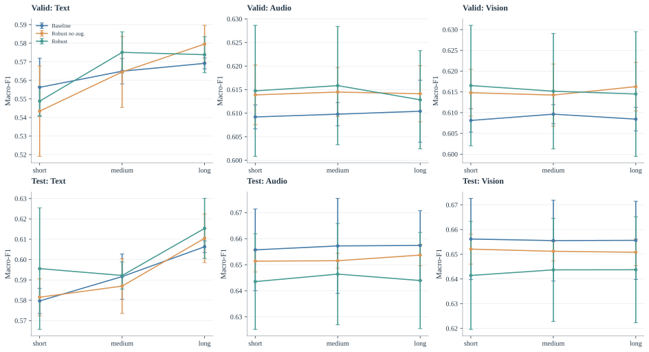

**数据来源与统计口径：**请求缺失率固定0.3；仅单模态；分别按位置或连续块时长分组；3种子。

这一组比较直接回应题目对缺失时长的要求。横轴是离散实验设置，连线用于同一模型组内比较，不是连续函数。下表同时给出MAE和全局实际缺失率，便于检查名义上相同缺失率是否对应相近损伤。

short/medium/long表示缺失连续块的设置，不是视频秒数。总请求缺失率相同而块长度不同，体现缺失集中程度；缺乏物理时间映射时不换算为秒。时长效应可能与有效长度、离散取整和片段覆盖同时相关。

各组观察范围：

- valid/baseline/text：short 0.5562 至 long 0.5692（差0.0129）
- valid/baseline/audio：short 0.6092 至 long 0.6104（差0.0012）
- valid/baseline/vision：short 0.6081 至 medium 0.6096（差0.0015）
- valid/robust_noaug/text：short 0.5434 至 long 0.5796（差0.0362）
- valid/robust_noaug/audio：short 0.6139 至 medium 0.6145（差0.0006）
- valid/robust_noaug/vision：medium 0.6142 至 long 0.6163（差0.0020）
- valid/robust/text：short 0.5488 至 medium 0.5751（差0.0263）
- valid/robust/audio：long 0.6128 至 medium 0.6159（差0.0030）
- valid/robust/vision：long 0.6145 至 short 0.6165（差0.0020）
- test/baseline/text：short 0.5797 至 long 0.6063（差0.0266）
- test/baseline/audio：short 0.6557 至 long 0.6574（差0.0017）
- test/baseline/vision：medium 0.6555 至 short 0.6562（差0.0006）
- test/robust_noaug/text：short 0.5815 至 long 0.6105（差0.0290）
- test/robust_noaug/audio：short 0.6514 至 long 0.6537（差0.0023）
- test/robust_noaug/vision：long 0.6508 至 short 0.6521（差0.0013）
- test/robust/text：medium 0.5922 至 long 0.6153（差0.0231）
- test/robust/audio：short 0.6435 至 medium 0.6464（差0.0029）
- test/robust/vision：short 0.6414 至 long 0.6437（差0.0023）

**观察到的时长规律并非单调恶化。**在相同30%请求缺失率下，测试Baseline文本短/中/长块F1为0.5797/0.5916/0.6063，长块反而优于短块；Robust为0.5955/0.5922/0.6153，也没有严格单调下降。因此不能写成“缺失越长性能必然越差”。总缺失量固定时，较短块可能分散到更多语义位置，但这只是可能解释，现有汇总结果未提供语义位置证据来验证该机制。

| split | modality | model | duration | macro_f1 | sd | mae | effective_total_rate |
| --- | --- | --- | --- | --- | --- | --- | --- |
| valid | text | baseline | short | 0.5562 | 0.0157 | 0.6302 | 0.1071 |
| valid | text | baseline | medium | 0.5649 | 0.0068 | 0.6329 | 0.1071 |
| valid | text | baseline | long | 0.5692 | 0.0030 | 0.6227 | 0.1071 |
| valid | text | robust_noaug | short | 0.5434 | 0.0243 | 0.6445 | 0.1071 |
| valid | text | robust_noaug | medium | 0.5645 | 0.0191 | 0.6283 | 0.1071 |
| valid | text | robust_noaug | long | 0.5796 | 0.0101 | 0.6170 | 0.1071 |
| valid | text | robust | short | 0.5488 | 0.0078 | 0.6226 | 0.1071 |
| valid | text | robust | medium | 0.5751 | 0.0111 | 0.6237 | 0.1071 |
| valid | text | robust | long | 0.5738 | 0.0097 | 0.6068 | 0.1071 |
| valid | audio | baseline | short | 0.6092 | 0.0025 | 0.5776 | 0.0988 |
| valid | audio | baseline | medium | 0.6098 | 0.0025 | 0.5782 | 0.0988 |
| valid | audio | baseline | long | 0.6104 | 0.0066 | 0.5775 | 0.0988 |
| valid | audio | robust_noaug | short | 0.6139 | 0.0063 | 0.5745 | 0.0988 |
| valid | audio | robust_noaug | medium | 0.6145 | 0.0052 | 0.5750 | 0.0988 |
| valid | audio | robust_noaug | long | 0.6141 | 0.0059 | 0.5741 | 0.0988 |
| valid | audio | robust | short | 0.6147 | 0.0139 | 0.5672 | 0.0988 |
| valid | audio | robust | medium | 0.6159 | 0.0126 | 0.5678 | 0.0988 |
| valid | audio | robust | long | 0.6128 | 0.0104 | 0.5668 | 0.0988 |
| valid | vision | baseline | short | 0.6081 | 0.0028 | 0.5779 | 0.0933 |
| valid | vision | baseline | medium | 0.6096 | 0.0023 | 0.5780 | 0.0933 |
| valid | vision | baseline | long | 0.6084 | 0.0028 | 0.5780 | 0.0933 |
| valid | vision | robust_noaug | short | 0.6148 | 0.0056 | 0.5748 | 0.0933 |
| valid | vision | robust_noaug | medium | 0.6142 | 0.0075 | 0.5746 | 0.0933 |
| valid | vision | robust_noaug | long | 0.6163 | 0.0059 | 0.5745 | 0.0933 |
| valid | vision | robust | short | 0.6165 | 0.0145 | 0.5675 | 0.0933 |
| valid | vision | robust | medium | 0.6152 | 0.0139 | 0.5673 | 0.0933 |
| valid | vision | robust | long | 0.6145 | 0.0150 | 0.5673 | 0.0933 |
| test | text | baseline | short | 0.5797 | 0.0062 | 0.7149 | 0.1075 |
| test | text | baseline | medium | 0.5916 | 0.0111 | 0.6926 | 0.1075 |
| test | text | baseline | long | 0.6063 | 0.0029 | 0.6878 | 0.1075 |
| test | text | robust_noaug | short | 0.5815 | 0.0091 | 0.7079 | 0.1075 |
| test | text | robust_noaug | medium | 0.5870 | 0.0135 | 0.6909 | 0.1075 |
| test | text | robust_noaug | long | 0.6105 | 0.0120 | 0.6858 | 0.1075 |
| test | text | robust | short | 0.5955 | 0.0299 | 0.6881 | 0.1075 |
| test | text | robust | medium | 0.5922 | 0.0067 | 0.6822 | 0.1075 |
| test | text | robust | long | 0.6153 | 0.0147 | 0.6711 | 0.1075 |
| test | audio | baseline | short | 0.6557 | 0.0157 | 0.6137 | 0.0988 |
| test | audio | baseline | medium | 0.6572 | 0.0182 | 0.6133 | 0.0988 |
| test | audio | baseline | long | 0.6574 | 0.0133 | 0.6136 | 0.0988 |
| test | audio | robust_noaug | short | 0.6514 | 0.0042 | 0.6093 | 0.0988 |
| test | audio | robust_noaug | medium | 0.6515 | 0.0029 | 0.6099 | 0.0988 |
| test | audio | robust_noaug | long | 0.6537 | 0.0041 | 0.6088 | 0.0988 |
| test | audio | robust | short | 0.6435 | 0.0184 | 0.6078 | 0.0988 |
| test | audio | robust | medium | 0.6464 | 0.0194 | 0.6082 | 0.0988 |
| test | audio | robust | long | 0.6439 | 0.0185 | 0.6074 | 0.0988 |
| test | vision | baseline | short | 0.6562 | 0.0164 | 0.6134 | 0.0928 |
| test | vision | baseline | medium | 0.6555 | 0.0164 | 0.6130 | 0.0928 |
| test | vision | baseline | long | 0.6556 | 0.0158 | 0.6134 | 0.0928 |
| test | vision | robust_noaug | short | 0.6521 | 0.0060 | 0.6093 | 0.0928 |
| test | vision | robust_noaug | medium | 0.6512 | 0.0039 | 0.6094 | 0.0928 |
| test | vision | robust_noaug | long | 0.6508 | 0.0054 | 0.6095 | 0.0928 |
| test | vision | robust | short | 0.6414 | 0.0219 | 0.6078 | 0.0928 |
| test | vision | robust | medium | 0.6437 | 0.0208 | 0.6076 | 0.0928 |
| test | vision | robust | long | 0.6437 | 0.0214 | 0.6079 | 0.0928 |

## 图29 请求缺失率与实际缺失率的分母差异

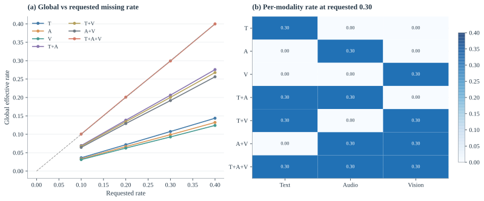

**数据来源与统计口径：**测试集baseline，种子均值；读取effective_missing_rate及各模态对应字段。

请求缺失率针对被选中的模态有效序列；全局实际缺失率以全部模态有效bin总量作分母。只缺失一个模态时，全局比例自然小于请求值；同时缺失T+A+V时两者才较接近。离散bin数量、可用长度和取整会产生小幅偏差。

热图将0.3设置分解到各模态，未被选中模态的缺失率应为零。该核对只检查保存结果的计数与实验条件是否对应，不审核实现代码。论文需要写清分母，不能把全局比例直接称为“文本缺失率”。

本图有助于解释不同缺失组合之间的损伤强弱，但不能把被删除bin数量等同于语义信息量；文本、音频、视觉的一个bin并不具有相同信息价值。

| modalities | requested | total_effective | text | audio | vision |
| --- | --- | --- | --- | --- | --- |
| T | 0.1000 | 0.0361 | 0.1007 | 0.0000 | 0.0000 |
| T | 0.2000 | 0.0717 | 0.1998 | 0.0000 | 0.0000 |
| T | 0.3000 | 0.1075 | 0.2995 | 0.0000 | 0.0000 |
| T | 0.4000 | 0.1436 | 0.4001 | 0.0000 | 0.0000 |
| A | 0.1000 | 0.0332 | 0.0000 | 0.1005 | 0.0000 |
| A | 0.2000 | 0.0666 | 0.0000 | 0.2016 | 0.0000 |
| A | 0.3000 | 0.0988 | 0.0000 | 0.2990 | 0.0000 |
| A | 0.4000 | 0.1322 | 0.0000 | 0.3999 | 0.0000 |
| V | 0.1000 | 0.0312 | 0.0000 | 0.0000 | 0.1004 |
| V | 0.2000 | 0.0626 | 0.0000 | 0.0000 | 0.2015 |
| V | 0.3000 | 0.0928 | 0.0000 | 0.0000 | 0.2990 |
| V | 0.4000 | 0.1241 | 0.0000 | 0.0000 | 0.3997 |
| T+A | 0.1000 | 0.0694 | 0.1007 | 0.1005 | 0.0000 |
| T+A | 0.2000 | 0.1384 | 0.1998 | 0.2016 | 0.0000 |
| T+A | 0.3000 | 0.2064 | 0.2995 | 0.2990 | 0.0000 |
| T+A | 0.4000 | 0.2758 | 0.4001 | 0.3999 | 0.0000 |
| T+V | 0.1000 | 0.0673 | 0.1007 | 0.0000 | 0.1004 |
| T+V | 0.2000 | 0.1343 | 0.1998 | 0.0000 | 0.2015 |
| T+V | 0.3000 | 0.2004 | 0.2995 | 0.0000 | 0.2990 |
| T+V | 0.4000 | 0.2677 | 0.4001 | 0.0000 | 0.3997 |
| A+V | 0.1000 | 0.0644 | 0.0000 | 0.1005 | 0.1004 |
| A+V | 0.2000 | 0.1292 | 0.0000 | 0.2016 | 0.2015 |
| A+V | 0.3000 | 0.1916 | 0.0000 | 0.2990 | 0.2990 |
| A+V | 0.4000 | 0.2563 | 0.0000 | 0.3999 | 0.3997 |
| T+A+V | 0.1000 | 0.1005 | 0.1007 | 0.1005 | 0.1004 |
| T+A+V | 0.2000 | 0.2009 | 0.1998 | 0.2016 | 0.2015 |
| T+A+V | 0.3000 | 0.2992 | 0.2995 | 0.2990 | 0.2990 |
| T+A+V | 0.4000 | 0.3999 | 0.4001 | 0.3999 | 0.3997 |

## 图30 整模态消融与极端信息丢失

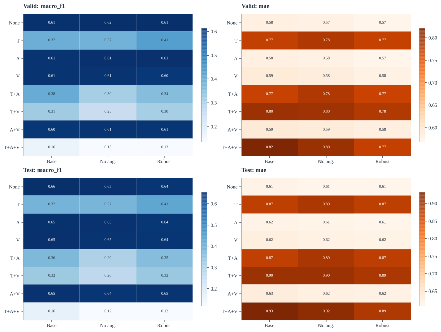

**数据来源与统计口径：**ablation组，8种保留/删除组合；行标签表示被删除的模态，None表示完整输入。

整模态删除是极端压力测试，与题目主要关心的局部连续缺失不同，应作为补充消融呈现。移除T、A、V后的性能变化揭示模型对相应输入的依赖；文本删除后的下降不能独立证明文本在所有真实场景中都具有最高因果重要性。

全部删除T+A+V时，即使分类准确率非零，也可能只是类先验或常数输出的表现。该条件下Pearson数值可能来自近常数浮点波动，不能解释为模型保留了实际强度预测能力。图中MAE与F1分开显示，避免不同量纲混合。

本文消融使用固定已训练模型的输入删除结果，而非为每种保留模态重新训练专门模型。因此“只剩文本”的成绩应表述为该融合模型在只保留文本时的表现，不应写成重新训练的纯文本模型基线。

**文本依赖的数量级。**测试Baseline移除文本后F1为0.3740，保留文本、移除音视频时为0.6488，与完整输入0.6558接近；Robust相应为0.4069和0.6458。三模态都存在于输入接口并不意味着模型充分利用了每一模态。Robust在整段文本丢失时优于Baseline约0.0329，但仍远低于完整输入。这与图43的文本主导解释相互呼应，但两图来自不同模型，不能视为同一模型的闭环因果证明。

| split | model | removed | accuracy | macro_f1 | mae | pearson |
| --- | --- | --- | --- | --- | --- | --- |
| valid | baseline | None | 0.6287 | 0.6096 | 0.5780 | 0.6826 |
| valid | baseline | T | 0.3887 | 0.3738 | 0.7726 | 0.1812 |
| valid | baseline | A | 0.6296 | 0.6070 | 0.5783 | 0.6825 |
| valid | baseline | V | 0.6277 | 0.6074 | 0.5883 | 0.6741 |
| valid | baseline | T+A | 0.4016 | 0.3803 | 0.7704 | 0.1834 |
| valid | baseline | T+V | 0.3283 | 0.3112 | 0.7980 | 0.0448 |
| valid | baseline | A+V | 0.6236 | 0.6006 | 0.5901 | 0.6732 |
| valid | baseline | T+A+V | 0.3333 | 0.1643 | 0.8221 | 0.0000 |
| valid | robust_noaug | None | 0.6337 | 0.6152 | 0.5747 | 0.6804 |
| valid | robust_noaug | T | 0.3800 | 0.3672 | 0.7838 | 0.2111 |
| valid | robust_noaug | A | 0.6305 | 0.6118 | 0.5756 | 0.6796 |
| valid | robust_noaug | V | 0.6264 | 0.6070 | 0.5846 | 0.6717 |
| valid | robust_noaug | T+A | 0.3544 | 0.3018 | 0.7838 | 0.2333 |
| valid | robust_noaug | T+V | 0.3040 | 0.2453 | 0.7960 | 0.0590 |
| valid | robust_noaug | A+V | 0.6264 | 0.6070 | 0.5865 | 0.6705 |
| valid | robust_noaug | T+A+V | 0.2527 | 0.1345 | 0.8009 | 0.0116 |
| valid | robust | None | 0.6447 | 0.6138 | 0.5675 | 0.6863 |
| valid | robust | T | 0.4171 | 0.4079 | 0.7706 | 0.2262 |
| valid | robust | A | 0.6429 | 0.6130 | 0.5687 | 0.6852 |
| valid | robust | V | 0.6314 | 0.6000 | 0.5770 | 0.6768 |
| valid | robust | T+A | 0.3851 | 0.3410 | 0.7684 | 0.2459 |
| valid | robust | T+V | 0.3429 | 0.3023 | 0.7829 | 0.0674 |
| valid | robust | A+V | 0.6342 | 0.6054 | 0.5795 | 0.6748 |
| valid | robust | T+A+V | 0.2527 | 0.1345 | 0.7716 | 0.0058 |
| test | baseline | None | 0.6923 | 0.6558 | 0.6137 | 0.7022 |
| test | baseline | T | 0.4081 | 0.3740 | 0.8721 | 0.2058 |
| test | baseline | A | 0.6905 | 0.6509 | 0.6155 | 0.7005 |
| test | baseline | V | 0.6859 | 0.6520 | 0.6245 | 0.6942 |
| test | baseline | T+A | 0.4108 | 0.3603 | 0.8711 | 0.1961 |
| test | baseline | T+V | 0.3439 | 0.3223 | 0.9027 | 0.1026 |
| test | baseline | A+V | 0.6868 | 0.6488 | 0.6292 | 0.6910 |
| test | baseline | T+A+V | 0.3333 | 0.1628 | 0.9330 | -0.0270 |
| test | robust_noaug | None | 0.6896 | 0.6525 | 0.6093 | 0.7020 |
| test | robust_noaug | T | 0.3902 | 0.3704 | 0.8874 | 0.2305 |
| test | robust_noaug | A | 0.6845 | 0.6479 | 0.6119 | 0.7002 |
| test | robust_noaug | V | 0.6818 | 0.6466 | 0.6179 | 0.6955 |
| test | robust_noaug | T+A | 0.3439 | 0.2944 | 0.8903 | 0.2110 |
| test | robust_noaug | T+V | 0.3095 | 0.2646 | 0.9029 | 0.1429 |
| test | robust_noaug | A+V | 0.6790 | 0.6442 | 0.6212 | 0.6931 |
| test | robust_noaug | T+A+V | 0.2173 | 0.1190 | 0.9166 | -0.0270 |
| test | robust | None | 0.6933 | 0.6437 | 0.6076 | 0.6978 |
| test | robust | T | 0.4360 | 0.4069 | 0.8729 | 0.2375 |
| test | robust | A | 0.6887 | 0.6397 | 0.6098 | 0.6958 |
| test | robust | V | 0.6896 | 0.6419 | 0.6151 | 0.6912 |
| test | robust | T+A | 0.3998 | 0.3507 | 0.8734 | 0.2188 |
| test | robust | T+V | 0.3645 | 0.3246 | 0.8876 | 0.1581 |
| test | robust | A+V | 0.6923 | 0.6458 | 0.6178 | 0.6884 |
| test | robust | T+A+V | 0.2173 | 0.1190 | 0.8858 | -0.0135 |

## 图31 架构与训练增强的配对差异

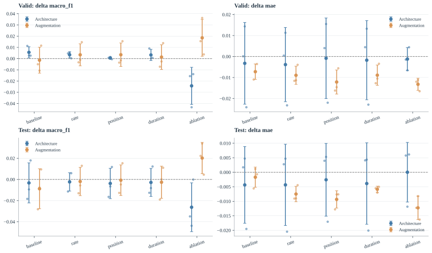

**数据来源与统计口径：**同一种子、同一条件相减后，先对条件族等权平均，再对3种子计算均值与标准差。

Architecture为No aug.减Baseline；Augmentation为Robust减No aug.。F1差值为正更好，MAE差值为负更好。图中的配对保留了种子编号和缺失条件，避免把大量相关条件误认为大量独立训练。

每个条件族的权重由本次设计决定，rate组的均值并不代表真实业务缺失分布。对于ablation，去掉重复完整输入后仅汇总7个压力条件。均值接近零时应查看三个种子的符号是否一致，而不能只选择其中一次成功的结果写进论文。

该设计比历史模型横向比较更能区分架构和增强作用，但模型/增强差异的解释仍应限定在保存配置、三个种子及当前条件范围内。

**增强收益主要落在回归。**测试集Robust减No aug.的MAE差值，在rate、position、duration三组分别为−0.00749、−0.00934、−0.00586，且每组三个种子均为负。相同三组的F1平均差值却分别为−0.00196、−0.00075、−0.00265，seed 42/43/44常出现方向不一致。合理结论是当前增强较一致地改善局部缺失下的回归误差，并在特定困难位置改善分类，而不是全面提高分类指标。

| split | metric | comparison | group | mean_difference | seed_sd | seed42 | seed43 | seed44 |
| --- | --- | --- | --- | --- | --- | --- | --- | --- |
| valid | macro_f1 | robust_noaug - baseline | baseline | 0.0056 | 0.0050 | 0.0113 | 0.0028 | 0.0027 |
| valid | macro_f1 | robust_noaug - baseline | rate | 0.0034 | 0.0027 | 0.0046 | 0.0053 | 0.0002 |
| valid | macro_f1 | robust_noaug - baseline | position | 0.0005 | 0.0010 | 0.0007 | 0.0015 | -0.0006 |
| valid | macro_f1 | robust_noaug - baseline | duration | 0.0033 | 0.0050 | 0.0090 | 0.0001 | 0.0006 |
| valid | macro_f1 | robust_noaug - baseline | ablation | -0.0243 | 0.0165 | -0.0156 | -0.0433 | -0.0138 |
| valid | macro_f1 | robust - robust_noaug | baseline | -0.0014 | 0.0116 | -0.0050 | -0.0107 | 0.0116 |
| valid | macro_f1 | robust - robust_noaug | rate | 0.0034 | 0.0098 | -0.0033 | -0.0012 | 0.0146 |
| valid | macro_f1 | robust - robust_noaug | position | 0.0035 | 0.0105 | -0.0036 | -0.0016 | 0.0155 |
| valid | macro_f1 | robust - robust_noaug | duration | 0.0013 | 0.0110 | -0.0072 | -0.0026 | 0.0138 |
| valid | macro_f1 | robust - robust_noaug | ablation | 0.0185 | 0.0164 | 0.0155 | 0.0362 | 0.0038 |
| valid | mae | robust_noaug - baseline | baseline | -0.0032 | 0.0195 | 0.0001 | 0.0143 | -0.0242 |
| valid | mae | robust_noaug - baseline | rate | -0.0038 | 0.0177 | 0.0004 | 0.0113 | -0.0233 |
| valid | mae | robust_noaug - baseline | position | -0.0008 | 0.0192 | 0.0040 | 0.0155 | -0.0220 |
| valid | mae | robust_noaug - baseline | duration | -0.0017 | 0.0189 | 0.0044 | 0.0133 | -0.0229 |
| valid | mae | robust_noaug - baseline | ablation | -0.0012 | 0.0055 | -0.0015 | -0.0066 | 0.0044 |
| valid | mae | robust - robust_noaug | baseline | -0.0072 | 0.0037 | -0.0110 | -0.0071 | -0.0036 |
| valid | mae | robust - robust_noaug | rate | -0.0089 | 0.0043 | -0.0116 | -0.0113 | -0.0039 |
| valid | mae | robust - robust_noaug | position | -0.0121 | 0.0057 | -0.0162 | -0.0146 | -0.0056 |
| valid | mae | robust - robust_noaug | duration | -0.0089 | 0.0049 | -0.0127 | -0.0105 | -0.0034 |
| valid | mae | robust - robust_noaug | ablation | -0.0132 | 0.0029 | -0.0120 | -0.0112 | -0.0165 |
| test | macro_f1 | robust_noaug - baseline | baseline | -0.0033 | 0.0189 | -0.0184 | -0.0094 | 0.0179 |
| test | macro_f1 | robust_noaug - baseline | rate | -0.0023 | 0.0087 | -0.0114 | -0.0015 | 0.0059 |
| test | macro_f1 | robust_noaug - baseline | position | -0.0038 | 0.0143 | -0.0165 | -0.0066 | 0.0118 |
| test | macro_f1 | robust_noaug - baseline | duration | -0.0029 | 0.0133 | -0.0126 | -0.0082 | 0.0122 |
| test | macro_f1 | robust_noaug - baseline | ablation | -0.0263 | 0.0231 | -0.0349 | -0.0438 | -0.0001 |
| test | macro_f1 | robust - robust_noaug | baseline | -0.0088 | 0.0189 | -0.0282 | -0.0077 | 0.0095 |
| test | macro_f1 | robust - robust_noaug | rate | -0.0020 | 0.0134 | -0.0130 | -0.0057 | 0.0129 |
| test | macro_f1 | robust - robust_noaug | position | -0.0007 | 0.0144 | -0.0127 | -0.0048 | 0.0153 |
| test | macro_f1 | robust - robust_noaug | duration | -0.0027 | 0.0152 | -0.0190 | 0.0001 | 0.0110 |
| test | macro_f1 | robust - robust_noaug | ablation | 0.0202 | 0.0148 | 0.0223 | 0.0339 | 0.0045 |
| test | mae | robust_noaug - baseline | baseline | -0.0044 | 0.0132 | 0.0017 | 0.0047 | -0.0195 |
| test | mae | robust_noaug - baseline | rate | -0.0043 | 0.0140 | 0.0028 | 0.0047 | -0.0205 |
| test | mae | robust_noaug - baseline | position | -0.0026 | 0.0125 | 0.0040 | 0.0053 | -0.0170 |
| test | mae | robust_noaug - baseline | duration | -0.0039 | 0.0140 | 0.0041 | 0.0044 | -0.0201 |
| test | mae | robust_noaug - baseline | ablation | 0.0000 | 0.0103 | 0.0058 | -0.0119 | 0.0061 |
| test | mae | robust - robust_noaug | baseline | -0.0017 | 0.0035 | -0.0056 | 0.0012 | -0.0007 |
| test | mae | robust - robust_noaug | rate | -0.0075 | 0.0026 | -0.0091 | -0.0090 | -0.0044 |
| test | mae | robust - robust_noaug | position | -0.0093 | 0.0030 | -0.0128 | -0.0076 | -0.0076 |
| test | mae | robust - robust_noaug | duration | -0.0059 | 0.0011 | -0.0055 | -0.0070 | -0.0050 |
| test | mae | robust - robust_noaug | ablation | -0.0123 | 0.0040 | -0.0122 | -0.0082 | -0.0163 |

## 图32 局部缺失的平均性能与最差条件

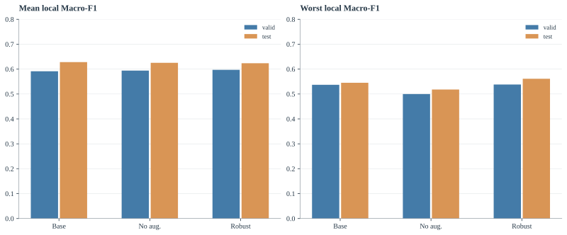

**数据来源与统计口径：**对三种子均值再按条件等权汇总；local=49个局部缺失条件，all_stress=56个条件含整模态删除。

平均值描述实验网格的整体表现，最差值用于识别模型在何种条件下失效；两者没有相同含义。图中仅画局部缺失，避免全模态全删这种极端条件主导主要结论；下表额外列出全部压力条件供核对。

最差条件是从固定测试网格中事后选出的观察值，不是有统计置信保证的性能下界。表中准确写出对应条件ID，也列出MAE最差条件，因为分类和回归最差情形未必重合。

题目中的“稳定输出”可由缺失条件下仍有可用F1、MAE及跨种子波动共同支撑，不应仅凭程序产生数值便称为鲁棒。

**平均性能与尾部风险的权衡。**49个局部缺失条件下，测试Baseline/No aug./Robust平均F1为0.6282/0.6254/0.6236，平均MAE为0.6494/0.6456/0.6379。Robust的最差F1为0.5613，优于Baseline的0.5451与No aug.的0.5181；最差MAE从Baseline 0.7560降至Robust 0.7117。它改善了本实验网格中的最差情形与强度误差，但未提高平均测试F1。验证集平均F1则是Robust更高，说明验证收益未全部迁移到测试分类。

| split | model | scope | conditions | mean_f1 | worst_f1 | mean_mae | worst_mae | worst_f1_condition | worst_mae_condition |
| --- | --- | --- | --- | --- | --- | --- | --- | --- | --- |
| valid | baseline | local | 49 | 0.5914 | 0.5371 | 0.6009 | 0.6717 | rate__text__r0p40__random__medium | position__text__r0p30__suffix__medium |
| valid | baseline | all_stress | 56 | 0.5718 | 0.1643 | 0.6137 | 0.8221 | ablation__text+audio+vision__r1p00__random__long | ablation__text+audio+vision__r1p00__random__long |
| valid | robust_noaug | local | 49 | 0.5940 | 0.5000 | 0.5982 | 0.7058 | position__text__r0p30__suffix__medium | position__text__r0p30__suffix__medium |
| valid | robust_noaug | all_stress | 56 | 0.5711 | 0.1345 | 0.6111 | 0.8009 | ablation__text+audio+vision__r1p00__random__long | ablation__text+audio+vision__r1p00__random__long |
| valid | robust | local | 49 | 0.5971 | 0.5382 | 0.5885 | 0.6452 | position__text__r0p30__suffix__medium | rate__text+vision__r0p40__random__medium |
| valid | robust | all_stress | 56 | 0.5761 | 0.1345 | 0.6010 | 0.7829 | ablation__text+audio+vision__r1p00__random__long | ablation__text+vision__r1p00__random__long |
| test | baseline | local | 49 | 0.6282 | 0.5451 | 0.6494 | 0.7560 | position__text__r0p30__suffix__medium | position__text__r0p30__suffix__medium |
| test | baseline | all_stress | 56 | 0.6063 | 0.1628 | 0.6655 | 0.9330 | ablation__text+audio+vision__r1p00__random__long | ablation__text+audio+vision__r1p00__random__long |
| test | robust_noaug | local | 49 | 0.6254 | 0.5181 | 0.6456 | 0.7755 | position__text__r0p30__suffix__medium | position__text__r0p30__suffix__medium |
| test | robust_noaug | all_stress | 56 | 0.6006 | 0.1190 | 0.6622 | 0.9166 | ablation__text+audio+vision__r1p00__random__long | ablation__text+audio+vision__r1p00__random__long |
| test | robust | local | 49 | 0.6236 | 0.5613 | 0.6379 | 0.7117 | rate__text__r0p40__random__medium | position__text__r0p30__suffix__medium |
| test | robust | all_stress | 56 | 0.6015 | 0.1190 | 0.6540 | 0.8876 | ablation__text+audio+vision__r1p00__random__long | ablation__text+vision__r1p00__random__long |

## 图33 文本局部缺失对各情感类别的差异影响

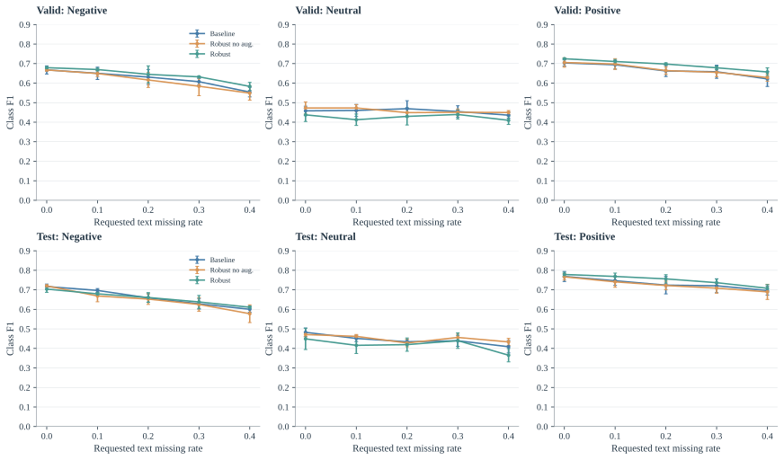

**数据来源与统计口径：**保存的逐类F1；文本局部缺失0至0.4，两个划分、3模型、3种子。

Macro-F1的变化可能由一个类别主导，本图用相同纵轴显示三类F1。中性类既需要与正面也需要与负面区分，其完整输入表现已偏弱；文本局部丢失后，如果中性曲线先下降，整体准确率可能因为多数正面类别相对稳定而掩盖风险。

各类F1结合precision与recall，不能单凭F1判定下降究竟来自漏识别还是误报。新增受控表只存逐类F1，未存各条件混淆矩阵；因此这里不伪造逐条件召回率或错误流向。

观察Robust相对No aug.的作用时，应说明受益类别与可能牺牲类别，而不是只报告单个平均数。完整数值随图导出。

**实际逐类趋势。**两划分中性类F1整体低于正负两类，但曲线并非总是最陡：正负类别也会随文本缺失持续下降。不能把“起点较低”写成“损伤斜率必然最大”。中性曲线在某些缺失率处回升，可能与决策边界移动有关；由于没有各条件混淆矩阵，本文不把这种回升进一步归因为精确率或召回率中的某一项。

| split | model | class | rate | f1 | sd |
| --- | --- | --- | --- | --- | --- |
| valid | baseline | negative | 0 | 0.6676 | 0.0208 |
| valid | baseline | negative | 0.1000 | 0.6501 | 0.0317 |
| valid | baseline | negative | 0.2000 | 0.6310 | 0.0387 |
| valid | baseline | negative | 0.3000 | 0.6073 | 0.0161 |
| valid | baseline | negative | 0.4000 | 0.5541 | 0.0246 |
| valid | robust_noaug | negative | 0 | 0.6675 | 0.0066 |
| valid | robust_noaug | negative | 0.1000 | 0.6491 | 0.0151 |
| valid | robust_noaug | negative | 0.2000 | 0.6160 | 0.0381 |
| valid | robust_noaug | negative | 0.3000 | 0.5840 | 0.0483 |
| valid | robust_noaug | negative | 0.4000 | 0.5486 | 0.0357 |
| valid | robust | negative | 0 | 0.6791 | 0.0052 |
| valid | robust | negative | 0.1000 | 0.6696 | 0.0070 |
| valid | robust | negative | 0.2000 | 0.6448 | 0.0436 |
| valid | robust | negative | 0.3000 | 0.6321 | 0.0035 |
| valid | robust | negative | 0.4000 | 0.5832 | 0.0207 |
| valid | baseline | neutral | 0 | 0.4580 | 0.0241 |
| valid | baseline | neutral | 0.1000 | 0.4600 | 0.0308 |
| valid | baseline | neutral | 0.2000 | 0.4690 | 0.0410 |
| valid | baseline | neutral | 0.3000 | 0.4545 | 0.0297 |
| valid | baseline | neutral | 0.4000 | 0.4358 | 0.0153 |
| valid | robust_noaug | neutral | 0 | 0.4726 | 0.0310 |
| valid | robust_noaug | neutral | 0.1000 | 0.4728 | 0.0172 |
| valid | robust_noaug | neutral | 0.2000 | 0.4488 | 0.0215 |
| valid | robust_noaug | neutral | 0.3000 | 0.4505 | 0.0170 |
| valid | robust_noaug | neutral | 0.4000 | 0.4496 | 0.0098 |
| valid | robust | neutral | 0 | 0.4375 | 0.0339 |
| valid | robust | neutral | 0.1000 | 0.4126 | 0.0294 |
| valid | robust | neutral | 0.2000 | 0.4296 | 0.0441 |
| valid | robust | neutral | 0.3000 | 0.4394 | 0.0232 |
| valid | robust | neutral | 0.4000 | 0.4096 | 0.0216 |
| valid | baseline | positive | 0 | 0.7032 | 0.0157 |
| valid | baseline | positive | 0.1000 | 0.6938 | 0.0215 |
| valid | baseline | positive | 0.2000 | 0.6623 | 0.0285 |
| valid | baseline | positive | 0.3000 | 0.6583 | 0.0336 |
| valid | baseline | positive | 0.4000 | 0.6215 | 0.0388 |
| valid | robust_noaug | positive | 0 | 0.7054 | 0.0242 |
| valid | robust_noaug | positive | 0.1000 | 0.6977 | 0.0275 |
| valid | robust_noaug | positive | 0.2000 | 0.6642 | 0.0197 |
| valid | robust_noaug | positive | 0.3000 | 0.6552 | 0.0222 |
| valid | robust_noaug | positive | 0.4000 | 0.6285 | 0.0185 |
| valid | robust | positive | 0 | 0.7248 | 0.0029 |
| valid | robust | positive | 0.1000 | 0.7107 | 0.0103 |
| valid | robust | positive | 0.2000 | 0.6977 | 0.0060 |
| valid | robust | positive | 0.3000 | 0.6785 | 0.0090 |
| valid | robust | positive | 0.4000 | 0.6571 | 0.0215 |
| test | baseline | negative | 0 | 0.7168 | 0.0127 |
| test | baseline | negative | 0.1000 | 0.6968 | 0.0097 |
| test | baseline | negative | 0.2000 | 0.6585 | 0.0214 |
| test | baseline | negative | 0.3000 | 0.6282 | 0.0273 |
| test | baseline | negative | 0.4000 | 0.6002 | 0.0145 |
| test | robust_noaug | negative | 0 | 0.7201 | 0.0045 |
| test | robust_noaug | negative | 0.1000 | 0.6685 | 0.0299 |
| test | robust_noaug | negative | 0.2000 | 0.6525 | 0.0272 |
| test | robust_noaug | negative | 0.3000 | 0.6251 | 0.0347 |
| test | robust_noaug | negative | 0.4000 | 0.5777 | 0.0454 |
| test | robust | negative | 0 | 0.7037 | 0.0166 |
| test | robust | negative | 0.1000 | 0.6793 | 0.0063 |
| test | robust | negative | 0.2000 | 0.6607 | 0.0249 |
| test | robust | negative | 0.3000 | 0.6379 | 0.0332 |
| test | robust | negative | 0.4000 | 0.6107 | 0.0057 |
| test | baseline | neutral | 0 | 0.4824 | 0.0220 |
| test | baseline | neutral | 0.1000 | 0.4510 | 0.0163 |
| test | baseline | neutral | 0.2000 | 0.4341 | 0.0108 |
| test | baseline | neutral | 0.3000 | 0.4390 | 0.0281 |
| test | baseline | neutral | 0.4000 | 0.4086 | 0.0317 |
| test | robust_noaug | neutral | 0 | 0.4709 | 0.0113 |
| test | robust_noaug | neutral | 0.1000 | 0.4617 | 0.0095 |
| test | robust_noaug | neutral | 0.2000 | 0.4278 | 0.0193 |
| test | robust_noaug | neutral | 0.3000 | 0.4561 | 0.0166 |
| test | robust_noaug | neutral | 0.4000 | 0.4332 | 0.0181 |
| test | robust | neutral | 0 | 0.4488 | 0.0545 |
| test | robust | neutral | 0.1000 | 0.4157 | 0.0418 |
| test | robust | neutral | 0.2000 | 0.4194 | 0.0340 |
| test | robust | neutral | 0.3000 | 0.4397 | 0.0396 |
| test | robust | neutral | 0.4000 | 0.3651 | 0.0339 |
| test | baseline | positive | 0 | 0.7683 | 0.0257 |
| test | baseline | positive | 0.1000 | 0.7464 | 0.0236 |
| test | baseline | positive | 0.2000 | 0.7239 | 0.0448 |
| test | baseline | positive | 0.3000 | 0.7207 | 0.0354 |
| test | baseline | positive | 0.4000 | 0.6962 | 0.0231 |
| test | robust_noaug | positive | 0 | 0.7665 | 0.0163 |
| test | robust_noaug | positive | 0.1000 | 0.7408 | 0.0279 |
| test | robust_noaug | positive | 0.2000 | 0.7221 | 0.0221 |
| test | robust_noaug | positive | 0.3000 | 0.7086 | 0.0257 |
| test | robust_noaug | positive | 0.4000 | 0.6895 | 0.0389 |
| test | robust | positive | 0 | 0.7785 | 0.0111 |
| test | robust | positive | 0.1000 | 0.7685 | 0.0171 |
| test | robust | positive | 0.2000 | 0.7560 | 0.0215 |
| test | robust | positive | 0.3000 | 0.7365 | 0.0194 |
| test | robust | positive | 0.4000 | 0.7079 | 0.0188 |

## 图34 新增九次训练的拟合与泛化过程

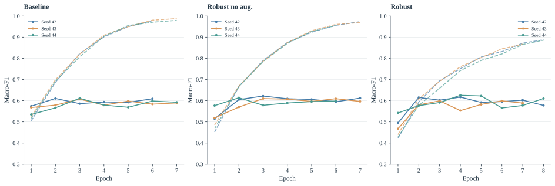

**数据来源与统计口径：**各模型seed_42/43/44的training_history.csv；实线验证，虚线训练。

新增训练记录与图16的30轮延长训练属于不同实验记录，不能无缝拼接成一条曲线。每个面板保留三个种子，直接观察早期提升、峰值轮次以及训练验证差距。

下表按已存验证Macro-F1定位峰值，仅用于复核历史选择，不重新训练或重新选择测试模型。若训练F1持续增大而验证F1停滞，说明继续拟合训练集并未同步提升验证性能；这比只看训练loss下降更能说明模型选择的必要性。

训练指标计算口径、正则化与增强可能影响训练验证数值差距，因此差距是诊断证据，不是对过拟合原因的唯一解释。

**与旧图16的关系。**图16保留的是历史延长复现训练，其前后阶段有特定来源；图34是此次受控实验的九份原生记录。相同seed编号或相同验证点不意味着所有训练过程指标必然相同，训练期与后处理评估还可能采用不同口径。报告保持两组记录独立，避免用一组的训练F1解释另一组模型的收敛速度。

| model | seed | recorded_epochs | best_valid_epoch | best_valid_f1 | last_train_f1 | last_valid_f1 | last_gap |
| --- | --- | --- | --- | --- | --- | --- | --- |
| baseline | 42 | 6 | 2.0000 | 0.6105 | 0.9757 | 0.6089 | 0.3668 |
| baseline | 43 | 7 | 3.0000 | 0.6071 | 0.9878 | 0.5893 | 0.3985 |
| baseline | 44 | 7 | 3.0000 | 0.6112 | 0.9793 | 0.5924 | 0.3869 |
| robust_noaug | 42 | 7 | 3.0000 | 0.6218 | 0.9732 | 0.6121 | 0.3612 |
| robust_noaug | 43 | 7 | 3.0000 | 0.6099 | 0.9688 | 0.5963 | 0.3725 |
| robust_noaug | 44 | 6 | 2.0000 | 0.6138 | 0.9550 | 0.5982 | 0.3568 |
| robust | 42 | 8 | 4.0000 | 0.6168 | 0.8878 | 0.5777 | 0.3101 |
| robust | 43 | 7 | 3.0000 | 0.5992 | 0.8670 | 0.5886 | 0.2784 |
| robust | 44 | 8 | 4.0000 | 0.6254 | 0.8858 | 0.6102 | 0.2756 |

## 图35 附件三aligned全量三模型输出

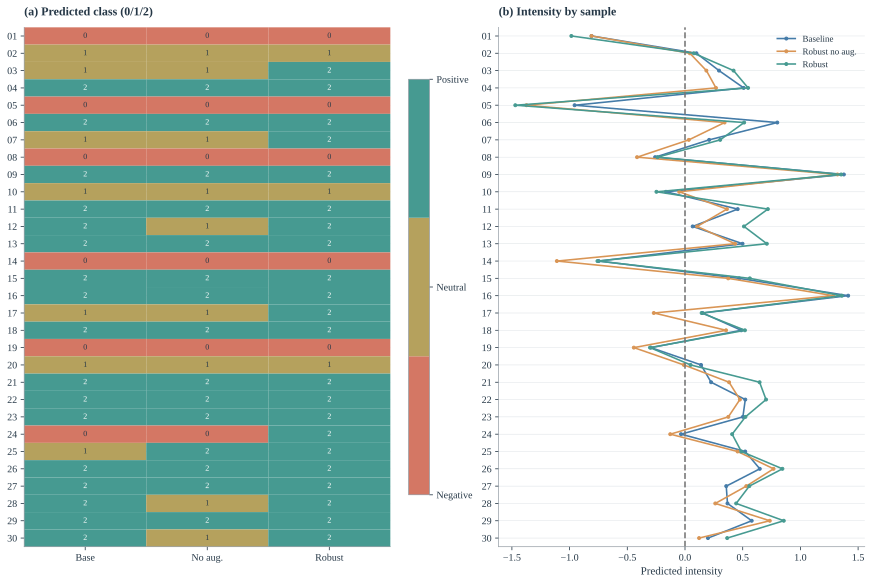

**数据来源与统计口径：**attachment3_predictions.csv，30个aligned样本×3模型；不是三种子平均。

左图0/1/2对应负面/中性/正面，右图保留每条样本的强度预测。下表列出全部30条结果，使正文图与提交文件逐条可对应。三模型分歧揭示模型选择对专项输出的影响，不能用多数票或高置信度来认定某个模型正确。

新增表没有种子列，因此不能把这180行专项预测理解为三种子集成。aligned是本轮受控训练使用的特征版本，对应结果应作为主分析。unaligned在下一图作为额外输出一致性诊断；题目要求训练与专项测试维持同一特征版本。

无真实标签时，类别分布、置信度和强度范围都是模型输出特征，不是性能评价。

**类别偏好。**aligned30条中，Baseline负/中/正为6/7/17，No aug.为6/9/15，Robust为5/3/22。Robust的正面预测占73.33%，中性仅10%；这提示模型间存在不同决策边界，但无标签不能判定是哪一个更准确。尤其不能因Robust标签更集中便称其输出更稳定。

| sample | baseline_class | baseline_intensity | robust_noaug_class | robust_noaug_intensity | robust_class | robust_intensity |
| --- | --- | --- | --- | --- | --- | --- |
| 01 | Negative | -0.8096 | Negative | -0.8102 | Negative | -0.9847 |
| 02 | Neutral | 0.0991 | Neutral | 0.0421 | Neutral | 0.0765 |
| 03 | Neutral | 0.2947 | Neutral | 0.1852 | Positive | 0.4207 |
| 04 | Positive | 0.5085 | Positive | 0.2682 | Positive | 0.5466 |
| 05 | Negative | -0.9567 | Negative | -1.3734 | Negative | -1.4705 |
| 06 | Positive | 0.7996 | Positive | 0.3429 | Positive | 0.5123 |
| 07 | Neutral | 0.2093 | Neutral | 0.0331 | Positive | 0.3047 |
| 08 | Negative | -0.2589 | Negative | -0.4155 | Negative | -0.2386 |
| 09 | Positive | 1.3766 | Positive | 1.3210 | Positive | 1.3531 |
| 10 | Neutral | -0.1650 | Neutral | -0.0500 | Neutral | -0.2476 |
| 11 | Positive | 0.4565 | Positive | 0.3631 | Positive | 0.7179 |
| 12 | Positive | 0.0664 | Neutral | 0.1055 | Positive | 0.5111 |
| 13 | Positive | 0.4985 | Positive | 0.4340 | Positive | 0.7090 |
| 14 | Negative | -0.7477 | Negative | -1.1105 | Negative | -0.7586 |
| 15 | Positive | 0.4696 | Positive | 0.3740 | Positive | 0.5617 |
| 16 | Positive | 1.4138 | Positive | 1.2853 | Positive | 1.3593 |
| 17 | Neutral | 0.1523 | Neutral | -0.2705 | Positive | 0.1442 |
| 18 | Positive | 0.4871 | Positive | 0.3557 | Positive | 0.5194 |
| 19 | Negative | -0.2957 | Negative | -0.4435 | Negative | -0.3030 |
| 20 | Neutral | 0.1390 | Neutral | -0.0103 | Neutral | 0.0482 |
| 21 | Positive | 0.2261 | Positive | 0.3818 | Positive | 0.6464 |
| 22 | Positive | 0.5223 | Positive | 0.4755 | Positive | 0.7022 |
| 23 | Positive | 0.5016 | Positive | 0.3756 | Positive | 0.5236 |
| 24 | Negative | -0.0345 | Negative | -0.1279 | Positive | 0.4084 |
| 25 | Neutral | 0.5216 | Positive | 0.4556 | Positive | 0.4881 |
| 26 | Positive | 0.6479 | Positive | 0.7672 | Positive | 0.8440 |
| 27 | Positive | 0.3574 | Positive | 0.5311 | Positive | 0.5572 |
| 28 | Positive | 0.3680 | Neutral | 0.2624 | Positive | 0.4434 |
| 29 | Positive | 0.5780 | Positive | 0.7346 | Positive | 0.8558 |
| 30 | Positive | 0.1990 | Neutral | 0.1221 | Positive | 0.3656 |

## 图36 附件三类别分布与格式敏感性

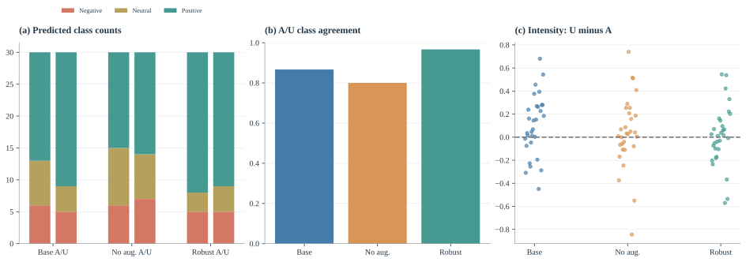

**数据来源与统计口径：**180行专项输出；同编号aligned/unaligned描述性配对，每模型30对。

柱状分布可以识别模型是否倾向输出某一极性，一致率与差值则量化输入版本变化的敏感性。两种格式之间的一致率高并不等于准确率高，强度差小也不代表鲁棒性已得到带标签验证。

本轮训练协议为aligned_50，unaligned输出不能替代同版本专项评价。图中A/U只表示输出来源，不能把60条版本记录当作60个独立真实样本。

完整输入缺失结构的统计还显示附件三的有效bin比例低于1，但其中可能混有填充与局部缺失，不能将1减有效比例全部解释为人为缺失率。

**一致性量化。**Baseline、No aug.、Robust两种版本的类别一致率分别86.67%、80.00%、96.67%；强度差绝对值均值分别0.2228、0.2161、0.1871。Robust的输出对版本变化较不敏感，但这是一种描述性的版本一致性，而非缺失鲁棒性的准确率证据。受控缺失结论应由图23至33承担。

| model | agreement | mean_signed_intensity_difference | mean_abs_intensity_difference | max_abs_difference | aligned_counts | unaligned_counts |
| --- | --- | --- | --- | --- | --- | --- |
| baseline | 0.8667 | 0.0989 | 0.2228 | 0.6802 | Counter({'Positive': 17, 'Neutral': 7, 'Negative': 6}) | Counter({'Positive': 21, 'Negative': 5, 'Neutral': 4}) |
| robust_noaug | 0.8000 | 0.0397 | 0.2161 | 0.8441 | Counter({'Positive': 15, 'Neutral': 9, 'Negative': 6}) | Counter({'Positive': 16, 'Negative': 7, 'Neutral': 7}) |
| robust | 0.9667 | 0.0094 | 0.1871 | 0.5710 | Counter({'Positive': 22, 'Negative': 5, 'Neutral': 3}) | Counter({'Positive': 21, 'Negative': 5, 'Neutral': 4}) |

## 三、问题三：预测质量、解释结构与证据核验

## 图37 问题三基础性能及与问题二参考结果的关系

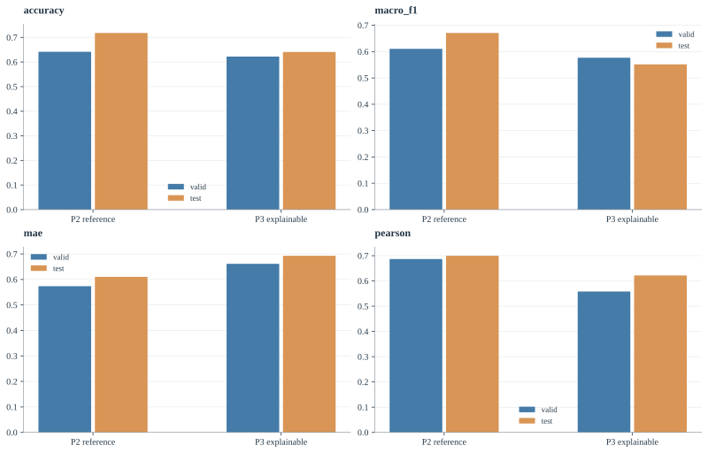

**数据来源与统计口径：**问题三验证728、测试727条；与旧问题二固定参考的描述性比较。

问题三模型的目标包含解释输出，但可解释性能力不能代替预测准确性。本图同时报告赛题四项指标，数值由预测表重新计算并与metrics.json核对一致。

问题三测试Accuracy为64.10%、Macro-F1为0.5516、MAE为0.6929、Pearson为0.6217；相较问题二固定参考，分类和回归表现均更弱。两者架构、训练与参数不同，不能将性能下降单独归因为“增加解释机制的代价”，也不能把解释输出存在视为可信性已经得到全面证明。

验证和测试应分开叙述：测试准确率略高于验证，但Macro-F1更低，提示类别分布和类别间表现不均衡的影响。下面用混淆矩阵与回归诊断解释这种表面矛盾。

| split | accuracy | macro_f1 | mae | rmse | pearson | bias | delta_accuracy | delta_macro_f1 | delta_mae | delta_pearson |
| --- | --- | --- | --- | --- | --- | --- | --- | --- | --- | --- |
| valid | 0.6223 | 0.5767 | 0.6613 | 0.8880 | 0.5582 | -0.1327 | -0.0192 | -0.0338 | 0.0878 | -0.1283 |
| test | 0.6410 | 0.5516 | 0.6929 | 0.9141 | 0.6217 | -0.1060 | -0.0770 | -0.1192 | 0.0827 | -0.0780 |

## 图38 问题三的类别瓶颈与错误流向

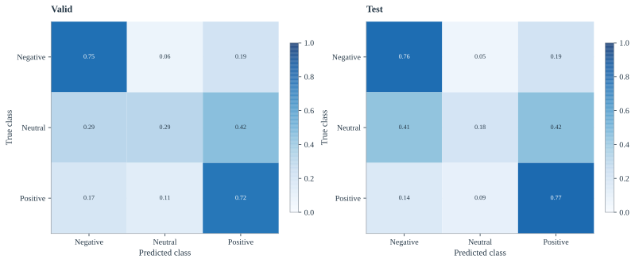

**数据来源与统计口径：**问题三全部验证/测试预测；颜色为按真实类别归一的比例，计数见下表。

验证中性类184条只识别53条，召回28.80%；测试中性类158条只识别28条，召回17.72%。测试中性误判中64条流向负面、66条流向正面，说明问题并非单向偏好，而是中性边界整体不足。

测试总误判261条，其中涉及真实或预测中性的错误为171条；直接负面与正面互换为90条。中性预测数量仅69条，明显小于真实158条。这样的混淆结构解释了Accuracy尚可而Macro-F1偏低。

这是一种数值层面的错误归因，不能在没有逐样本素材复核时进一步归因为讽刺、转写错误或表情遮挡。

| split | class | support | correct | precision | recall | f1 | predicted_count |
| --- | --- | --- | --- | --- | --- | --- | --- |
| valid | Negative | 206 | 155 | 0.5871 | 0.7524 | 0.6596 | 264 |
| valid | Neutral | 184 | 53 | 0.5196 | 0.2880 | 0.3706 | 102 |
| valid | Positive | 338 | 245 | 0.6768 | 0.7249 | 0.7000 | 362 |
| test | Negative | 207 | 158 | 0.5788 | 0.7633 | 0.6583 | 273 |
| test | Neutral | 158 | 28 | 0.4058 | 0.1772 | 0.2467 | 69 |
| test | Positive | 362 | 280 | 0.7273 | 0.7735 | 0.7497 | 385 |

## 图39 问题三的强度压缩与强情感误差

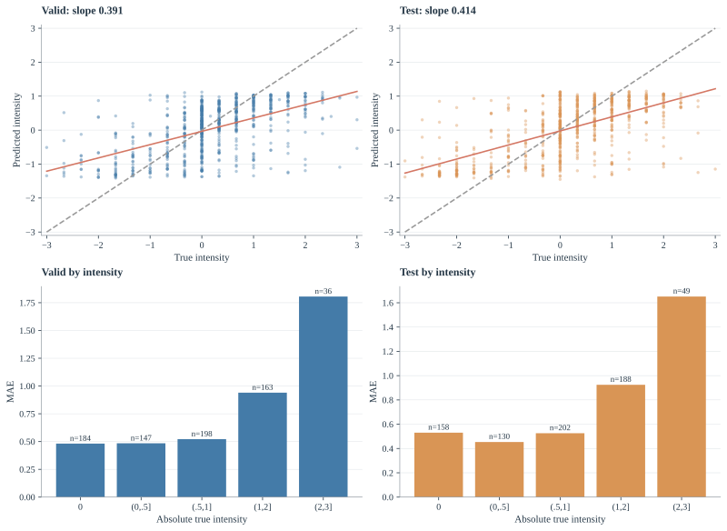

**数据来源与统计口径：**回归散点保留全部样本；直线为诊断最小二乘拟合，不修改预测；下排按真实绝对强度分层。

真实值越强而预测仍集中在中间区域，反映回归收缩。斜率仅用于描述预测对标签的响应幅度，不是模型训练参数。分层MAE揭示整体均值可能掩盖强情绪样本的大误差。

零强度组与非零组的样本量不同；每个柱标注n，下表同时给出分类准确率，便于检查“极性正确但强度不准”的情况。强度高并不必然分类更困难，符号和幅值应分别评价。

问题二也存在回归压缩，因此它是现有多模态方案共有的结果现象，但不能仅靠散点判定由损失权重、标签噪声或模型容量中的哪一项导致。

**强情绪误差。**问题三诊断斜率在验证/测试分别约0.391/0.414，比旧问题二参考的约0.514/0.499更低。测试|真实强度|>2组49条的分类准确率为87.76%，但MAE达到1.6512，说明极性判断正确与强度估计准确可以明显分离；验证同组36条MAE为1.8057。

| split | abs_true_band | n | mae | bias | accuracy |
| --- | --- | --- | --- | --- | --- |
| valid | 0 | 184 | 0.4816 | 0.0415 | 0.2880 |
| valid | (0,.5] | 147 | 0.4847 | -0.0616 | 0.5850 |
| valid | (.5,1] | 198 | 0.5216 | -0.2004 | 0.7222 |
| valid | (1,2] | 163 | 0.9402 | -0.3093 | 0.8528 |
| valid | (2,3] | 36 | 1.8057 | -0.1410 | 0.8889 |
| test | 0 | 158 | 0.5302 | 0.0188 | 0.1772 |
| test | (0,.5] | 130 | 0.4537 | -0.0133 | 0.5923 |
| test | (.5,1] | 202 | 0.5257 | -0.2266 | 0.7574 |
| test | (1,2] | 188 | 0.9248 | -0.2522 | 0.8777 |
| test | (2,3] | 49 | 1.6512 | 0.3033 | 0.8776 |

## 图40 问题三概率置信度与高置信错误

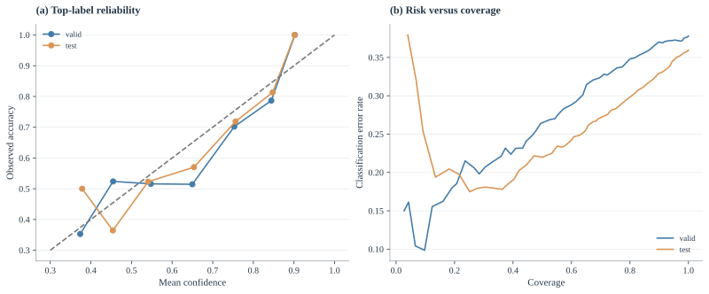

**数据来源与统计口径：**预测表仅保存最大类置信度，使用10个等宽箱；风险曲线每点至少15样本。

验证集ECE=0.0674，测试集ECE=0.0501。置信度≥0.8的错误分别为38与42条。可靠性图能够说明置信水平与实际正确率是否一致，但ECE对分箱有依赖，也不能保证单例可靠。

风险覆盖图描述拒绝低置信样本后保留集合的表现，覆盖率下降意味着更多样本没有得到被接受的预测。这里不基于测试结果选择部署阈值。

由于问题三带标签预测表没有完整三类概率，本报告不生成该模型的逐类ROC/PR、Brier或多类NLL；仅凭最大概率无法还原另外两个类别的概率。

| split | bin_low | n | mean_confidence | accuracy |
| --- | --- | --- | --- | --- |
| valid | 0.3000 | 17 | 0.3737 | 0.3529 |
| valid | 0.4000 | 105 | 0.4547 | 0.5238 |
| valid | 0.5000 | 126 | 0.5476 | 0.5159 |
| valid | 0.6000 | 138 | 0.6498 | 0.5145 |
| valid | 0.7000 | 161 | 0.7530 | 0.7019 |
| valid | 0.8000 | 178 | 0.8441 | 0.7865 |
| valid | 0.9000 | 3 | 0.9023 | 1.0000 |
| test | 0.3000 | 16 | 0.3784 | 0.5000 |
| test | 0.4000 | 107 | 0.4541 | 0.3645 |
| test | 0.5000 | 109 | 0.5410 | 0.5229 |
| test | 0.6000 | 107 | 0.6538 | 0.5701 |
| test | 0.7000 | 160 | 0.7563 | 0.7188 |
| test | 0.8000 | 225 | 0.8475 | 0.8133 |
| test | 0.9000 | 3 | 0.9020 | 1.0000 |

## 图41 问题三50轮训练与早期验证峰值

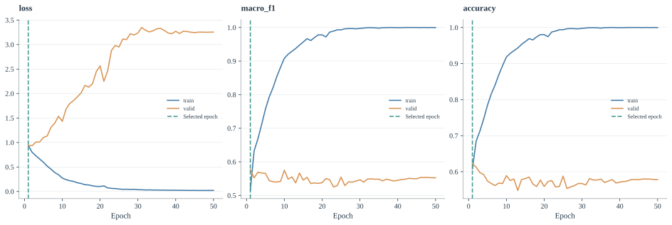

**数据来源与统计口径：**training_history.csv与problem3_metrics.json；保存选择轮为1。

保存模型在第1轮被选中，后续训练没有得到更高的已记录验证Macro-F1。第1轮训练/验证F1为0.5148/0.5767，最后一轮为0.9997/0.5525。训练loss由0.9426变为0.0211，验证loss由0.9414变为3.2540。

后期训练拟合改善而验证停滞说明继续训练并不能保证泛化。报告应使用已保存选中模型的预测，不能把第50轮训练成绩写成最终验证成绩。该问题三实验只提供seed 42，不能引用问题二的三种子波动来替代其训练稳定性证据。

历史中第1轮valid_mae与最终metrics存在约十万分之几量级差异，应以最终保存的逐样本预测为本报告评价口径，不将微小浮点或评价过程差异解释为实质提升。

| epoch | train_loss | valid_loss | train_f1 | valid_f1 | valid_mae |
| --- | --- | --- | --- | --- | --- |
| 1.0000 | 0.9426 | 0.9414 | 0.5148 | 0.5767 | 0.6613 |
| 2.0000 | 0.8019 | 0.9343 | 0.6327 | 0.5522 | 0.6119 |
| 5.0000 | 0.5980 | 1.1032 | 0.7569 | 0.5658 | 0.6232 |
| 10.0000 | 0.2744 | 1.4330 | 0.9085 | 0.5749 | 0.6444 |
| 20.0000 | 0.1020 | 2.5650 | 0.9778 | 0.5381 | 0.6694 |
| 30.0000 | 0.0363 | 3.2364 | 0.9974 | 0.5465 | 0.6229 |
| 40.0000 | 0.0238 | 3.2722 | 0.9995 | 0.5451 | 0.6490 |
| 50.0000 | 0.0211 | 3.2540 | 0.9997 | 0.5525 | 0.6367 |

## 图42 附件四全部预测与置信度

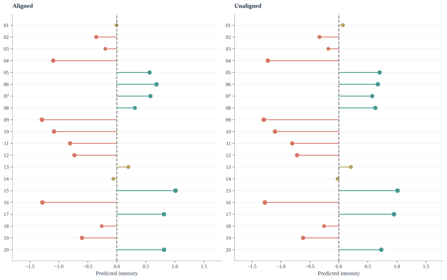

**数据来源与统计口径：**40行=20个编号×两种版本；颜色为极性，圆大小随置信度变化。

该图逐条呈现附件四的强度和极性，不删除边界样本。表中保留所有预测及主要参考模态，满足全量展示需要；原始详细证据字符串由专项CSV提供。

附件四没有真实标签，因此不可计算准确率，也不能把高置信预测称为正确解释。两种版本对应相同编号，只能作为配对版本记录，不能当作40条独立随机抽样。

问题三训练使用aligned版本，因此aligned输出作为主要结果，unaligned结果作描述性补充。强度靠近零且分类概率不集中的样本应被明确标为边界预测，但本次不修改其类别或引入新的中性阈值。

| variant | id | predicted_label | regression_prediction | confidence | main_modality |
| --- | --- | --- | --- | --- | --- |
| aligned | 01 | Neutral | -0.0065 | 0.4764 | text |
| aligned | 02 | Negative | -0.3556 | 0.5637 | text |
| aligned | 03 | Negative | -0.1991 | 0.4182 | text |
| aligned | 04 | Negative | -1.0964 | 0.7815 | text |
| aligned | 05 | Positive | 0.5637 | 0.6695 | vision |
| aligned | 06 | Positive | 0.6829 | 0.8041 | text |
| aligned | 07 | Positive | 0.5791 | 0.6657 | text |
| aligned | 08 | Positive | 0.3120 | 0.4924 | text |
| aligned | 09 | Negative | -1.2914 | 0.8603 | text |
| aligned | 10 | Negative | -1.0827 | 0.8262 | text |
| aligned | 11 | Negative | -0.8055 | 0.7190 | text |
| aligned | 12 | Negative | -0.7312 | 0.7035 | text |
| aligned | 13 | Neutral | 0.1989 | 0.4897 | text |
| aligned | 14 | Neutral | -0.0605 | 0.4122 | text |
| aligned | 15 | Positive | 1.0111 | 0.8664 | text |
| aligned | 16 | Negative | -1.2827 | 0.8539 | text |
| aligned | 17 | Positive | 0.8121 | 0.7801 | text |
| aligned | 18 | Negative | -0.2612 | 0.4408 | text |
| aligned | 19 | Negative | -0.6003 | 0.7186 | text |
| aligned | 20 | Positive | 0.8128 | 0.8051 | vision |
| unaligned | 01 | Neutral | 0.0707 | 0.4836 | text |
| unaligned | 02 | Negative | -0.3350 | 0.5625 | text |
| unaligned | 03 | Negative | -0.1825 | 0.4004 | text |
| unaligned | 04 | Negative | -1.2227 | 0.8059 | text |
| unaligned | 05 | Positive | 0.7016 | 0.7281 | audio |
| unaligned | 06 | Positive | 0.6717 | 0.8031 | text |
| unaligned | 07 | Positive | 0.5752 | 0.6651 | text |
| unaligned | 08 | Positive | 0.6289 | 0.6943 | text |
| unaligned | 09 | Negative | -1.2952 | 0.8610 | text |
| unaligned | 10 | Negative | -1.1009 | 0.8290 | text |
| unaligned | 11 | Negative | -0.8037 | 0.7186 | text |
| unaligned | 12 | Negative | -0.7203 | 0.7026 | text |
| unaligned | 13 | Neutral | 0.2083 | 0.4876 | text |
| unaligned | 14 | Neutral | -0.0238 | 0.4196 | text |
| unaligned | 15 | Positive | 1.0112 | 0.8586 | audio |
| unaligned | 16 | Negative | -1.2750 | 0.8543 | text |
| unaligned | 17 | Positive | 0.9497 | 0.8419 | text |
| unaligned | 18 | Negative | -0.2564 | 0.4351 | text |
| unaligned | 19 | Negative | -0.6176 | 0.7220 | text |
| unaligned | 20 | Positive | 0.7316 | 0.7644 | text |

## 图43 附件四逐样本三模态作用程度

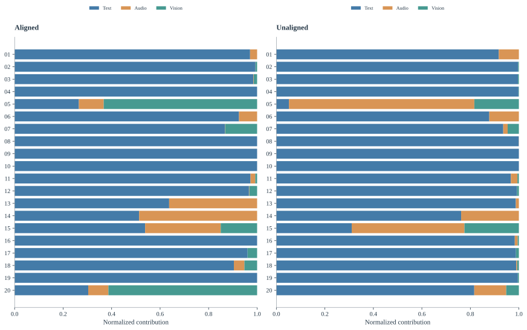

**数据来源与统计口径：**attachment4_explanations.csv，保存的归一化模态作用程度；每行三模态合计约1。

40份版本记录中36份以文本为主要参考模态，语音与视觉各2份。该比例说明此模型在当前样本的决策证据明显偏向文本，不能被描述为三模态贡献均衡。

贡献值是归一化相对量：当其他模态遮挡变化很小时，文本占比可能接近1，但并不意味着文本单独贡献了100%的预测正确性。某模态贡献为0也不能证明它在真实世界没有情绪信息，应结合有符号遮挡变化和归一化规则分析。

本图对每一条记录展示分布，避免均值抹平少数音频/视觉主导案例。主导模态的差异为选取解释卡提供依据，不应只挑选文本主导的成功例子。

**分版本结构。**aligned中18/20份文本主导、2/20份视觉主导，无音频主导；unaligned中18/20份文本主导、2/20份音频主导，无视觉主导。文本贡献均值分别0.8401与0.8783，中位数分别0.9686与0.9877，均值低于中位数表明少数非文本主导案例拉低总体均值。音频/视觉贡献的很多精确零来自结果定义，不能直接当作该模态完全未被使用。

| variant | modality | main_count | mean_contribution | median_contribution | zero_count |
| --- | --- | --- | --- | --- | --- |
| aligned | text | 18 | 0.8401 | 0.9686 | 0 |
| aligned | audio | 0 | 0.0759 | 0.0018 | 7 |
| aligned | vision | 2 | 0.0840 | 0.0035 | 9 |
| unaligned | text | 18 | 0.8783 | 0.9877 | 0 |
| unaligned | audio | 2 | 0.0939 | 0.0080 | 6 |
| unaligned | vision | 0 | 0.0278 | 0.0040 | 7 |

## 图44 主要参考模态内50个局部位置的重要性分布

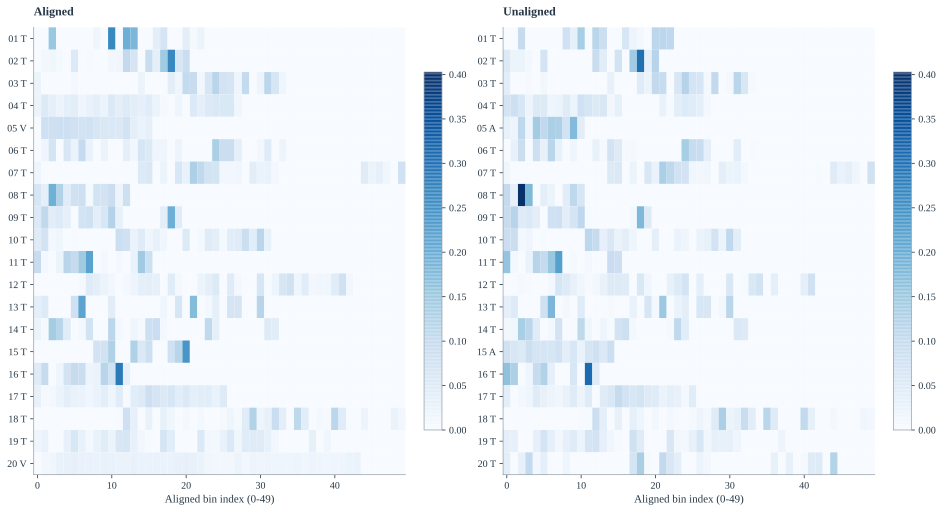

**数据来源与统计口径：**primary_modality_local_importance_samples.csv，40记录×50bin；T/A/V标注主导模态。

每行展示当前样本主要参考模态的完整50位置重要性；并非三个模态共150位置的全量矩阵。该CSV共2000行，足以覆盖主导模态的全局分布，不能扩称为6000条三模态全位置观测。

正向遮挡下降值经归一化后绘图。深色块表示在该样本内部相对集中，不适合直接比较不同样本的绝对概率下降幅度。下表提供前5位置累计质量、正值bin数量与最高位置，便于量化集中程度。

横轴严格称为bin索引，暂不标注真实秒数。零重要性既可能意味着遮挡没有降低当前预测类别概率，也可能来自负下降值被截为零；这种零值不等于该片段没有信息。

**解释分布与证据完整性。**全量局部CSV只列main_modality，因此可分析每份记录主要参考模态的50位置分布；另外两模态仅能从解释卡读取各5个候选位置。两类数据的覆盖范围不同，本报告没有把候选位置的均值当成其他模态全部位置的均值。

| variant | id | main_modality | sum_importance | positive_bins | top_bin | top5_mass | signed_drop_sum |
| --- | --- | --- | --- | --- | --- | --- | --- |
| aligned | 01 | text | 1.0000 | 10 | 10 | 0.8716 | -0.0706 |
| aligned | 02 | text | 1.0000 | 15 | 18 | 0.7061 | 0.2339 |
| aligned | 03 | text | 1.0000 | 34 | 24 | 0.5367 | 0.2826 |
| aligned | 04 | text | 1.0000 | 26 | 24 | 0.2961 | 0.2881 |
| aligned | 05 | vision | 1.0000 | 15 | 4 | 0.4245 | 0.0945 |
| aligned | 06 | text | 1.0000 | 22 | 24 | 0.4907 | 0.0434 |
| aligned | 07 | text | 1.0000 | 24 | 21 | 0.4730 | 0.0105 |
| aligned | 08 | text | 1.0000 | 13 | 2 | 0.5886 | 0.5283 |
| aligned | 09 | text | 1.0000 | 14 | 18 | 0.5861 | 0.0175 |
| aligned | 10 | text | 1.0000 | 42 | 30 | 0.4522 | 0.1559 |
| aligned | 11 | text | 1.0000 | 12 | 7 | 0.7421 | 0.4325 |
| aligned | 12 | text | 1.0000 | 33 | 41 | 0.3473 | 0.1241 |
| aligned | 13 | text | 1.0000 | 31 | 6 | 0.6700 | -0.0169 |
| aligned | 14 | text | 1.0000 | 19 | 2 | 0.5759 | -0.0435 |
| aligned | 15 | text | 1.0000 | 9 | 20 | 0.7072 | -0.0014 |
| aligned | 16 | text | 1.0000 | 12 | 11 | 0.6979 | 0.0353 |
| aligned | 17 | text | 1.0000 | 26 | 15 | 0.3362 | 0.3453 |
| aligned | 18 | text | 1.0000 | 30 | 29 | 0.5253 | 0.1728 |
| aligned | 19 | text | 1.0000 | 39 | 17 | 0.3213 | 0.2674 |
| aligned | 20 | vision | 1.0000 | 43 | 20 | 0.1603 | 0.0601 |
| unaligned | 01 | text | 1.0000 | 12 | 10 | 0.5944 | 0.0109 |
| unaligned | 02 | text | 1.0000 | 12 | 18 | 0.7421 | 0.1072 |
| unaligned | 03 | text | 1.0000 | 33 | 24 | 0.5467 | 0.2210 |
| unaligned | 04 | text | 1.0000 | 23 | 1 | 0.3699 | 0.0753 |
| unaligned | 05 | audio | 1.0000 | 11 | 9 | 0.6999 | 0.1163 |
| unaligned | 06 | text | 1.0000 | 19 | 24 | 0.5418 | 0.0225 |
| unaligned | 07 | text | 1.0000 | 23 | 21 | 0.4783 | 0.0044 |
| unaligned | 08 | text | 1.0000 | 9 | 2 | 0.8618 | 0.1548 |
| unaligned | 09 | text | 1.0000 | 14 | 18 | 0.5932 | 0.0104 |
| unaligned | 10 | text | 1.0000 | 22 | 11 | 0.5037 | 0.1107 |
| unaligned | 11 | text | 1.0000 | 45 | 7 | 0.7663 | 0.3963 |
| unaligned | 12 | text | 1.0000 | 28 | 41 | 0.3542 | 0.0887 |
| unaligned | 13 | text | 1.0000 | 17 | 6 | 0.6010 | -0.0035 |
| unaligned | 14 | text | 1.0000 | 20 | 2 | 0.5563 | -0.0276 |
| unaligned | 15 | audio | 1.0000 | 50 | 14 | 0.4201 | 0.0178 |
| unaligned | 16 | text | 1.0000 | 46 | 11 | 0.8356 | 0.0173 |
| unaligned | 17 | text | 1.0000 | 26 | 15 | 0.3697 | 0.1945 |
| unaligned | 18 | text | 1.0000 | 29 | 29 | 0.5427 | 0.1480 |
| unaligned | 19 | text | 1.0000 | 28 | 17 | 0.3577 | 0.1971 |
| unaligned | 20 | text | 1.0000 | 20 | 18 | 0.5415 | -0.0179 |

## 图45 按主导模态聚合的局部重要性与样本不均衡

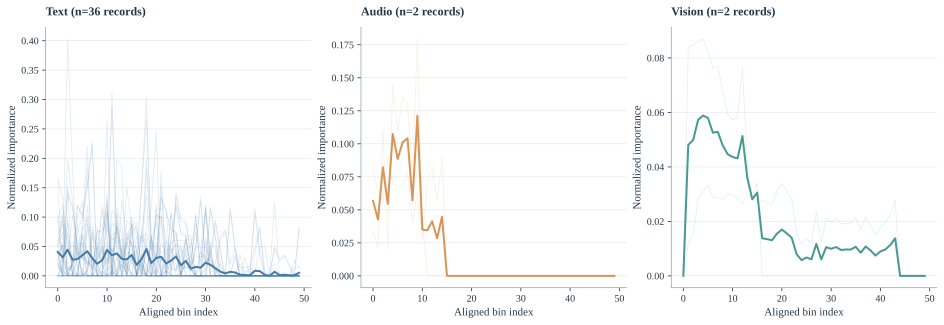

**数据来源与统计口径：**文本36份、音频2份、视觉2份版本记录；淡线为单记录，粗线为均值。

不同模态组的样本量极不平衡。文本曲线可以概括36份记录，但音频和视觉均只有2份，均值高度受个例影响，不能比较曲线形状后宣布某模态具有稳定的时间规律。

bin索引相同并不保证对应同一语义阶段或相同绝对秒数，跨样本平均主要用于描述索引空间中的集中位置。两种版本记录也存在同编号依赖，因此这里不画把40条当独立样本得到的置信区间。

下表的前5位置累计质量越大，说明单样本解释越集中；集中并不自动意味着解释更正确，需要与原始素材的真实定位和遮挡效应共同核验。

**集中程度。**文本主导记录前5位置的重要性质量平均55.78%，音频56.00%，视觉29.24%；平均正向位置数分别23.25、30.50、29.00。视觉组看起来更分散，但只有2份版本记录，不足以证明视觉解释天然比文本更分散。文本平均曲线峰位为bin18，它是跨样本索引统计，不是共同的第18秒。

| modality | records | mean_top5_mass | mean_positive_bins | peak_of_mean_bin | peak_of_mean_value |
| --- | --- | --- | --- | --- | --- |
| text | 36 | 0.5578 | 23.2500 | 18 | 0.0457 |
| audio | 2 | 0.5600 | 30.5000 | 9 | 0.1212 |
| vision | 2 | 0.2924 | 29.0000 | 4 | 0.0589 |

## 图46 遮挡效应的正负方向与解释强度

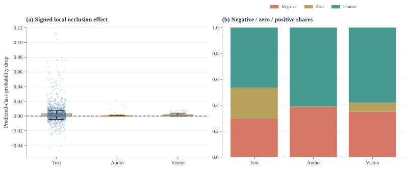

**数据来源与统计口径：**2000个主导模态局部位置；负值表示遮挡后当前预测类别概率反而升高。

遮挡下降并不总为正。正下降值可作为当前预测的支持证据，负值表示该局部信息对该预测存在抑制或与其他信息交互；不能先截成非负再宣称所有局部片段都支持预测。

左图散点保留全部数值，箱线图不另重复画离群符号；右图给出正、零、负比例。三个模态的样本数与记录数不同，不将2000个位置当成2000个独立样本进行显著性检验。

遮挡是对模型输入的局部干预，因此可检验模型响应；它并不等于自然场景中的因果实验，且全零输入可能离开正常数据分布。报告应称为局部忠实度或模型敏感性证据。

**数值精度边界。**文本1800个位置中29.67%为负、23.83%为精确零、46.50%为正；语音和视觉组存在约10⁻⁸量级的变化，接近浮点噪声。正负比例按原值统计，没有施加阈值；对极小下降值不应作语义强解释。绝对幅值最大值分别约0.1122、0.0210、0.0082，归一化贡献图会隐藏这种数量级差异。

| main_modality | positions | negative_fraction | zero_fraction | positive_fraction | min_drop | median_drop | max_drop |
| --- | --- | --- | --- | --- | --- | --- | --- |
| text | 1800 | 0.2967 | 0.2383 | 0.4650 | -0.0478 | 0.0000 | 0.1122 |
| audio | 100 | 0.3900 | 0.0000 | 0.6100 | -0.0010 | 0.0000 | 0.0210 |
| vision | 100 | 0.3500 | 0.0700 | 0.5800 | -0.0000 | 0.0010 | 0.0082 |

## 图47 注意力权重与遮挡贡献是否一致

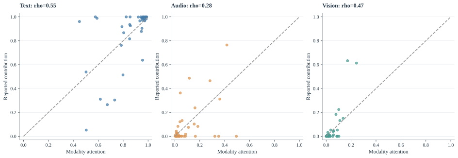

**数据来源与统计口径：**40张解释卡中的modality_attention与modality_contribution；Spearman为描述性秩相关。

两种量都呈现在[0,1]范围内，但含义不同：注意力描述内部加权，遮挡贡献描述输入扰动后的响应。散点接近对角线只能说明两种摘要接近，不代表注意力已被证明是因果解释。

图中逐模态相关反映样本间排序的一致程度；主导模态组高度不均衡、同编号版本成对，因此不报告把40点视为独立观察的显著性p值。尤其对近零模态，微小数值变化可能使秩相关看起来明显，仍应结合绝对差值。

保留两套量有助于识别“模型关注但遮挡影响不大”或“注意力小但干预响应明显”的样本，后续解释卡将展示具体证据。

**一致但并不等同。**文本、语音、视觉的注意力—贡献Spearman相关分别为0.5546、0.2760、0.4732，并非完全一致；平均绝对差分别0.1235、0.0931、0.0463。文本平均注意力0.8547与平均贡献0.8592很接近，但单样本平均绝对差仍达0.1235，说明总体均值一致不能代替逐样本核验。

| modality | n_records | spearman | mean_attention | mean_contribution | mean_abs_difference |
| --- | --- | --- | --- | --- | --- |
| text | 40 | 0.5546 | 0.8547 | 0.8592 | 0.1235 |
| audio | 40 | 0.2760 | 0.0996 | 0.0849 | 0.0931 |
| vision | 40 | 0.4732 | 0.0457 | 0.0559 | 0.0463 |

## 图48 典型解释卡：text主导的aligned_08

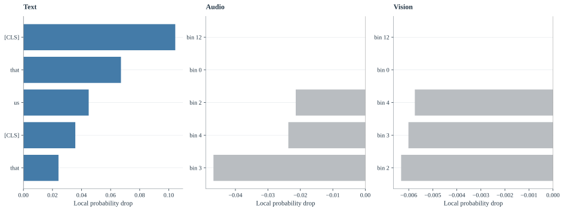

**数据来源与统计口径：**真实保存的解释卡；每模态5个候选位置，按原始输出顺序展示。

样本aligned_08，预测Positive，强度0.3120，置信度0.4924；主导模态text。三模态贡献分别为text=1.0000, audio=0.0000, vision=0.0000。

**原始转写：**That brings us to tonight, the Universal Design Grand Challenge

图中直接展示有符号遮挡下降，灰色表示负值。选择此例是为了覆盖主导模态类型，不表示它是准确预测或解释最可靠的样本。文本token只提供模型关注的词元，不能仅因词语看似带情感就断言其解释正确；[CLS]、标点或子词也可能进入候选列表。

语音与视觉图使用bin标注，下表原样保留输出中的秒数与帧号以供核对。现有卡片的duration_seconds与真实素材时长需单独检查，未经核实的秒数不能作为已验证的原视频证据位置。

**特殊词元与重复映射。**该卡文本候选中出现两次[CLS]和两次that，分别对应不同bin；[CLS]具有较大的遮挡下降，但并不是可直接回看的自然语言词语。该现象提示不能把所有bin候选都表述为独立的情绪关键词。它说明模型对特殊词元/映射位置敏感，具体语义解释仍需人工核验。

| modality | bin | token | drop | attention | reported_start_s | reported_end_s | reported_frame_start | reported_frame_end |
| --- | --- | --- | --- | --- | --- | --- | --- | --- |
| text | 2 | [CLS] | 0.1045 | 0.0520 |  |  |  |  |
| text | 3 | that | 0.0671 | 0.0486 |  |  |  |  |
| text | 12 | us | 0.0449 | 0.0535 |  |  |  |  |
| text | 0 | [CLS] | 0.0357 | 0.0487 |  |  |  |  |
| text | 4 | that | 0.0241 | 0.0474 |  |  |  |  |
| audio | 12 |  | 0.0000 | 0.0297 | 0.2400 | 0.2600 | 1 | 1 |
| audio | 0 |  | 0.0000 | 0.0271 | 0.0000 | 0.0200 | 0 | 0 |
| audio | 2 |  | -0.0214 | 0.0289 | 0.0400 | 0.0600 | 0 | 0 |
| audio | 4 |  | -0.0237 | 0.0264 | 0.0800 | 0.1000 | 0 | 0 |
| audio | 3 |  | -0.0468 | 0.0270 | 0.0600 | 0.0800 | 0 | 0 |
| vision | 12 |  | 0.0000 | 0.0095 | 0.2400 | 0.2600 | 1 | 1 |
| vision | 0 |  | 0.0000 | 0.0086 | 0.0000 | 0.0200 | 0 | 0 |
| vision | 4 |  | -0.0057 | 0.0084 | 0.0800 | 0.1000 | 0 | 0 |
| vision | 3 |  | -0.0060 | 0.0086 | 0.0600 | 0.0800 | 0 | 0 |
| vision | 2 |  | -0.0063 | 0.0092 | 0.0400 | 0.0600 | 0 | 0 |

## 图49 典型解释卡：audio主导的unaligned_05

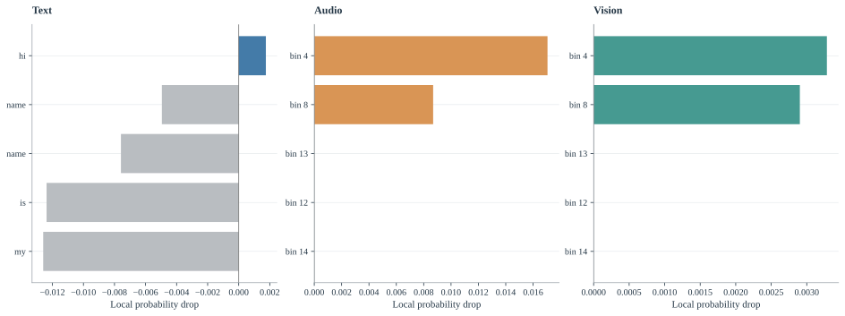

**数据来源与统计口径：**真实保存的解释卡；每模态5个候选位置，按原始输出顺序展示。

样本unaligned_05，预测Positive，强度0.7016，置信度0.7281；主导模态audio。三模态贡献分别为text=0.0519, audio=0.7644, vision=0.1837。

**原始转写：**Hi, my name is Chloe, video marketer for Red Wagon Marketing.

图中直接展示有符号遮挡下降，灰色表示负值。选择此例是为了覆盖主导模态类型，不表示它是准确预测或解释最可靠的样本。文本token只提供模型关注的词元，不能仅因词语看似带情感就断言其解释正确；[CLS]、标点或子词也可能进入候选列表。

语音与视觉图使用bin标注，下表原样保留输出中的秒数与帧号以供核对。现有卡片的duration_seconds与真实素材时长需单独检查，未经核实的秒数不能作为已验证的原视频证据位置。

**版本限定。**当前aligned解释中没有音频主导样本，因此此卡明确取自unaligned，仅用于覆盖已有输出中的音频主导机制。它不能作为aligned主实验存在音频主导样本的证据，更不能补造一个aligned音频主导案例。

| modality | bin | token | drop | attention | reported_start_s | reported_end_s | reported_frame_start | reported_frame_end |
| --- | --- | --- | --- | --- | --- | --- | --- | --- |
| text | 4 | hi | 0.0017 | 0.0314 |  |  |  |  |
| text | 12 | name | -0.0049 | 0.0337 |  |  |  |  |
| text | 13 | name | -0.0076 | 0.0349 |  |  |  |  |
| text | 14 | is | -0.0124 | 0.0317 |  |  |  |  |
| text | 8 | my | -0.0126 | 0.0348 |  |  |  |  |
| audio | 4 |  | 0.0171 | 0.0261 | 0.0800 | 0.1000 | 0 | 0 |
| audio | 8 |  | 0.0087 | 0.0289 | 0.1600 | 0.1800 | 1 | 1 |
| audio | 13 |  | 0.0000 | 0.0290 | 0.2600 | 0.2800 | 1 | 1 |
| audio | 12 |  | 0.0000 | 0.0279 | 0.2400 | 0.2600 | 1 | 1 |
| audio | 14 |  | 0.0000 | 0.0263 | 0.2800 | 0.3000 | 1 | 2 |
| vision | 4 |  | 0.0033 | 0.0049 | 0.0800 | 0.1000 | 0 | 0 |
| vision | 8 |  | 0.0029 | 0.0054 | 0.1600 | 0.1800 | 1 | 1 |
| vision | 13 |  | 0.0000 | 0.0055 | 0.2600 | 0.2800 | 1 | 1 |
| vision | 12 |  | 0.0000 | 0.0053 | 0.2400 | 0.2600 | 1 | 1 |
| vision | 14 |  | 0.0000 | 0.0049 | 0.2800 | 0.3000 | 1 | 2 |

## 图50 典型解释卡：vision主导的aligned_05

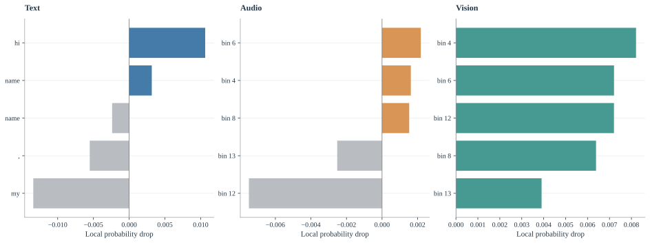

**数据来源与统计口径：**真实保存的解释卡；每模态5个候选位置，按原始输出顺序展示。

样本aligned_05，预测Positive，强度0.5637，置信度0.6695；主导模态vision。三模态贡献分别为text=0.2650, audio=0.1024, vision=0.6326。

**原始转写：**Hi, my name is Chloe, video marketer for Red Wagon Marketing.

图中直接展示有符号遮挡下降，灰色表示负值。选择此例是为了覆盖主导模态类型，不表示它是准确预测或解释最可靠的样本。文本token只提供模型关注的词元，不能仅因词语看似带情感就断言其解释正确；[CLS]、标点或子词也可能进入候选列表。

语音与视觉图使用bin标注，下表原样保留输出中的秒数与帧号以供核对。现有卡片的duration_seconds与真实素材时长需单独检查，未经核实的秒数不能作为已验证的原视频证据位置。

| modality | bin | token | drop | attention | reported_start_s | reported_end_s | reported_frame_start | reported_frame_end |
| --- | --- | --- | --- | --- | --- | --- | --- | --- |
| text | 4 | hi | 0.0106 | 0.0419 |  |  |  |  |
| text | 12 | name | 0.0032 | 0.0464 |  |  |  |  |
| text | 13 | name | -0.0024 | 0.0464 |  |  |  |  |
| text | 6 | , | -0.0055 | 0.0431 |  |  |  |  |
| text | 8 | my | -0.0134 | 0.0483 |  |  |  |  |
| audio | 6 |  | 0.0022 | 0.0100 | 0.1200 | 0.1400 | 1 | 1 |
| audio | 4 |  | 0.0016 | 0.0097 | 0.0800 | 0.1000 | 0 | 0 |
| audio | 8 |  | 0.0015 | 0.0112 | 0.1600 | 0.1800 | 1 | 1 |
| audio | 13 |  | -0.0025 | 0.0107 | 0.2600 | 0.2800 | 1 | 1 |
| audio | 12 |  | -0.0075 | 0.0107 | 0.2400 | 0.2600 | 1 | 1 |
| vision | 4 |  | 0.0082 | 0.0107 | 0.0800 | 0.1000 | 0 | 0 |
| vision | 6 |  | 0.0072 | 0.0110 | 0.1200 | 0.1400 | 1 | 1 |
| vision | 12 |  | 0.0072 | 0.0118 | 0.2400 | 0.2600 | 1 | 1 |
| vision | 8 |  | 0.0064 | 0.0123 | 0.1600 | 0.1800 | 1 | 1 |
| vision | 13 |  | 0.0039 | 0.0118 | 0.2600 | 0.2800 | 1 | 1 |

## 图51 附件四预测与解释的跨版本一致性

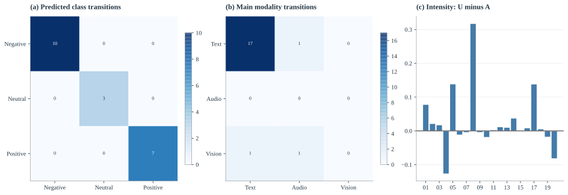

**数据来源与统计口径：**20个编号配对；矩阵行为aligned、列为unaligned。

类别一致20/20，主导模态一致17/20，强度差绝对值均值0.0520。同一个样本的预测一致不保证解释一致，反之亦然，两个层面应分别报告。

对角线外的主导模态转移揭示解释对输入版本的敏感性。但两种版本不是受控的单一因素扰动，不应据此量化某个模态缺失的因果效应。

题目要求保持训练与专项测试输入版本一致，因此本图用于界定额外输出的稳定性边界，不能用于在无标签专项集上选出所谓更准确版本。

**预测一致而解释变化。**20对样本的类别全部一致，但主导模态只有17对一致；变化为编号05：vision→audio；编号15：text→audio；编号20：vision→text。主导模态变动并不必然导致类别变化，最终预测的稳定性与解释路径稳定性应分别报告。

| id | aligned_class | unaligned_class | same_class | aligned_main | unaligned_main | same_main | intensity_difference |
| --- | --- | --- | --- | --- | --- | --- | --- |
| 01 | Neutral | Neutral | 1 | text | text | 1 | 0.0772 |
| 02 | Negative | Negative | 1 | text | text | 1 | 0.0206 |
| 03 | Negative | Negative | 1 | text | text | 1 | 0.0167 |
| 04 | Negative | Negative | 1 | text | text | 1 | -0.1263 |
| 05 | Positive | Positive | 1 | vision | audio | 0 | 0.1379 |
| 06 | Positive | Positive | 1 | text | text | 1 | -0.0111 |
| 07 | Positive | Positive | 1 | text | text | 1 | -0.0039 |
| 08 | Positive | Positive | 1 | text | text | 1 | 0.3168 |
| 09 | Negative | Negative | 1 | text | text | 1 | -0.0038 |
| 10 | Negative | Negative | 1 | text | text | 1 | -0.0182 |
| 11 | Negative | Negative | 1 | text | text | 1 | 0.0017 |
| 12 | Negative | Negative | 1 | text | text | 1 | 0.0109 |
| 13 | Neutral | Neutral | 1 | text | text | 1 | 0.0093 |
| 14 | Neutral | Neutral | 1 | text | text | 1 | 0.0367 |
| 15 | Positive | Positive | 1 | text | audio | 0 | 0.0001 |
| 16 | Negative | Negative | 1 | text | text | 1 | 0.0077 |
| 17 | Positive | Positive | 1 | text | text | 1 | 0.1376 |
| 18 | Negative | Negative | 1 | text | text | 1 | 0.0047 |
| 19 | Negative | Negative | 1 | text | text | 1 | -0.0173 |
| 20 | Positive | Positive | 1 | vision | text | 0 | -0.0813 |

## 图52 解释位置的物理时间可核验性

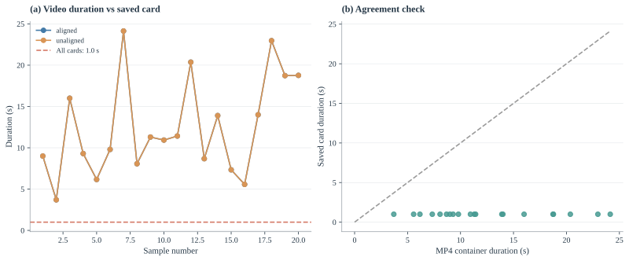

**数据来源与统计口径：**只读取原始MP4容器mvhd时长，与40张解释卡的duration_seconds比较；未重跑推理。

全部40张解释卡保存的duration_seconds均为1.0秒，而本地视频容器时长范围为3.700至24.134秒。当前结果的语音秒数和视觉帧号由此不能直接视为已经验证的原素材定位。这个差异是保存成果之间的实证不一致，不涉及代码审核。

题目问题三要求关键证据可对应原始文本、语音时段或视觉关键帧。现有结果支持bin级局部重要性和token级候选证据，但当前秒数/帧号对应需要额外核验。仅将bin按视频总时长线性拉伸也不能证明正确，因为aligned特征位置未必是等时间采样；本报告不擅自修正。

因此应把“已输出解释”和“原始素材定位已验证”区分开。图48至50用bin作主图标签，同时保留原秒数供复核，避免把有问题的时间映射再包装成确定的科研结论。

**具体可复核例子。**aligned_01原视频容器时长9.000秒，而解释卡保存1.000秒；aligned_03原视频16.000秒，卡片仍为1.000秒。时长差异覆盖全部40张卡片，不能当成单个案例的舍入误差。图中的原视频时长由文件容器读取，未重新提取情感特征或训练模型。

| variant | id | reported_duration_s | container_duration_s | ratio_reported_to_container |
| --- | --- | --- | --- | --- |
| aligned | 01 | 1.0000 | 9.0000 | 0.1111 |
| aligned | 02 | 1.0000 | 3.7000 | 0.2703 |
| aligned | 03 | 1.0000 | 16.0000 | 0.0625 |
| aligned | 04 | 1.0000 | 9.3000 | 0.1075 |
| aligned | 05 | 1.0000 | 6.1670 | 0.1622 |
| aligned | 06 | 1.0000 | 9.8000 | 0.1020 |
| aligned | 07 | 1.0000 | 24.1340 | 0.0414 |
| aligned | 08 | 1.0000 | 8.0670 | 0.1240 |
| aligned | 09 | 1.0000 | 11.3000 | 0.0885 |
| aligned | 10 | 1.0000 | 10.9340 | 0.0915 |
| aligned | 11 | 1.0000 | 11.4240 | 0.0875 |
| aligned | 12 | 1.0000 | 20.3670 | 0.0491 |
| aligned | 13 | 1.0000 | 8.6800 | 0.1152 |
| aligned | 14 | 1.0000 | 13.9000 | 0.0719 |
| aligned | 15 | 1.0000 | 7.3340 | 0.1364 |
| aligned | 16 | 1.0000 | 5.5730 | 0.1794 |
| aligned | 17 | 1.0000 | 14.0000 | 0.0714 |
| aligned | 18 | 1.0000 | 22.9670 | 0.0435 |
| aligned | 19 | 1.0000 | 18.7340 | 0.0534 |
| aligned | 20 | 1.0000 | 18.7670 | 0.0533 |
| unaligned | 01 | 1.0000 | 9.0000 | 0.1111 |
| unaligned | 02 | 1.0000 | 3.7000 | 0.2703 |
| unaligned | 03 | 1.0000 | 16.0000 | 0.0625 |
| unaligned | 04 | 1.0000 | 9.3000 | 0.1075 |
| unaligned | 05 | 1.0000 | 6.1670 | 0.1622 |
| unaligned | 06 | 1.0000 | 9.8000 | 0.1020 |
| unaligned | 07 | 1.0000 | 24.1340 | 0.0414 |
| unaligned | 08 | 1.0000 | 8.0670 | 0.1240 |
| unaligned | 09 | 1.0000 | 11.3000 | 0.0885 |
| unaligned | 10 | 1.0000 | 10.9340 | 0.0915 |
| unaligned | 11 | 1.0000 | 11.4240 | 0.0875 |
| unaligned | 12 | 1.0000 | 20.3670 | 0.0491 |
| unaligned | 13 | 1.0000 | 8.6800 | 0.1152 |
| unaligned | 14 | 1.0000 | 13.9000 | 0.0719 |
| unaligned | 15 | 1.0000 | 7.3340 | 0.1364 |
| unaligned | 16 | 1.0000 | 5.5730 | 0.1794 |
| unaligned | 17 | 1.0000 | 14.0000 | 0.0714 |
| unaligned | 18 | 1.0000 | 22.9670 | 0.0435 |
| unaligned | 19 | 1.0000 | 18.7340 | 0.0534 |
| unaligned | 20 | 1.0000 | 18.7670 | 0.0533 |

## 四、综合讨论：哪些主张可以写入论文

### 4.1 鲁棒性应按指标与条件准确表述

现有数据支持“文本局部缺失具有较强影响，后段文本缺失是突出困难条件；增强方案改善强度回归及本测试网格中的最差情形”。它不支持“Robust在全部条件和全部指标上最优”。跨条件平均F1和MAE出现方向分歧，说明分类边界与强度估计存在不同收益，不宜将不同量纲压成一个没有权重依据的综合分数。

完整输入跨种子均值与旧单次参考必须分开。旧参考71.80%准确率高于Baseline三种子均值69.23%；采用单次最高值作为新方法对照，会夸大或缩小方法差异。新受控表直接提供匹配种子比较，是讨论架构和增强的主要依据；旧历史五模型比较仍只能作为背景。

### 4.2 可解释性成果分为三个层次

第一层是输出结构：预测、模态作用、主导模态、候选片段和解释卡已经存在。第二层是模型响应：局部遮挡产生正负概率变化，可以复核模型对局部输入的敏感性；归一化贡献与注意力并不完全相同。第三层是素材定位与语义可信度：秒数、帧号应真实对应视频，片段意义应可人工回看。当前第三层存在明确时长不一致，不能把前两层成果写成第三层已经验证完成。

文本主导不是方法失败的充分条件，但它限制了“充分融合三模态互补信息”的强主张。注意力均值和贡献均值很接近，也不能证明每条解释一致。无标签附件四无法评价解释是否对应真实情感，因此应将解释忠实度、定位准确性和预测准确性分别定义、分别讨论。

### 4.3 当前结果中仍不能量化的内容

没有问题二各缺失条件的逐样本三类概率，无法从汇总指标重建每条件混淆矩阵、校准曲线或视频聚类配对区间。问题三带标签表只有最大类置信度，无法绘制真实逐类ROC/PR或计算多类Brier/NLL。问题三只有一个训练种子，不能声称已经验证多次训练稳定性。局部遮挡完整分布只覆盖主导模态，另外两模态的全50位置分布不能从5个候选点推断。

现有结果没有给出人工词时间边界真值，也没有解释正确性的人工标注，所以不报告对齐误差、解释准确率或语义因果正确率。上述内容是现有证据能支持的结论边界，不是本次要求重新开展实验的任务清单。

### 4.4 可用于论文的综合结果表述

在附件二的既定划分上，三模型、三种子受控实验覆盖局部缺失率、位置、连续块时长及整模态消融，共得到1044条条件评价。结果显示，含文本的缺失条件通常引起更明显性能下降；在30%文本后段缺失条件下，Robust模型的测试Macro-F1为0.5742，高于无增强架构的0.5181，MAE由0.7755下降至0.7117。对49个局部缺失条件作等权描述性汇总时，Robust的测试MAE为0.6379，低于Baseline的0.6494，最差Macro-F1由0.5451提高至0.5613；但平均Macro-F1为0.6236，略低于Baseline的0.6282。因此改进主要体现为强度估计误差下降和部分困难条件的稳定性改善，而非分类指标全面领先。

可解释模型在测试集上达到64.10%准确率、0.5516 Macro-F1、0.6929 MAE和0.6217 Pearson相关。中性类召回率为17.72%，构成主要分类瓶颈。专项解释输出中，36/40份版本记录以文本为主要参考模态，局部遮挡结果提供了可量化的模型敏感性证据；然而全部解释卡的1秒时长与原视频容器时长不符，现阶段只能确认bin与token级证据，不能将保存秒数/帧号表述为已经验证的真实素材定位。

## 五、全量数据附录与可追溯性

### 5.1 问题一全部100条样本汇总

每条样本均有文本768、语音74、视觉35维特征，三模态各50位置。下表给出保存时长、视频元数据与有效位置数；300行逐模态详细表见tables/problem1_all_300_modality_records.csv，其中包含源区间、工具字段与视频SHA-256。这里的时长沿用结果文件定义，未改写成题面时长。

| id | duration_seconds | fps | frame_count | text_valid_bins | audio_valid_bins | vision_valid_bins |
| --- | --- | --- | --- | --- | --- | --- |
| -3g5yACwYnA$_$2 | 9.3900 | 30.0000 | 282.0000 | 23.0000 | 50.0000 | 50.0000 |
| -3g5yACwYnA$_$3 | 14.3900 | 30.0000 | 432.0000 | 37.0000 | 50.0000 | 50.0000 |
| -3g5yACwYnA$_$9 | 8.8200 | 30.0000 | 265.0000 | 37.0000 | 50.0000 | 50.0000 |
| -3g5yACwYnA$_$13 | 5.5100 | 30.0000 | 165.0000 | 32.0000 | 49.0000 | 50.0000 |
| -3nNcZdcdvU$_$5 | 7.8700 | 30.0000 | 236.0000 | 40.0000 | 50.0000 | 50.0000 |
| -571d8cVauQ$_$0 | 5.0700 | 30.0000 | 152.0000 | 34.0000 | 50.0000 | 50.0000 |
| -571d8cVauQ$_$5 | 15.2700 | 30.0000 | 458.0000 | 41.0000 | 50.0000 | 50.0000 |
| -6rXp3zJ3kc$_$8 | 12.8100 | 30.0000 | 384.0000 | 39.0000 | 50.0000 | 50.0000 |
| -9y-fZ3swSY$_$0 | 6.8300 | 30.0000 | 205.0000 | 40.0000 | 50.0000 | 50.0000 |
| -9y-fZ3swSY$_$4 | 2.8200 | 30.0000 | 85.0000 | 28.0000 | 48.0000 | 50.0000 |
| -9y-fZ3swSY$_$8 | 4.9900 | 30.0000 | 150.0000 | 34.0000 | 50.0000 | 50.0000 |
| -AUZQgSxyPQ$_$2 | 22.5100 | 30.0000 | 675.0000 | 44.0000 | 50.0000 | 50.0000 |
| -HeZS2-Prhc$_$2 | 8.2600 | 30.0000 | 248.0000 | 36.0000 | 50.0000 | 50.0000 |
| -HwX2H8Z4hY$_$2 | 3.9800 | 30.0000 | 119.0000 | 21.0000 | 50.0000 | 50.0000 |
| -HwX2H8Z4hY$_$5 | 5.6500 | 30.0000 | 170.0000 | 38.0000 | 49.0000 | 50.0000 |
| -HwX2H8Z4hY$_$6 | 3.3600 | 30.0000 | 101.0000 | 26.0000 | 49.0000 | 50.0000 |
| -HwX2H8Z4hY$_$9 | 7.7300 | 30.0000 | 232.0000 | 37.0000 | 50.0000 | 50.0000 |
| -I_e4mIh0yE$_$1 | 7.6200 | 30.0000 | 229.0000 | 35.0000 | 49.0000 | 50.0000 |
| -I_e4mIh0yE$_$3 | 9.1600 | 30.0000 | 275.0000 | 34.0000 | 50.0000 | 50.0000 |
| -MeTTeMJBNc$_$0 | 9.3000 | 30.0000 | 279.0000 | 38.0000 | 50.0000 | 50.0000 |
| -MeTTeMJBNc$_$7 | 10.5200 | 30.0000 | 316.0000 | 41.0000 | 50.0000 | 50.0000 |
| -MeTTeMJBNc$_$13 | 5.4300 | 30.0000 | 163.0000 | 33.0000 | 49.0000 | 50.0000 |
| -NFrJFQijFE$_$1 | 5.7500 | 25.0000 | 144.0000 | 44.0000 | 50.0000 | 50.0000 |
| -NFrJFQijFE$_$2 | 6.8600 | 25.0000 | 172.0000 | 41.0000 | 49.0000 | 50.0000 |
| -RfYyzHpjk4$_$2 | 5.5200 | 30.0000 | 166.0000 | 40.0000 | 49.0000 | 50.0000 |
| -RfYyzHpjk4$_$8 | 4.5900 | 30.0000 | 138.0000 | 38.0000 | 50.0000 | 50.0000 |
| -RfYyzHpjk4$_$11 | 5.2400 | 30.0000 | 157.0000 | 34.0000 | 49.0000 | 50.0000 |
| -THoVjtIkeU$_$2 | 4.2900 | 30.0000 | 129.0000 | 35.0000 | 50.0000 | 50.0000 |
| -THoVjtIkeU$_$6 | 8.1000 | 30.0000 | 243.0000 | 41.0000 | 50.0000 | 50.0000 |
| -THoVjtIkeU$_$12 | 14.9000 | 30.0000 | 447.0000 | 44.0000 | 50.0000 | 50.0000 |
| -UUCSKoHeMA$_$0 | 7.8000 | 30.0000 | 234.0000 | 34.0000 | 50.0000 | 50.0000 |
| -UacrmKiTn4$_$4 | 4.7400 | 30.0000 | 142.0000 | 39.0000 | 50.0000 | 50.0000 |
| -UacrmKiTn4$_$10 | 7.3600 | 30.0000 | 221.0000 | 37.0000 | 50.0000 | 50.0000 |
| -UuX1xuaiiE$_$0 | 3.6300 | 30.0000 | 109.0000 | 39.0000 | 50.0000 | 50.0000 |
| -UuX1xuaiiE$_$1 | 10.3500 | 30.0000 | 310.0000 | 39.0000 | 50.0000 | 50.0000 |
| -UuX1xuaiiE$_$3 | 4.1300 | 30.0000 | 124.0000 | 29.0000 | 49.0000 | 50.0000 |
| -UuX1xuaiiE$_$6 | 8.1100 | 30.0000 | 243.0000 | 37.0000 | 49.0000 | 50.0000 |
| -a55Q6RWvTA$_$3 | 22.1500 | 30.0000 | 664.0000 | 37.0000 | 50.0000 | 50.0000 |
| -aNfi7CP8vM$_$7 | 8.6900 | 30.0000 | 261.0000 | 37.0000 | 50.0000 | 50.0000 |
| -aqamKhZ1Ec$_$0 | 10.9700 | 30.0000 | 329.0000 | 44.0000 | 50.0000 | 50.0000 |
| -dxfTGcXJoc$_$0 | 20.5000 | 30.0000 | 615.0000 | 40.0000 | 50.0000 | 50.0000 |
| -dxfTGcXJoc$_$1 | 16.1600 | 30.0000 | 485.0000 | 46.0000 | 50.0000 | 50.0000 |
| -dxfTGcXJoc$_$2 | 16.7000 | 30.0000 | 501.0000 | 43.0000 | 50.0000 | 50.0000 |
| -dxfTGcXJoc$_$6 | 12.7400 | 30.0000 | 382.0000 | 45.0000 | 50.0000 | 50.0000 |
| -egA8-b7-3M$_$1 | 10.2700 | 30.0000 | 308.0000 | 34.0000 | 50.0000 | 50.0000 |
| -egA8-b7-3M$_$6 | 6.2600 | 30.0000 | 188.0000 | 38.0000 | 50.0000 | 50.0000 |
| -egA8-b7-3M$_$9 | 5.0900 | 30.0000 | 153.0000 | 36.0000 | 49.0000 | 50.0000 |
| -egA8-b7-3M$_$13 | 4.1800 | 30.0000 | 125.0000 | 32.0000 | 49.0000 | 50.0000 |
| -egA8-b7-3M$_$16 | 5.5400 | 30.0000 | 166.0000 | 39.0000 | 50.0000 | 50.0000 |
| -egA8-b7-3M$_$17 | 7.2700 | 30.0000 | 218.0000 | 32.0000 | 49.0000 | 50.0000 |
| -egA8-b7-3M$_$18 | 8.3900 | 30.0000 | 252.0000 | 38.0000 | 50.0000 | 50.0000 |
| -egA8-b7-3M$_$20 | 6.6400 | 30.0000 | 199.0000 | 37.0000 | 49.0000 | 50.0000 |
| -egA8-b7-3M$_$26 | 6.0300 | 30.0000 | 181.0000 | 36.0000 | 50.0000 | 50.0000 |
| -hnBHBN8p5A$_$6 | 6.4000 | 23.9800 | 153.0000 | 30.0000 | 50.0000 | 50.0000 |
| -hnBHBN8p5A$_$7 | 7.3700 | 23.9800 | 177.0000 | 33.0000 | 50.0000 | 50.0000 |
| -iRBcNs9oI8$_$3 | 5.6200 | 29.9700 | 168.0000 | 24.0000 | 50.0000 | 50.0000 |
| -iRBcNs9oI8$_$6 | 2.9000 | 29.9700 | 87.0000 | 19.0000 | 49.0000 | 50.0000 |
| -iRBcNs9oI8$_$7 | 4.1000 | 29.9700 | 123.0000 | 40.0000 | 49.0000 | 50.0000 |
| -iRBcNs9oI8$_$8 | 8.0900 | 29.9700 | 242.0000 | 38.0000 | 50.0000 | 50.0000 |
| -iRBcNs9oI8$_$9 | 3.4200 | 29.9700 | 102.0000 | 20.0000 | 50.0000 | 50.0000 |
| -lzEya4AM_4$_$5 | 7.6800 | 30.0000 | 230.0000 | 35.0000 | 50.0000 | 50.0000 |
| -lzEya4AM_4$_$6 | 14.7900 | 30.0000 | 444.0000 | 43.0000 | 50.0000 | 50.0000 |
| -mJ2ud6oKI8$_$1 | 6.1000 | 29.9700 | 183.0000 | 50.0000 | 50.0000 | 50.0000 |
| -mJ2ud6oKI8$_$2 | 5.7300 | 29.9700 | 172.0000 | 50.0000 | 50.0000 | 50.0000 |
| -mJ2ud6oKI8$_$6 | 2.2600 | 29.9700 | 68.0000 | 35.0000 | 50.0000 | 50.0000 |
| -mJ2ud6oKI8$_$8 | 4.1900 | 29.9700 | 126.0000 | 38.0000 | 50.0000 | 50.0000 |
| -mJ2ud6oKI8$_$9 | 7.0300 | 29.9700 | 211.0000 | 37.0000 | 50.0000 | 50.0000 |
| -mqbVkbCndg$_$0 | 6.4700 | 30.0000 | 194.0000 | 34.0000 | 50.0000 | 50.0000 |
| -qDkUB0GgYY$_$6 | 4.6800 | 30.0000 | 140.0000 | 34.0000 | 50.0000 | 50.0000 |
| -ri04Z7vwnc$_$0 | 2.8100 | 23.9800 | 67.0000 | 43.0000 | 50.0000 | 50.0000 |
| -ri04Z7vwnc$_$2 | 6.0300 | 23.9800 | 145.0000 | 43.0000 | 49.0000 | 50.0000 |
| -ri04Z7vwnc$_$5 | 3.5500 | 23.9800 | 85.0000 | 31.0000 | 49.0000 | 50.0000 |
| -s9qJ7ATP7w$_$0 | 6.8000 | 30.0000 | 204.0000 | 39.0000 | 50.0000 | 50.0000 |
| -s9qJ7ATP7w$_$1 | 4.7900 | 30.0000 | 144.0000 | 30.0000 | 49.0000 | 50.0000 |
| -s9qJ7ATP7w$_$4 | 4.4300 | 30.0000 | 133.0000 | 28.0000 | 48.0000 | 50.0000 |
| -s9qJ7ATP7w$_$5 | 8.5600 | 30.0000 | 257.0000 | 32.0000 | 50.0000 | 50.0000 |
| -s9qJ7ATP7w$_$6 | 2.4800 | 30.0000 | 74.0000 | 17.0000 | 47.0000 | 50.0000 |
| -s9qJ7ATP7w$_$7 | 6.9700 | 30.0000 | 209.0000 | 41.0000 | 50.0000 | 50.0000 |
| -s9qJ7ATP7w$_$8 | 3.2900 | 30.0000 | 99.0000 | 32.0000 | 49.0000 | 50.0000 |
| -t217m2on-s$_$2 | 5.6900 | 30.0000 | 171.0000 | 28.0000 | 50.0000 | 50.0000 |
| -t217m2on-s$_$7 | 17.1800 | 30.0000 | 515.0000 | 40.0000 | 50.0000 | 50.0000 |
| -tANM6ETl_M$_$3 | 6.7600 | 30.0000 | 203.0000 | 42.0000 | 49.0000 | 50.0000 |
| -tPCytz4rww$_$10 | 4.7900 | 30.0000 | 144.0000 | 33.0000 | 49.0000 | 50.0000 |
| -tPCytz4rww$_$11 | 5.4700 | 30.0000 | 164.0000 | 42.0000 | 50.0000 | 50.0000 |
| -tPCytz4rww$_$12 | 11.8600 | 30.0000 | 356.0000 | 37.0000 | 50.0000 | 50.0000 |
| -tPCytz4rww$_$16 | 7.2100 | 30.0000 | 216.0000 | 31.0000 | 50.0000 | 50.0000 |
| -tPCytz4rww$_$18 | 6.6400 | 30.0000 | 199.0000 | 34.0000 | 50.0000 | 50.0000 |
| -uywlfIYOS8$_$4 | 6.0400 | 30.0000 | 181.0000 | 41.0000 | 49.0000 | 50.0000 |
| -vxjVxOeScU$_$4 | 9.1300 | 30.0000 | 274.0000 | 38.0000 | 50.0000 | 50.0000 |
| -wMB_hJL-3o$_$7 | 6.0400 | 30.0000 | 181.0000 | 38.0000 | 50.0000 | 50.0000 |
| -wny0OAz3g8$_$0 | 3.3300 | 30.0000 | 100.0000 | 35.0000 | 50.0000 | 50.0000 |
| -wny0OAz3g8$_$1 | 6.8400 | 30.0000 | 205.0000 | 42.0000 | 50.0000 | 50.0000 |
| -wny0OAz3g8$_$2 | 6.6900 | 30.0000 | 201.0000 | 40.0000 | 49.0000 | 50.0000 |
| -wny0OAz3g8$_$3 | 6.1500 | 30.0000 | 184.0000 | 41.0000 | 50.0000 | 50.0000 |
| -wny0OAz3g8$_$5 | 6.9100 | 30.0000 | 207.0000 | 42.0000 | 49.0000 | 50.0000 |
| -wny0OAz3g8$_$7 | 8.0700 | 30.0000 | 242.0000 | 49.0000 | 49.0000 | 50.0000 |
| -wny0OAz3g8$_$9 | 6.2100 | 30.0000 | 186.0000 | 47.0000 | 49.0000 | 50.0000 |
| -yRb-Jum7EQ$_$1 | 29.2900 | 30.0000 | 879.0000 | 44.0000 | 50.0000 | 50.0000 |
| -yRb-Jum7EQ$_$5 | 13.1700 | 30.0000 | 395.0000 | 41.0000 | 50.0000 | 50.0000 |
| -yRb-Jum7EQ$_$6 | 11.2400 | 30.0000 | 337.0000 | 36.0000 | 50.0000 | 50.0000 |

### 5.2 附件三全部模型和两版本结果

图35已经给出aligned全部30条三模型对照；下表给出unaligned90条补充记录。完整180行表还含三类概率及有效bin比例，见tables/attachment3_all_180_predictions.csv。两版本不用于合并计算无标签准确率。

| model | variant | id | predicted_label | regression_prediction |
| --- | --- | --- | --- | --- |
| baseline | unaligned | sample_01 | Negative | -0.8227 |
| baseline | unaligned | sample_02 | Neutral | -0.2103 |
| baseline | unaligned | sample_03 | Neutral | 0.2196 |
| baseline | unaligned | sample_04 | Positive | 0.5439 |
| baseline | unaligned | sample_05 | Negative | -0.9420 |
| baseline | unaligned | sample_06 | Positive | 1.0384 |
| baseline | unaligned | sample_07 | Positive | 0.3703 |
| baseline | unaligned | sample_08 | Negative | -0.4855 |
| baseline | unaligned | sample_09 | Positive | 1.1214 |
| baseline | unaligned | sample_10 | Neutral | -0.2118 |
| baseline | unaligned | sample_11 | Positive | 0.5027 |
| baseline | unaligned | sample_12 | Positive | 0.0776 |
| baseline | unaligned | sample_13 | Positive | 0.5666 |
| baseline | unaligned | sample_14 | Negative | -0.6032 |
| baseline | unaligned | sample_15 | Positive | 0.8453 |
| baseline | unaligned | sample_16 | Positive | 1.4168 |
| baseline | unaligned | sample_17 | Positive | 0.6079 |
| baseline | unaligned | sample_18 | Positive | 0.6394 |
| baseline | unaligned | sample_19 | Negative | -0.0266 |
| baseline | unaligned | sample_20 | Neutral | -0.0561 |
| baseline | unaligned | sample_21 | Positive | 0.4887 |
| baseline | unaligned | sample_22 | Positive | 0.0731 |
| baseline | unaligned | sample_23 | Positive | 0.8952 |
| baseline | unaligned | sample_24 | Positive | 0.6456 |
| baseline | unaligned | sample_25 | Positive | 0.7489 |
| baseline | unaligned | sample_26 | Positive | 0.3601 |
| baseline | unaligned | sample_27 | Positive | 0.6363 |
| baseline | unaligned | sample_28 | Positive | 0.6479 |
| baseline | unaligned | sample_29 | Positive | 1.1211 |
| baseline | unaligned | sample_30 | Positive | 0.3831 |
| robust_noaug | unaligned | sample_01 | Negative | -0.8019 |
| robust_noaug | unaligned | sample_02 | Negative | -0.3329 |
| robust_noaug | unaligned | sample_03 | Neutral | 0.0162 |
| robust_noaug | unaligned | sample_04 | Neutral | 0.2019 |
| robust_noaug | unaligned | sample_05 | Negative | -1.3055 |
| robust_noaug | unaligned | sample_06 | Positive | 0.3415 |
| robust_noaug | unaligned | sample_07 | Neutral | -0.0240 |
| robust_noaug | unaligned | sample_08 | Negative | -0.5231 |
| robust_noaug | unaligned | sample_09 | Positive | 1.0750 |
| robust_noaug | unaligned | sample_10 | Neutral | -0.0907 |
| robust_noaug | unaligned | sample_11 | Positive | 0.2523 |
| robust_noaug | unaligned | sample_12 | Neutral | 0.1918 |
| robust_noaug | unaligned | sample_13 | Positive | 0.6874 |
| robust_noaug | unaligned | sample_14 | Negative | -1.0788 |
| robust_noaug | unaligned | sample_15 | Positive | 0.6620 |
| robust_noaug | unaligned | sample_16 | Positive | 1.3117 |
| robust_noaug | unaligned | sample_17 | Positive | 0.4694 |
| robust_noaug | unaligned | sample_18 | Positive | 0.5625 |
| robust_noaug | unaligned | sample_19 | Negative | -0.1893 |
| robust_noaug | unaligned | sample_20 | Neutral | 0.0382 |
| robust_noaug | unaligned | sample_21 | Positive | 0.5394 |
| robust_noaug | unaligned | sample_22 | Negative | -0.3686 |
| robust_noaug | unaligned | sample_23 | Positive | 0.8906 |
| robust_noaug | unaligned | sample_24 | Positive | 0.3826 |
| robust_noaug | unaligned | sample_25 | Positive | 0.3769 |
| robust_noaug | unaligned | sample_26 | Positive | 0.2174 |
| robust_noaug | unaligned | sample_27 | Positive | 0.5724 |
| robust_noaug | unaligned | sample_28 | Positive | 0.4491 |
| robust_noaug | unaligned | sample_29 | Positive | 1.1432 |
| robust_noaug | unaligned | sample_30 | Neutral | 0.1266 |
| robust | unaligned | sample_01 | Negative | -0.9595 |
| robust | unaligned | sample_02 | Neutral | -0.1262 |
| robust | unaligned | sample_03 | Positive | 0.1861 |
| robust | unaligned | sample_04 | Positive | 0.4741 |
| robust | unaligned | sample_05 | Negative | -1.4008 |
| robust | unaligned | sample_06 | Positive | 0.4613 |
| robust | unaligned | sample_07 | Positive | 0.2071 |
| robust | unaligned | sample_08 | Negative | -0.4197 |
| robust | unaligned | sample_09 | Positive | 1.1821 |
| robust | unaligned | sample_10 | Neutral | -0.2867 |
| robust | unaligned | sample_11 | Positive | 0.7291 |
| robust | unaligned | sample_12 | Positive | 0.4074 |
| robust | unaligned | sample_13 | Positive | 0.8707 |
| robust | unaligned | sample_14 | Negative | -0.7888 |
| robust | unaligned | sample_15 | Positive | 0.7055 |
| robust | unaligned | sample_16 | Positive | 1.3961 |
| robust | unaligned | sample_17 | Positive | 0.6889 |
| robust | unaligned | sample_18 | Positive | 0.6148 |
| robust | unaligned | sample_19 | Negative | -0.2441 |
| robust | unaligned | sample_20 | Neutral | 0.0657 |
| robust | unaligned | sample_21 | Positive | 0.7136 |
| robust | unaligned | sample_22 | Positive | 0.1311 |
| robust | unaligned | sample_23 | Positive | 0.9459 |
| robust | unaligned | sample_24 | Positive | 0.9461 |
| robust | unaligned | sample_25 | Neutral | 0.1210 |
| robust | unaligned | sample_26 | Positive | 0.3080 |
| robust | unaligned | sample_27 | Positive | 0.5495 |
| robust | unaligned | sample_28 | Positive | 0.6653 |
| robust | unaligned | sample_29 | Positive | 1.1855 |
| robust | unaligned | sample_30 | Positive | 0.5679 |

### 5.3 附件四全部解释摘要

图42给出全量预测，以下补充三模态作用程度和候选文本token。语音秒数与视觉帧号存在图52所述边界，不在正文将其包装为核验通过的真实定位；原始字段保留于tables/attachment4_all_40_explanations.csv与源解释卡。

| variant | id | main_modality | text_contribution | audio_contribution | vision_contribution | text_evidence |
| --- | --- | --- | --- | --- | --- | --- |
| aligned | 01 | text | 0.9710 | 0.0290 | 0.0000 | replacing  /  timing  /  components  /  when  /  [CLS] |
| aligned | 02 | text | 0.9930 | 0.0002 | 0.0068 | other  /  other  /  live  /  want  /  live |
| aligned | 03 | text | 0.9846 | 0.0017 | 0.0137 | who  /  rental  /  just  /  which  /  think |
| aligned | 04 | text | 0.9999 | 0.0000 | 0.0001 | chances  /  my  /  kiss  /  team  /  exercise |
| aligned | 05 | vision | 0.2650 | 0.1024 | 0.6326 | hi  /  name  /  name  /  ,  /  my |
| aligned | 06 | text | 0.9254 | 0.0746 | 0.0000 | re  /  sense  /  of  /  impressive  /  then |
| aligned | 07 | text | 0.8671 | 0.0012 | 0.1318 | [SEP]  /  along  /  ,  /  the  /  of |
| aligned | 08 | text | 1.0000 | 0.0000 | 0.0000 | [CLS]  /  that  /  us  /  [CLS]  /  that |
| aligned | 09 | text | 1.0000 | 0.0000 | 0.0000 | ##h  /  ##h  /  uh  /  did  /  did |
| aligned | 10 | text | 1.0000 | 0.0000 | 0.0000 | flick  /  ##s  /  so  /  chick  /  know |
| aligned | 11 | text | 0.9729 | 0.0196 | 0.0075 | would  /  i  /  would  /  [CLS]  /  be |
| aligned | 12 | text | 0.9663 | 0.0019 | 0.0319 | and  /  perhaps  /  individual  /  their  /  own |
| aligned | 13 | text | 0.6373 | 0.3627 | 0.0000 | ,  /  ,  /  that  /  take  /  for |
| aligned | 14 | text | 0.5136 | 0.4864 | 0.0000 | -  /  co  /  uniform  /  and  /  ##e |
| aligned | 15 | text | 0.5382 | 0.3118 | 0.1500 | their  /  prior  /  their  /  [CLS]  /  however |
| aligned | 16 | text | 1.0000 | 0.0000 | 0.0000 | '  /  it  /  '  /  it  /  [CLS] |
| aligned | 17 | text | 0.9607 | 0.0000 | 0.0393 | presentations  /  presentations  /  simple  /  your  /  four |
| aligned | 18 | text | 0.9042 | 0.0433 | 0.0524 | been  /  has  /  on  /  in  /  – |
| aligned | 19 | text | 1.0000 | 0.0000 | 0.0000 | there  /  to  /  ,  /  some  /  imperfect |
| aligned | 20 | vision | 0.3036 | 0.0831 | 0.6132 | more  /  we  /  for  /  the  /  this |
| unaligned | 01 | text | 0.9173 | 0.0827 | 0.0000 | replacing  /  components  /  timing  /  when  /  these |
| unaligned | 02 | text | 0.9970 | 0.0000 | 0.0030 | other  /  other  /  want  /  live  /  live |
| unaligned | 03 | text | 0.9964 | 0.0000 | 0.0036 | who  /  rental  /  just  /  which  /  think |
| unaligned | 04 | text | 0.9983 | 0.0000 | 0.0017 | if  /  team  /  chances  /  exercise  /  kiss |
| unaligned | 05 | audio | 0.0519 | 0.7644 | 0.1837 | hi  /  name  /  name  /  is  /  my |
| unaligned | 06 | text | 0.8781 | 0.1219 | 0.0000 | re  /  sense  /  of  /  then  /  impressive |
| unaligned | 07 | text | 0.9355 | 0.0182 | 0.0463 | [SEP]  /  along  /  ,  /  with  /  the |
| unaligned | 08 | text | 0.9995 | 0.0005 | 0.0000 | [CLS]  /  that  /  brings  /  that  /  that |
| unaligned | 09 | text | 1.0000 | 0.0000 | 0.0000 | ##h  /  ##h  /  uh  /  did  /  did |
| unaligned | 10 | text | 1.0000 | 0.0000 | 0.0000 | like  /  flick  /  ##s  /  do  /  chick |
| unaligned | 11 | text | 0.9672 | 0.0269 | 0.0060 | would  /  i  /  would  /  [CLS]  /  be |
| unaligned | 12 | text | 0.9922 | 0.0000 | 0.0078 | and  /  perhaps  /  individual  /  own  /  their |
| unaligned | 13 | text | 0.9875 | 0.0125 | 0.0000 | ,  /  and  /  ,  /  that  /  for |
| unaligned | 14 | text | 0.7620 | 0.2380 | 0.0000 | -  /  co  /  uniform  /  and  /  ##e |
| unaligned | 15 | audio | 0.3107 | 0.4649 | 0.2244 | their  /  prior  /  ,  /  despite  /  however |
| unaligned | 16 | text | 0.9831 | 0.0120 | 0.0049 | [CLS]  /  it  /  it  /  [CLS]  /  ' |
| unaligned | 17 | text | 0.9880 | 0.0000 | 0.0120 | presentations  /  is  /  your  /  simple  /  easy |
| unaligned | 18 | text | 0.9891 | 0.0040 | 0.0069 | denied  /  been  /  in  /  –  /  on |
| unaligned | 19 | text | 0.9957 | 0.0000 | 0.0043 | there  /  to  /  ,  /  some  /  imperfect |
| unaligned | 20 | text | 0.8160 | 0.1319 | 0.0521 | more  /  we  /  for  /  ,  /  this |

### 5.4 图表目录

图53作为问题一补充放在问题一部分，其余图按图号分析。PDF图集按1—53编号排列。每张图在本报告均有图注、数据口径、结果解释与结论边界。

| 图号 | 标题 | 处理 | 文件 |
| --- | --- | --- | --- |
| 1 | 问题一 样本构成与文本长度 | 原图移入 | [SVG](figures/01_p1_cohort.svg) |
| 2 | 问题一 覆盖率分布与时序覆盖图 | 原图移入 | [SVG](figures/02_p1_coverage.svg) |
| 3 | 问题一 典型样本的词段与特征对应 | 原图移入 | [SVG](figures/03_p1_typical_timeline.svg) |
| 4 | 问题二 划分组成与真实强度分布 | 原图移入 | [SVG](figures/04_p2_label_distribution.svg) |
| 5 | 问题二 基础指标与聚类自助区间 | 原图移入 | [SVG](figures/05_p2_metric_intervals.svg) |
| 6 | 问题二 行归一化混淆矩阵 | 原图移入 | [SVG](figures/06_p2_confusion.svg) |
| 7 | 问题二 逐类精确率 召回率与F1 | 原图移入 | [SVG](figures/07_p2_class_metrics.svg) |
| 8 | 问题二 回归预测与强度收缩 | 原图移入 | [SVG](figures/08_p2_regression.svg) |
| 9 | 问题二 残差分布与类别方向性偏差 | 原图移入 | [SVG](figures/09_p2_residuals.svg) |
| 10 | 问题二 不同情感强度的分类与回归表现 | 原图移入 | [SVG](figures/10_p2_intensity_strata.svg) |
| 11 | 问题二 概率校准与高置信错误 | 原图移入 | [SVG](figures/11_p2_calibration.svg) |
| 12 | 问题二 置信筛选的覆盖率与错误率权衡 | 原图移入 | [SVG](figures/12_p2_selective_prediction.svg) |
| 13 | 问题二 单类对其余类别的排序能力 | 原图移入 | [SVG](figures/13_p2_roc_pr.svg) |
| 14 | 问题二 历史实验的多指标对比 | 原图移入 | [SVG](figures/14_p2_historical_models.svg) |
| 15 | 问题二 固定预测的配对差异区间 | 原图移入 | [SVG](figures/15_p2_paired_comparison.svg) |
| 16 | 问题二 已记录复现训练过程 | 原图移入 | [SVG](figures/16_p2_training_dynamics.svg) |
| 17 | 问题二 分类与回归输出的一致性 | 原图移入 | [SVG](figures/17_p2_joint_outputs.svg) |
| 18 | 附件三 aligned 全量预测 | 原图移入 | [SVG](figures/18_attachment3_aligned.svg) |
| 19 | 附件三 两种既有输出的描述性比较 | 原图移入 | [SVG](figures/19_attachment3_format_comparison.svg) |
| 20 | 问题二 不同实验的错误重叠与误差累积分布 | 原图移入 | [SVG](figures/20_p2_error_overlap.svg) |
| 21 | 新增鲁棒性实验的覆盖范围 | 新增绘制 | [SVG](figures/21_experiment_coverage.svg) |
| 22 | 完整输入下的多种子性能与稳定性 | 新增绘制 | [SVG](figures/22_complete_seed_stability.svg) |
| 23 | 验证集局部缺失率对Macro-F1的影响 | 新增绘制 | [SVG](figures/23_rate_valid_macro_f1.svg) |
| 24 | 测试集局部缺失率对Macro-F1的影响 | 新增绘制 | [SVG](figures/24_rate_test_macro_f1.svg) |
| 25 | 验证集局部缺失率对MAE的影响 | 新增绘制 | [SVG](figures/25_rate_valid_mae.svg) |
| 26 | 测试集局部缺失率对MAE的影响 | 新增绘制 | [SVG](figures/26_rate_test_mae.svg) |
| 27 | 缺失位置对分类性能的影响 | 新增绘制 | [SVG](figures/27_missing_position.svg) |
| 28 | 缺失连续块时长对分类性能的影响 | 新增绘制 | [SVG](figures/28_missing_duration.svg) |
| 29 | 请求缺失率与实际缺失率的分母差异 | 新增绘制 | [SVG](figures/29_missing_rate_denominators.svg) |
| 30 | 整模态消融与极端信息丢失 | 新增绘制 | [SVG](figures/30_whole_modality_ablation.svg) |
| 31 | 架构与训练增强的配对差异 | 新增绘制 | [SVG](figures/31_paired_architecture_augmentation.svg) |
| 32 | 局部缺失的平均性能与最差条件 | 新增绘制 | [SVG](figures/32_average_worst_conditions.svg) |
| 33 | 文本局部缺失对各情感类别的差异影响 | 新增绘制 | [SVG](figures/33_class_sensitivity.svg) |
| 34 | 新增九次训练的拟合与泛化过程 | 新增绘制 | [SVG](figures/34_controlled_training.svg) |
| 35 | 附件三aligned全量三模型输出 | 新增绘制 | [SVG](figures/35_attachment3_models.svg) |
| 36 | 附件三类别分布与格式敏感性 | 新增绘制 | [SVG](figures/36_attachment3_formats.svg) |
| 37 | 问题三基础性能及与问题二参考结果的关系 | 新增绘制 | [SVG](figures/37_p3_overall.svg) |
| 38 | 问题三的类别瓶颈与错误流向 | 新增绘制 | [SVG](figures/38_p3_confusion.svg) |
| 39 | 问题三的强度压缩与强情感误差 | 新增绘制 | [SVG](figures/39_p3_regression.svg) |
| 40 | 问题三概率置信度与高置信错误 | 新增绘制 | [SVG](figures/40_p3_confidence.svg) |
| 41 | 问题三50轮训练与早期验证峰值 | 新增绘制 | [SVG](figures/41_p3_training.svg) |
| 42 | 附件四全部预测与置信度 | 新增绘制 | [SVG](figures/42_attachment4_predictions.svg) |
| 43 | 附件四逐样本三模态作用程度 | 新增绘制 | [SVG](figures/43_modality_contributions.svg) |
| 44 | 主要参考模态内50个局部位置的重要性分布 | 新增绘制 | [SVG](figures/44_local_importance_heatmap.svg) |
| 45 | 按主导模态聚合的局部重要性与样本不均衡 | 新增绘制 | [SVG](figures/45_local_importance_aggregate.svg) |
| 46 | 遮挡效应的正负方向与解释强度 | 新增绘制 | [SVG](figures/46_signed_occlusion.svg) |
| 47 | 注意力权重与遮挡贡献是否一致 | 新增绘制 | [SVG](figures/47_attention_occlusion_agreement.svg) |
| 48 | 典型解释卡：text主导的aligned_08 | 新增绘制 | [SVG](figures/48_evidence_text.svg) |
| 49 | 典型解释卡：audio主导的unaligned_05 | 新增绘制 | [SVG](figures/49_evidence_audio.svg) |
| 50 | 典型解释卡：vision主导的aligned_05 | 新增绘制 | [SVG](figures/50_evidence_vision.svg) |
| 51 | 附件四预测与解释的跨版本一致性 | 新增绘制 | [SVG](figures/51_attachment4_formats.svg) |
| 52 | 解释位置的物理时间可核验性 | 新增绘制 | [SVG](figures/52_evidence_time_consistency.svg) |
| 53 | 问题一新增汇总中的完整性与可追溯性 | 新增绘制 | [SVG](figures/53_p1_completeness.svg) |

### 5.5 文件说明与复现

主报告为本Markdown；figures目录保存53份SVG，previews保存相应PNG，科研矢量图集.pdf按图号收集全部53组图。tables中保留旧统计表、新条件汇总、逐图数据与全量专项输出。build_current_analysis.py读取已有结果生成新增图；write_current_report.py组装本报告；verify_current_artifacts.py检查矢量结构、旧图字节一致性与图文覆盖。

analysis/source_comparison.json记录上次直接输入的前后SHA-256；current_statistics.json记录当前新增读取的源文件SHA-256。为保留先前结论的可追溯性，旧报告与内嵌原SVG的离线HTML仍保留在results_analysis_20260924；原独立SVG/PNG已按要求移到analysis。旧报告相对图片链接已指向新位置。未改变模型输出文件、权重或原始标签。

绘图依赖与原报告相同：NumPy、SciPy、Matplotlib；PDF合并与验证使用pypdf，页面渲染使用pypdfium2。所有随机展示与重采样均有固定种子。后续如果输入变化，应先重新比较指纹，不能直接沿用本次已确认不变的图件。
