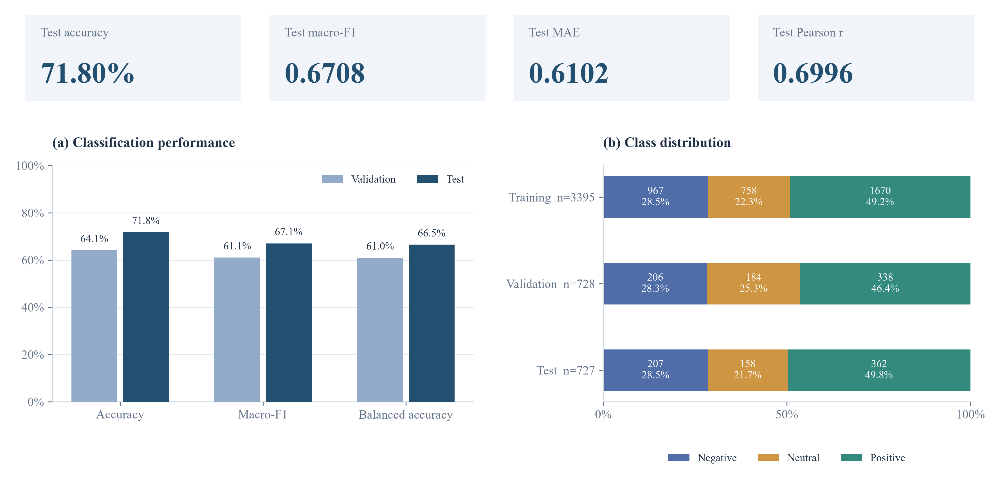
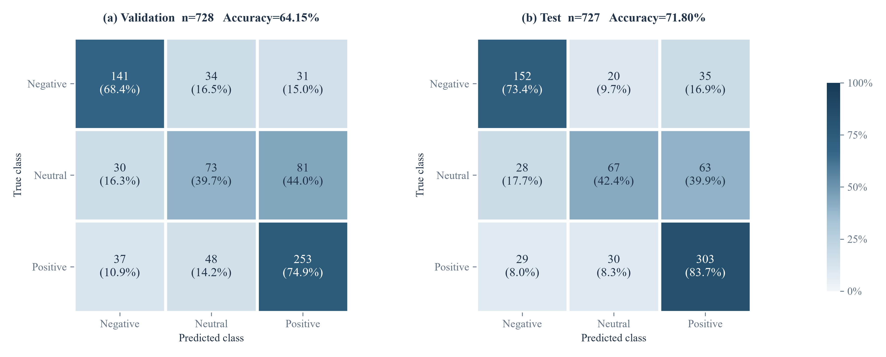
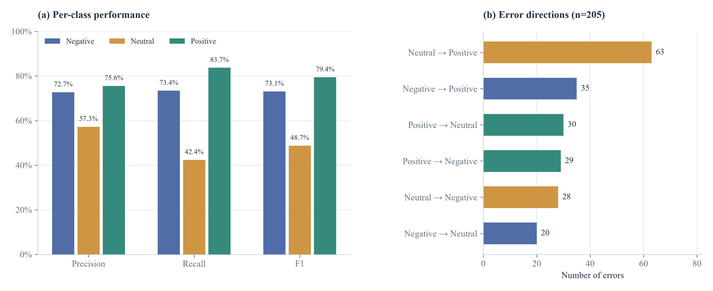
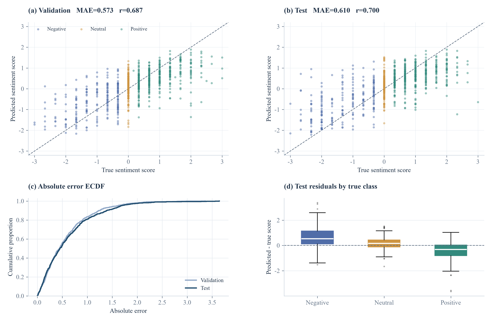
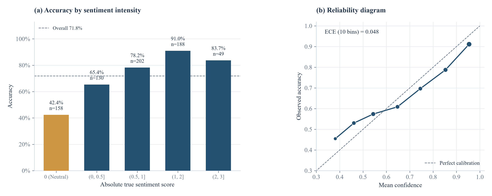
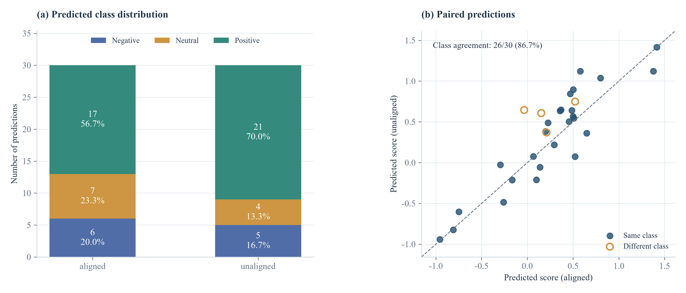
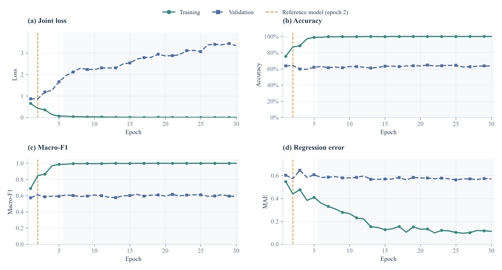

# 问题二阶段性成果分析

本报告对应所选目录中的 BERT 音视频融合模型。图表由保存的预测结果及可用训练记录生成。

## 1. 阶段结论

本阶段采用 BERT 文本微调与音视频统计特征融合模型。测试集共 727 条，正确分类 522 条，Accuracy 为 71.80%，Macro-F1 为 0.6708。回归 MAE 为 0.6102，RMSE 为 0.8271，Pearson 相关系数为 0.6996。

模型对正面和负面情感的识别较好，中性类别仍较弱：测试集三类 F1 分别为 0.7308、0.4873、0.7942。该模型作为后续分析的固定基线，当前结果尚不能证明对局部模态缺失具有稳定鲁棒性。

原始逐轮日志未保存；目前补充了 30 轮实测复现记录，复现中第 2 轮的全部权重及缓冲区与当前参考模型逐张量完全一致，归一化统计量也一致。曲线标记为经权重校验的复现过程，不声称找回了当时的原始日志。参考权重、原始指标与预测文件均保留，文件哈希校验通过。前 5 轮对应原实验的复现，第 6 轮起为延长训练分析。后续轮次不会替换已确定的参考模型，完整曲线不表示原实验当时训练了这么多轮。

## 2. 评价协议与基础指标

附件二保持原有划分：训练集 3395 条、验证集 728 条、测试集 727 条。现有训练代码采用验证集 Macro-F1 选择权重；归一化统计量仅由训练集拟合。分类结果使用三类概率的 argmax，本报告没有重新训练或调整决策阈值。

代码中的模型以本地 BERT 为文本编码器，对有效 token 求均值；音频与视觉分别汇总有效帧的均值、标准差和有效比例，投影后与文本拼接，连接三分类头及回归头。代码中的联合损失为交叉熵加 0.15 倍 SmoothL1 回归损失。该结构主要使用音视频统计信息，不能据此声称已实现细粒度跨模态时序注意力。

测试准确率比验证集高 7.65 个百分点，但测试 MAE 比验证集高 0.0367。分类与回归指标衡量不同目标；两个划分的样本组成和难度也不同，不能把它们视为训练前后的提升。

按训练集多数类固定预测 Positive，测试准确率为 49.79%；当前模型高出 22.01 个百分点。Macro-F1 与平均召回率同时报告，以免多数类掩盖中性类表现。历史开发已多次查看测试结果，这不是一个始终未被查看的最终盲测结论。

| 指标 | 验证集 | 测试集 |
| --- | --- | --- |
| 样本数 | 728 | 727 |
| Accuracy | 0.6415 | 0.7180 |
| Macro-F1 | 0.6105 | 0.6708 |
| 平均召回率 | 0.6099 | 0.6651 |
| MAE | 0.5735 | 0.6102 |
| RMSE | 0.7626 | 0.8271 |
| Pearson r | 0.6865 | 0.6996 |

## 3. 逐类表现与错误归因

测试集中，中性样本 158 条，仅 67 条识别正确，召回率为 42.41%；其中 28 条被预测为负面、63 条被预测为正面。另一方面，模型预测为中性的 117 条中，有 50 条实际属于其他类别，中性类别既存在漏判，也存在误报。

涉及中性类别的错误共 141 条，占全部 205 条误判的 68.78%。直接跨越负面与正面的错误仍有 64 条，因此问题并非只发生在中性边界。

这些结果支持“中性类别区分不足”的定量结论，但不能单凭混淆矩阵认定标签有错、说话者存在讽刺或某一模态失效。语义级归因仍需按错误样本编号核对文本、音视频原始内容；本报告仅保留可由预测表验证的结论。

| 测试类别 | 真实数量 | 预测数量 | Precision | Recall | F1 |
| --- | --- | --- | --- | --- | --- |
| Negative | 207 | 209 | 0.7273 | 0.7343 | 0.7308 |
| Neutral | 158 | 117 | 0.5726 | 0.4241 | 0.4873 |
| Positive | 362 | 401 | 0.7556 | 0.8370 | 0.7942 |

## 4. 情感强度回归

测试集 Pearson r=0.6996 表明预测分数与真实分数存在正相关，但相关性不等同于数值准确。RMSE=0.8271 高于 MAE=0.6102，说明较大误差对平方误差指标的影响较明显；绝对误差中位数为 0.4516。

测试集整体平均残差（预测值减真实值）为 0.0009。下表进一步按真实类别展示有方向的误差；正残差表示数值高估，负残差表示低估。分组统计用于描述现象，不作为标签或缺失机制的因果解释。

负面样本的平均预测值由真实的 -1.3060 向 -0.6702 收缩，正面样本则由 1.0304 向 0.6097 收缩。这表明模型在组平均意义上倾向于低估正负情绪的强烈程度；正负方向的残差相互抵消，不能用接近零的整体平均残差证明模型没有系统偏差。

| 真实类别 | 平均真实强度 | 平均预测强度 | 平均残差 | MAE |
| --- | --- | --- | --- | --- |
| Negative | -1.3060 | -0.6702 | 0.6357 | 0.7992 |
| Neutral | 0.0000 | 0.1350 | 0.1350 | 0.4109 |
| Positive | 1.0304 | 0.6097 | -0.4207 | 0.5891 |

## 5. 错误分布与预测置信度

按真实情感强度的绝对值分组，0 单独代表中性类，其余区间混合正负两种极性。各组样本量不同，分组差异是描述性结果；没有额外进行显著性检验或独立性假设下的置信区间估计。

使用 [0,1] 上 10 个等宽概率箱，ECE 为 0.0484。ECE 是各箱平均置信度与实际准确率之差的绝对值，按箱内样本数加权；空箱不参与计算。可靠性曲线位于对角线下方的部分表示过度自信。

置信度不低于 0.8 的预测有 330 条，其中 45 条错误。高预测概率并不保证预测正确。报告同时导出全部分类错误清单，并按错误预测置信度由高到低排序，便于优先人工核查。

| 真实强度绝对值 | 样本数 | 分类准确率 |
| --- | --- | --- |
| 0（中性） | 158 | 42.41% |
| (0, 0.5] | 130 | 65.38% |
| (0.5, 1] | 202 | 78.22% |
| (1, 2] | 188 | 90.96% |
| (2, 3] | 49 | 83.67% |

## 6. 附件三全量预测

aligned 与 unaligned 各有 30 条记录，按相同文件编号配对展示，不视为 60 条独立带标签样本。aligned 的负面/中性/正面预测数为 [6, 7, 17]，unaligned 为 [5, 4, 21]。两个格式均以正面预测居多，但缺少真实标签，无法据此判定偏置方向或预测准确率。

两种格式的预测类别一致 26/30 条，一致率为 86.67%；回归预测的平均绝对差为 0.2228。一致率仅描述两种输入格式的输出一致程度，不是对真实标签的准确率。

unaligned 的音视频序列在导出前按有效行平均至 50 个区间，文本重新分词后截取到 50 个位置；aligned 使用提供的文本 token 和对应掩码。这些预处理差异也会影响预测，不能把两种格式的输出差异直接解释成某种模态缺失的因果效应。全零行中还可能包含尾部填充，掩码有效比例不能直接当作真实缺失率。

## 7. 经权重校验的训练复现过程

实测过程共 30 轮，参考模型在原来的前 5 轮内按验证集 Macro-F1 选择，匹配于第 2 轮。后续延长训练的全程最佳验证轮次为 16，单独记录，不替换参考模型。虚线标记参考模型轮次，浅色背景表示超出原实验轮数的延长训练部分。测试集不参与此次复现的逐轮选择，也未依据测试分数搜索超参数。原始 best_epoch 字段保留未知，复现轮次单独记录。

训练集和验证集曲线均在每轮结束后，以固定权重和 eval 模式评价完整划分，关闭 Dropout，便于比较泛化差距。损失为交叉熵加 0.15 倍 SmoothL1，分类权重沿用该次训练设置。

曲线使用实测值，不做平滑或插值。训练指标持续改善而验证指标恶化时，支持出现过拟合的判断；不同轮次的最终权重不同，不能把训练过程中的指标直接代替已选权重的评估结果。

## 8. 可追溯性与当前边界

报告从四份预测 CSV 重算指标，逐项与 metrics.json 核对。检查包括文件内 ID 唯一性、验证/测试 ID 不重叠、概率合法性、分类 argmax 一致性，以及混淆矩阵、Accuracy、Macro-F1、MAE、RMSE、Pearson 的一致性。analysis.json 保存计算结果和输入文件 SHA-256，便于对应这一次成果。

现阶段已完成基础预测评估、定量错误诊断及附件三全量预测展示。局部缺失类型/缺失率实验、同一模型下的消融实验和错误样本原素材核查尚未完成。历史不同架构的分数不能替代严格消融；当前 BERT 基线也不能继承旧 Hybrid 模型的缺失增强能力。
